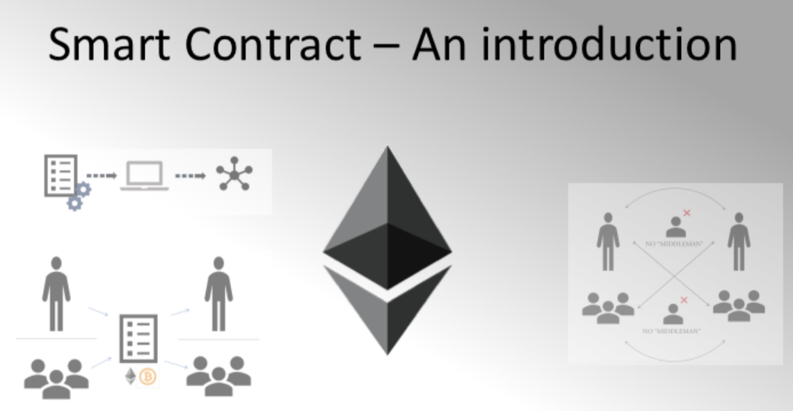
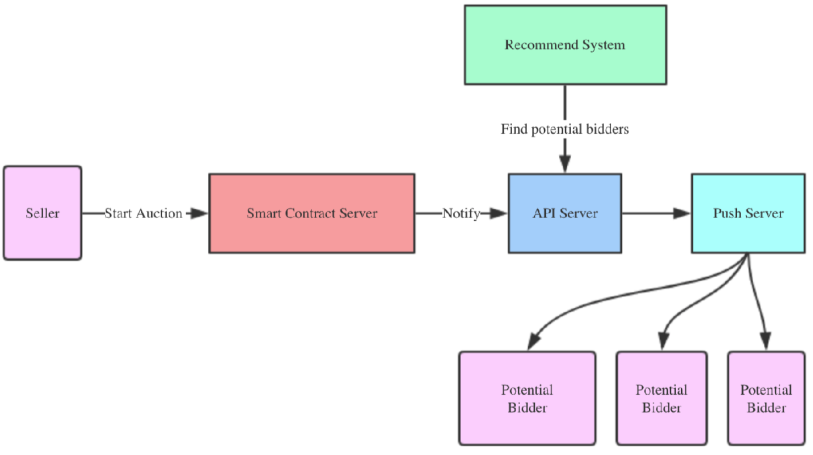
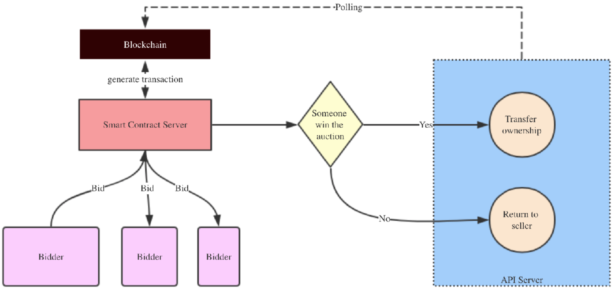

目前各种电商、实体店都有很多优惠券发放，但是人们并没有充分利用起来，如果可以把优惠券在智能合约上流通起来，那商家实现了广告的目的，也得到了客流量，而顾客也能得到优惠。这个去中心化的业务场景可以用区块链智能合约实现。

## 重新定义
- 重新定义优惠券的流通方式
- 重新定义公正透明的拍卖方式

智能合约具有如下特点：
- 一种传播、验证或执行合同的协议
- 不需要第三方的可信交易
- 可追踪
- 不可逆转

智能合约保证了拍卖的公正透明，无需人工参与

## 架构设计

**发起拍卖的流程**

**参与竞拍**

