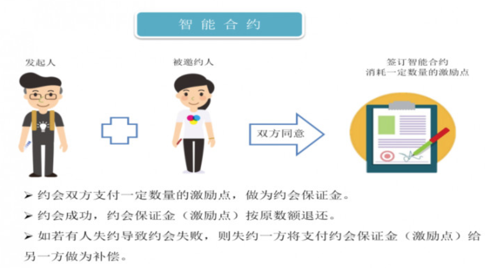

最近在找对象，突发奇想做个基于区块链的相亲合约。

听说有个程序员在婚恋网站上挂了1个多月都没人搭理他，然后给自己加了个 `区块链工程师` 的标签，几天后收到大量私信😝

## 传统相亲平台的痛点
- 中介所收费贵，介绍的还不靠谱
- 百合网、珍爱网之流坑爹，看个消息要钱，还都是机器人发的
- 虚假信息多，各种酒拖
- 效率低

## 区块链相亲的优势

LoveChain可以解决三大婚恋社交问题，分别是安全性、激励性、产业生态。

### 安全性

安全性问题又分为三类：用户身份的真实性、网站登记信息的私密性、以及线下实地见面的安全性。

针对真实用户，运用 AI、大数据、生物识别认证等技术对用户的合法身份进行有效认证，结合百合佳缘积累的社交黑名单库，对可疑的用户进行拦截和清除。同时，反垃圾监测系统可以将可疑用户进行账号隔离，并对其发出的垃圾信息进行单边隐藏，保护合法的用户利益。

针对用户敏感信息私密性的保护，其中提及一旦成为平台认证的合法用户，会有一个虚拟用户钱包，钱包由用户自己设置账号和密码， 只要把密钥安全存放，任何人都无法获取用户账户内的虚拟资产。用 户可以用自己的公私钥进行对自己的虚拟资产进行消费交易。

针对线下活动，采用智能合约，质押数字资产存放于平台，只有利益相关方的密钥才可以转移价值，其它人无权转移。当有人违约时，按照智能合约的约定，质押数字资产会自动转移到守约者账户。当各方都遵循合约约定时，合约 履行完毕，质押数字资产自动退到质押方各自账户。

线下智能约会场景

### 激励性

由于婚恋社交的用户粘性比较低，因此可以通过代币奖励来提高积极性，比如通过注册账户、上传照片、主动发消息、身份认证、朋友圈发帖等方式获得激励点。这些代币平台可以应用于多种业务，包括情感咨询、婚礼婚庆甚至婚房等。

### 产业生态

可以预见，未来的婚恋问题将向低结婚欲望、大龄未婚等发现发展，这方面的产业生态将发生改变，需要提前去布局。

## 实现

基于以太坊，做了一个简单的demo

请前往[airdropfans区块恋](http://airdropfans.com/love)体验。
