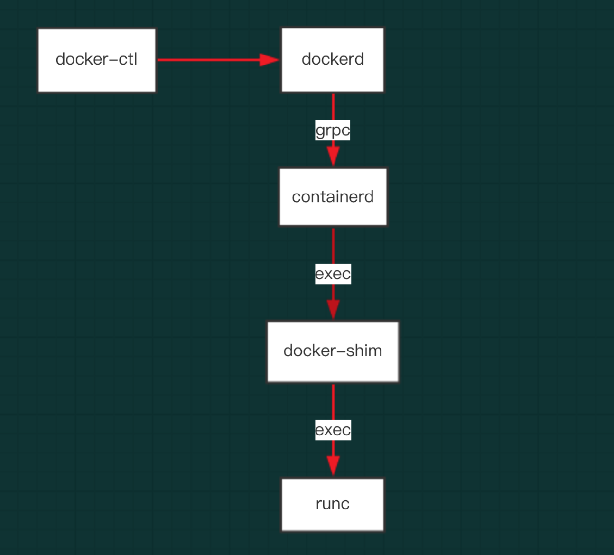

# 组件

从 Docker 1.11 之后，Docker Daemon 被分成了多个模块以适应 OCI 标准。容器是由多个组件共同管理协同后才运行起来的，主要的组件有：

- Docker
- Docker Daemon
- Containerd
- RunC


图，容器组件图

其中，containerd 独立负责容器运行时和生命周期（如创建、启动、停止、中止、信号处理、删除等），其他一些如镜像构建、卷管理、日志等由 Docker Daemon 的其他模块处理。

## Docker

作为 Client 接受用户的指令并将指令发送给 Docker daemon 处理。是 Docker API 的最上层封装，直接面向操作用户。

## Docker Daemon

Docker 容器管理的守护进程，负责与 Docker client 交互，实现对 Docker 镜像和容器的管理。


图，Docker daemon 的作用

从Docker 1.11开始，通过如下命令启动

	dockerd

在 Hulk 中的进程如下

	/usr/bin/dockerd-current --exec-opt native.cgroupdriver=systemd --userland-proxy-path=/usr/libexec/docker/docker-proxy-current --init-path=/usr/libexec/docker/docker-init-current --seccomp-profile=/etc/docker/seccomp.json --selinux-enabled --log-driver=json-file --log-opt max-size=100m --signature-verification=false --live-restore


## Containerd

containerd是容器技术标准化之后的产物，为了能够兼容OCI 标准，将容器运行时及其管理功能从 Docker Daemon 剥离。理论上，即使不运行 dockerd，也能够直接通过 containerd 来管理容器。（当然，containerd 本身也只是一个守护进程，容器的实际运行时由后面介绍的 runC 控制。）

Containerd 主要职责是镜像管理（镜像、元信息等）、容器执行（调用最终运行时（RunC）组件执行）。


图，Containerd 架构


图，Containerd 整体架构

containerd 向上为 Docker Daemon 提供了 gRPC 接口，使得 Docker Daemon 屏蔽下面的结构变化，确保原有接口向下兼容。向下通过 containerd-shim 结合 runC，使得引擎可以独立升级，避免之前 Docker Daemon 升级会导致所有容器不可用的问题。


Docker、containerd 和 containerd-shim 之间的关系，可以通过启动一个 Docker 容器，观察进程之间的关联。首先启动一个容器，

	# docker run -d busybox sleep 1000
	94325941834e353c137113d78158a114df3332e8759fba5176bfbd56049f7221

然后通过pstree命令查看进程之间的父子关系（其中 197979 是dockerd的 PID）：

```
# pstree -l -a -A  197979
dockerd-current --exec-opt native.cgroupdriver=systemd --userland-proxy-path=/usr/libexec/docker/docker-proxy-current --init-path=/usr/libexec/docker/docker-init-current --seccomp-profile=/etc/docker/seccomp.json --selinux-enabled --log-driver=json-file --log-opt max-size=100m --signature-verification=false --live-restore
|-docker-containe -l unix:///var/run/docker/libcontainerd/docker-containerd.sock --metrics-interval=0 --start-timeout 2m --state-dir /var/run/docker/libcontainerd/containerd --shim docker-containerd-shim --runtime docker-runc --runtime-args --systemd-cgroup=true
|   |-docker-containe 94325941834e353c137113d78158a114df3332e8759fba5176bfbd56049f7221 /var/run/docker/libcontainerd/94325941834e353c137113d78158a114df3332e8759fba5176bfbd56049f7221 docker-runc
|   |   |-sleep 1000
|   |   `-9*[{docker-containe}]
```

由于 pstree 截断了进程名字，实际的进程名字是 `docker-containerd-shim`。Docker daemon 启动之后，dockerd 和 docker-containerd 进程一直存在。当启动容器之后，docker-containerd 进程（也是这里介绍的 containerd 组件）会创建 docker-containerd-shim 进程，其中的参数 94325941834e353c137113d78158a114df3332e8759fba5176bfbd56049f7221 就是要启动容器的 id。最后 docker-containerd-shim 子进程，已经是实际在容器中运行的进程（既 sleep 1000）。

Hulk 中的 containerd 和 containerd-shim 进程如下

```
# ps aux | grep containerd
root     134481  0.0  0.0 446412  5980 ?        Sl   10:31   0:00 /usr/bin/docker-containerd-shim-current 94325941834e353c137113d78158a114df3332e8759fba5176bfbd56049f7221 /var/run/docker/libcontainerd/94325941834e353c137113d78158a114df3332e8759fba5176bfbd56049f7221 docker-runc
root     197990  0.0  0.0 3571764 41852 ?       Ssl  May17   8:26 /usr/bin/docker-containerd-current -l unix:///var/run/docker/libcontainerd/docker-containerd.sock --metrics-interval=0 --start-timeout 2m --state-dir /var/run/docker/libcontainerd/containerd --shim docker-containerd-shim --runtime docker-runc --runtime-args --systemd-cgroup=true
```
docker-containerd-shim 另一个参数，是一个和容器相关的目录 /var/run/docker/libcontainerd/94325941834e353c137113d78158a114df3332e8759fba5176bfbd56049f7221，里面的内容有：

```
.
├── config.json
├── init-stderr
├── init-stdin
└── init-stdout
```

其中包括了容器配置和标准输入、标准输出、标准错误三个管道文件。

containerd 是dockerd和runc之间的一个中间交流组件。

## Containerd-shim

Containerd-shim 是一个真实运行的容器的真实垫片载体，每启动一个容器都会起一个新的 containerd-shim 的一个进程，指定的三个参数：

- 容器id
- boundle目录（containerd的对应某个容器生成的目录，一般位于：/var/run/docker/libcontainerd/containerID），
- 运行时二进制（默认为runc）来调用runc的api创建一个容器（比如创建容器：最后拼装的命令如下：runc create xxx）


## RunC

OCI 定义了容器运行时标准，runC 是 Docker 按照开放容器格式标准（OCF, Open Container Format）制定的一种具体实现。

runC 是从 Docker 的 libcontainer 中迁移而来的，实现了容器启停、资源隔离等功能。Docker 默认提供了 docker-runc 实现，事实上，通过 containerd 的封装，可以在 Docker Daemon 启动的时候指定 runc 的实现。

我们可以通过启动 Docker Daemon 时增加--add-runtime参数来选择其他的 runC 现。例如：

	docker daemon --add-runtime "custom=/usr/local/bin/my-runc-replacement"

下面就让我们看下这几个模块如何工作。


## 总结



图，各组件的调用关系

可以查看 [Docker update 流程分析](/post/cloud/container/201906-docker-update/) 的代码调用流程。


# 参考

[Docker、Containerd、RunC...：你应该知道的所有](https://www.infoq.cn/article/2017/02/Docker-Containerd-RunC)
