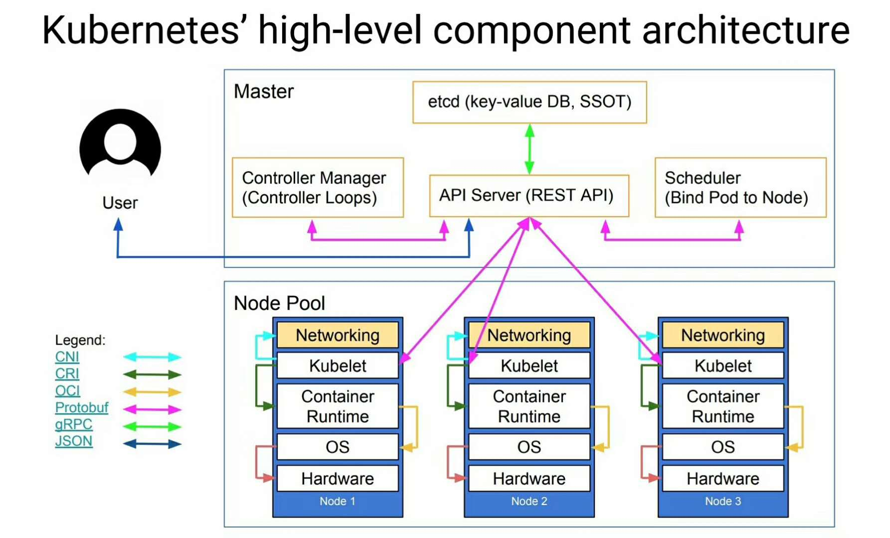
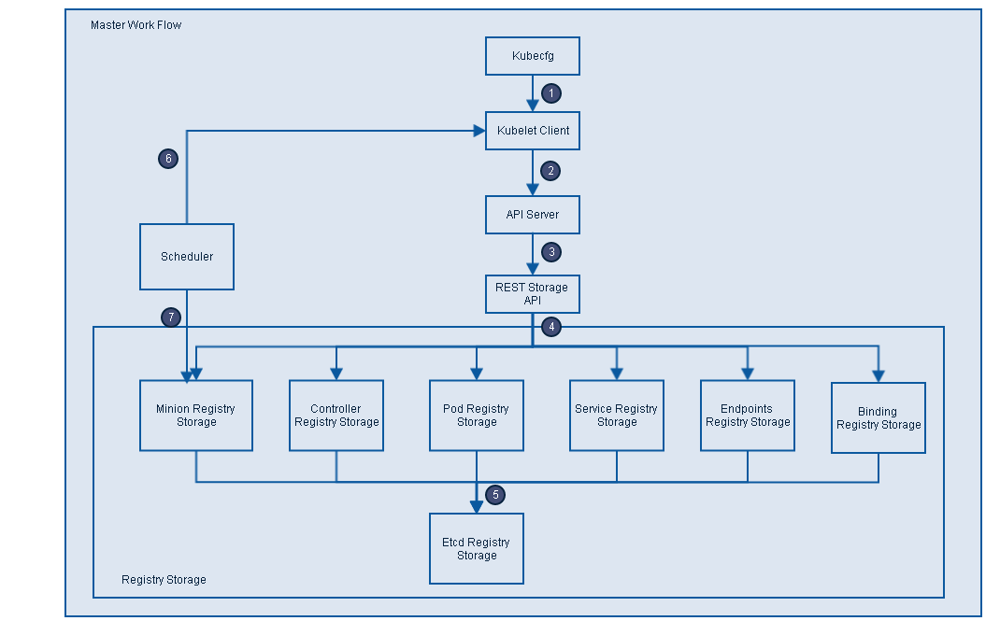
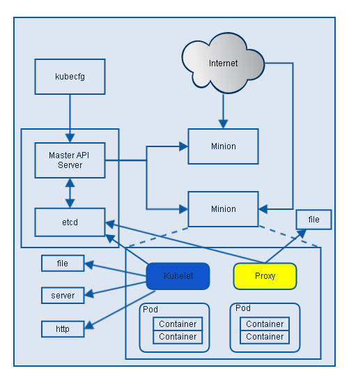
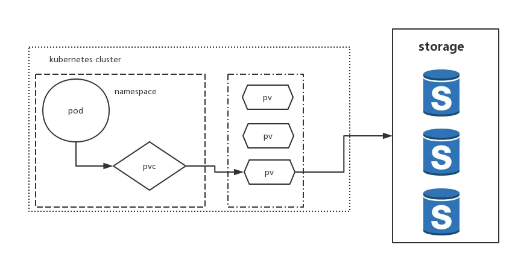
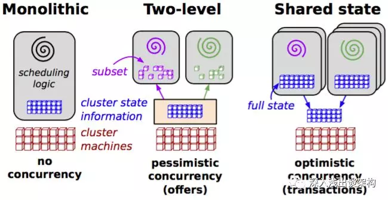
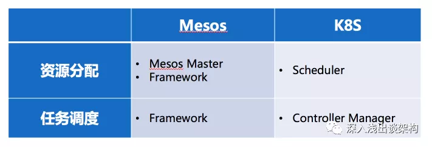
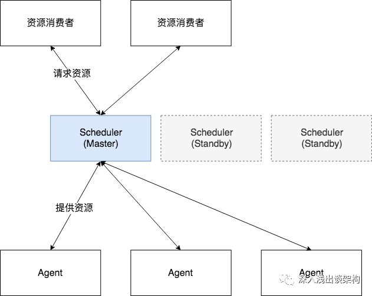
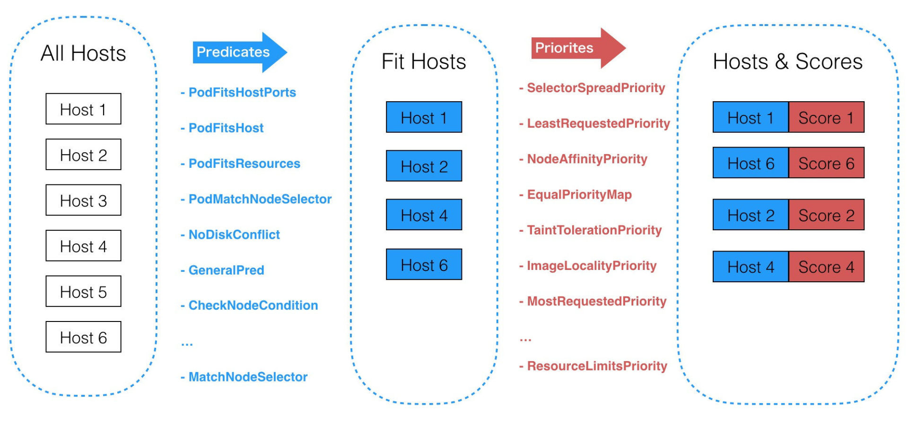
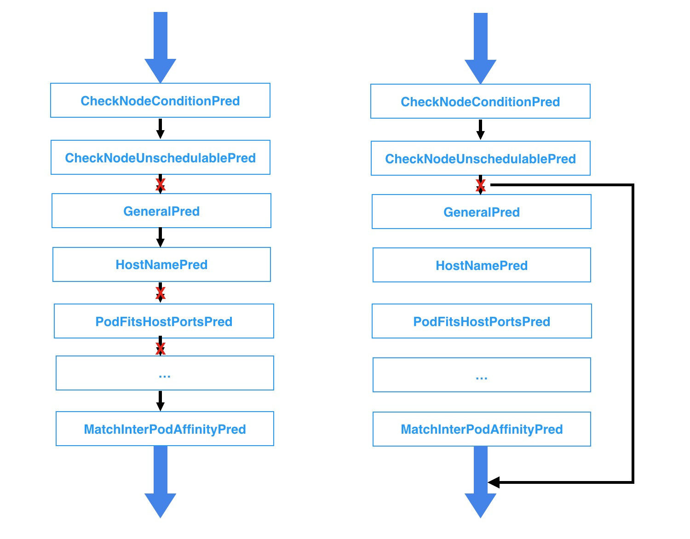

# Kubernetes

Kubernetes 是 Google 开源的容器集群管理系统，其提供应用部署、维护、 扩展机制等功能，利用 Kubernetes 能方便地管理跨机器运行容器化的应用，其主要功能如下：

1) 使用 Docker 对应用程序包装 (package)、实例化 (instantiate)、运行 (run)。

2) 以集群的方式运行、管理跨机器的容器。

3) 解决 Docker 跨机器容器之间的通讯问题。

4) Kubernetes 的自我修复机制使得容器集群总是运行在用户期望的状态。

 k8s 要做的不是dockerize，也不是containerize，而是作为一个集群操作系统，为此重新定义了可执行文件、进程、存储、网络的形态。

# 整体结构

## Master

集群控制节点，master节点上运行着一组关键的进程

- `etcd`，各个组件通信都并不是互相调用 API 来完成的，而是把状态写入 ETCD（相当于写入一个消息），其他组件通过监听 ETCD 的状态的的变化（相当于订阅消息），然后做后续的处理，然后再一次把更新的数据写入 ETCD。
- `api server`，各个组件并不是直接访问 ETCD，而是访问一个代理，这个代理是通过标准的RESTFul API，重新封装了对 ETCD 接口调用，除此之外，这个代理还实现了一些附加功能，比如身份的认证、缓存等
- `Controller Manager` 是实现任务调度的
- `Scheduler` 是用来做资源调度的

Master 定义了 Kubernetes 集群 Master/API Server 的主要声明，包括 Pod Registry、Controller Registry、Service Registry、Endpoint Registry、Minion Registry、Binding Registry、RESTStorage 以及 Client, 是 client(Kubecfg) 调用 Kubernetes API，管理 Kubernetes 主要构件 Pods、Services、Minions、容器的入口。Master 由 API Server、Scheduler 以及 Registry 等组成。从下图可知 Master 的工作流主要分以下步骤：

图片 - Master 主要构件及工作流

1) Kubecfg 将特定的请求，比如创建 Pod，发送给 Kubernetes Client。

2) Kubernetes Client 将请求发送给 API server。

3) API Server 根据请求的类型，比如创建 Pod 时 storage 类型是 pods，然后依此选择何种 REST Storage API 对请求作出处理。

4) REST Storage API 对的请求作相应的处理。

5) 将处理的结果存入高可用键值存储系统 Etcd 中。

6) 在 API Server 响应 Kubecfg 的请求后，Scheduler 会根据 Kubernetes Client 获取集群中运行 Pod 及 Minion 信息。

7) 依据从 Kubernetes Client 获取的信息，Scheduler 将未分发的 Pod 分发到可用的 Minion 节点上。

### Minion Registry

Minion Registry 负责跟踪 Kubernetes 集群中有多少 Minion(Host)。Kubernetes 封装 Minion Registry 成实现 Kubernetes API Server 的 RESTful API 接口 REST，通过这些 API，我们可以对 Minion Registry 做Create、Get、List、Delete 操作，由于 Minon 只能被创建或删除，所以不支持 Update 操作，并把 Minion 的相关配置信息存储到 etcd。除此之外，Scheduler 算法根据 Minion 的资源容量来确定是否将新建 Pod 分发到该 Minion 节点。

### Pod Registry
Pod Registry 负责跟踪 Kubernetes 集群中有多少 Pod 在运行，以及这些 Pod 跟 Minion 是如何的映射关系。将 Pod Registry 和 Cloud Provider 信息及其他相关信息封装成实现 Kubernetes API Server 的 RESTful API 接口 REST。通过这些 API，我们可以对 Pod 进行 Create、Get、List、Update、Delete 操作，并将 Pod 的信息存储到 etcd 中，而且可以通过 Watch 接口监视 Pod 的变化情况，比如一个 Pod 被新建、删除或者更新。

### Service Registry
Service Registry 负责跟踪 Kubernetes 集群中运行的所有服务。根据提供的 Cloud Provider 及 Minion Registry 信息把 Service Registry 封装成实现 Kubernetes API Server 需要的 RESTful API 接口 REST。利用这些接口，我们可以对 Service 进行 Create、Get、List、Update、Delete 操作，以及监视 Service 变化情况的 watch 操作，并把 Service 信息存储到 etcd。

### Controller Registry
Controller Registry 负责跟踪 Kubernetes 集群中所有的 Replication Controller，Replication Controller 维护着指定数量的 pod 副本 (replicas) 拷贝，如果其中的一个容器死掉，Replication Controller 会自动启动一个新的容器，如果死掉的容器恢复，其会杀死多出的容器以保证指定的拷贝不变。通过封装 Controller Registry 为实现 Kubernetes API Server 的 RESTful API 接口 REST， 利用这些接口，我们可以对 Replication Controller 进行 Create、Get、List、Update、Delete 操作，以及监视 Replication Controller 变化情况的 watch 操作，并把 Replication Controller 信息存储到 etcd。

### Endpoints Registry
Endpoints Registry 负责收集 Service 的 endpoint，比如 Name："mysql"，Endpoints: ["10.10.1.1:1909"，"10.10.2.2:8834"]，同 Pod Registry，Controller Registry 也实现了 Kubernetes API Server 的 RESTful API 接口，可以做 Create、Get、List、Update、Delete 以及 watch 操作。

### Binding Registry
Binding 包括一个需要绑定 Pod 的 ID 和 Pod 被绑定的 Host，Scheduler 写 Binding Registry 后，需绑定的 Pod 被绑定到一个 host。Binding Registry 也实现了 Kubernetes API Server 的 RESTful API 接口，但 Binding Registry 是一个 write-only 对象，所有只有 Create 操作可以使用， 否则会引起错误。

### Scheduler
Scheduler 收集和分析当前 Kubernetes 集群中所有 Minion 节点的资源 (内存、CPU) 负载情况，然后依此分发新建的 Pod 到 Kubernetes 集群中可用的节点。由于一旦 Minion 节点的资源被分配给 Pod，那这些资源就不能再分配给其他 Pod， 除非这些 Pod 被删除或者退出， 因此，Kubernetes 需要分析集群中所有 Minion 的资源使用情况，保证分发的工作负载不会超出当前该 Minion 节点的可用资源范围。具体来说，Scheduler 做以下工作：

1) 实时监测 Kubernetes 集群中未分发的 Pod。

2) 实时监测 Kubernetes 集群中所有运行的 Pod，Scheduler 需要根据这些 Pod 的资源状况安全地将未分发的 Pod 分发到指定的 Minion 节点上。

3) Scheduler 也监测 Minion 节点信息，由于会频繁查找 Minion 节点，Scheduler 会缓存一份最新的信息在本地。

4) 最后，Scheduler 在分发 Pod 到指定的 Minion 节点后，会把 Pod 相关的信息 Binding 写回 API Server。

## Node

Node是工作主机，可以使物理主机、VM等。

- `kubelet`：负责管控docker容器，如启动/停止、监控运行状态等。
- `kube-proxy`： 负责为pod提供代理。它会定期从etcd获取所有的service，并根据service信息创建代理。

### kubelet

根据上图可知 Kubelet 是 Kubernetes 集群中每个 Minion 和 Master API Server 的连接点，Kubelet 运行在每个 Minion 上，是 Master API Server 和 Minion 之间的桥梁，接收 Master API Server 分配给它的 commands 和 work，与持久性键值存储 etcd、file、server 和 http 进行交互，读取配置信息。Kubelet 的主要工作是管理 Pod 和容器的生命周期，其包括 Docker Client、Root Directory、Pod Workers、Etcd Client、Cadvisor Client 以及 Health Checker 组件，具体工作如下：

1) 通过 Worker 给 Pod 异步运行特定的 Action。

2) 设置容器的环境变量。

3) 给容器绑定 Volume。

4) 给容器绑定 Port。

5) 根据指定的 Pod 运行一个单一容器。

6) 杀死容器。

7) 给指定的 Pod 创建 network 容器。

8) 删除 Pod 的所有容器。

9) 同步 Pod 的状态。

10) 从 Cadvisor 获取 container info、 pod info、root info、machine info。

11) 检测 Pod 的容器健康状态信息。

12) 在容器中运行命令。

### Container Runtime（容器运行时）

每一个Node都会运行一个Container Runtime，其负责下载镜像和运行容器。Kubernetes本身并不停容器运行时环境，但提供了接口，可以插入所选择的容器运行时环境。kubelet使用Unix socket之上的gRPC框架与容器运行时进行通信，kubelet作为客户端，而CRI shim作为服务器。

protocol buffers API提供两个gRPC服务，ImageService和RuntimeService。ImageService提供拉取、查看、和移除镜像的RPC。RuntimeSerivce则提供管理Pods和容器生命周期管理的RPC，以及与容器进行交互(exec/attach/port-forward)。容器运行时能够同时管理镜像和容器（例如：Docker和Rkt），并且可以通过同一个套接字提供这两种服务。在Kubelet中，这个套接字通过–container-runtime-endpoint和–image-service-endpoint字段进行设置。Kubernetes CRI支持的容器运行时包括docker、rkt、cri-o、frankti、kata-containers和clear-containers等。

### Proxy

Proxy 是为了解决外部网络能够访问跨机器集群中容器提供的应用服务而设计的，从上图可知 Proxy 服务也运行在每个 Minion 上。Proxy 提供 TCP/UDP sockets 的 proxy，每创建一种 Service，Proxy 主要从 etcd 获取 Services 和 Endpoints 的配置信息，或者也可以从 file 获取，然后根据配置信息在 Minion 上启动一个 Proxy 的进程并监听相应的服务端口，当外部请求发生时，Proxy 会根据 Load Balancer 将请求分发到后端正确的容器处理。

服务发现主要通过DNS实现。

在Kubernetes中，kube proxy负责为Pod创建代理服务；引到访问至服务；并实现服务到Pod的路由和转发，以及通过应用的负载均衡。

Proxy不但解决了同一主宿机相同服务端口冲突的问题，还提供了Service转发服务端口对外提供服务的能力，Proxy后端使用了随机、轮循负载均衡算法。

# 分层架构

Kubernetes设计理念和功能其实就是一个类似Linux的分层架构，如下图所示

- 核心层：Kubernetes最核心的功能，对外提供API构建高层的应用，对内提供插件式应用执行环境
- 应用层：部署（无状态应用、有状态应用、批处理任务、集群应用等）和路由（服务发现、DNS解析等）
- 管理层：系统度量（如基础设施、容器和网络的度量），自动化（如自动扩展、动态Provision等）以及策略管理（RBAC、Quota、PSP、NetworkPolicy等）
- 接口层：kubectl命令行工具、客户端SDK以及集群联邦
- 生态系统：在接口层之上的庞大容器集群管理调度的生态系统，可以划分为两个范畴
- Kubernetes外部：日志、监控、配置管理、CI、CD、Workflow、FaaS、OTS应用、ChatOps等
- Kubernetes内部：CRI、CNI、CVI、镜像仓库、Cloud Provider、集群自身的配置和管理等

# 系统流程

**一位大牛整理的 K8S 调用流程**

# 设计理念

1. 声明式 VS 命令式, 声明式优点很多，一个很重要的点是：在分布式系统中，任何组件都可能随时出现故障。当组件恢复时，需要弄清楚要做什么，使用命令式 API 时，处理起来就很棘手。但是使用声明式 API ，组件只需查看 API 服务器的当前状态，即可确定它需要执行的操作。

2. 显式的 API, Kubernetes 是透明的，它没有隐藏的内部 API。换句话说 Kubernetes 系统内部用来交互的 API 和我们用来与 Kubernetes 交互的 API 相同。这样做的好处是，当 Kubernetes 默认的组件无法满足我们的需求时，我们可以利用已有的 API 实现我们自定义的特性。

3. 无侵入性, 感谢 Docker 容器技术的流行，使得 Kubernetes 为大家提供了无缝的使用方式。我们的应用达到镜像后, 不需要改动就可以遨游在 Kubernetes 集群中。Kubernetes 还提供存储 Secret、Configuration 等包含但不局限于密码、证书、容器镜像信息、应用启动参数能力。如此，Kubernetes 以一种友好的方式将这些东西注入 Pod，减少了大家的工作量，而无需重写或者很大幅度改变原有的应用代码。

4. 为了实现这一目标，Kubernetes 引入了 PersistentVolumeClaim（PVC）和 PersistentVolume（PV）API 对象。这些对象将存储实现与存储使用分离。 PersistentVolumeClaim 对象用作用户以与实现无关的方式请求存储的方法，通过它来抹除对底层 PersistentVolume 的差异性。这样就使 Kubernetes 拥有了跨集群的移植能力。

# 容器编排系统的比较

在 Google 的一篇关于内部 Omega 调度系统的论文中，将调度系统分成三类：单体、二层调度和共享状态三种，按照它的分类方法，通常Google的 Borg被分到单体这一类，Mesos被当做二层调度，而Google自己的Omega被当做第三类“共享状态”。

因为Kubernetes的大部分设计是延续 Borg的，而且Kubernetes的核心组件（Controller Manager和Scheduler）缺省也都是绑定部署在一起，状态也都是存储在ETCD里面的，所以通常大家会把Kubernetes也当做“单体”调度系统，我觉得 Kubernetes 的调度模型也完全是二层调度的，和 Mesos 一样，任务调度和资源的调度是完全分离的，Controller Manager承担任务调度的职责，而Scheduler则承担资源调度的职责。

## Mesos

实际上Kubernetes和Mesos调度的最大区别在于资源调度请求的方式：

主动 Push 方式。是 Mesos 采用的方式，就是 Mesos 的资源调度组件（Mesos Master）主动推送资源 Offer 给 Framework，Framework 不能主动请求资源，只能根据 Offer 的信息来决定接受或者拒绝。

被动 Pull 方式。是 Kubernetes 的方式，资源调度组件 Scheduler 被动的响应 Controller Manager的资源请求。

这两种方式带来的不同，我主要从一下 5 个方面来分析。另外注意，我所比较两者的优劣，都是从理论上做的分析，工程实现上会有差异，一些指标我也并没有实际测试过。

1.资源利用率：Kubernetes 胜出

理论上，Kubernetes 应该能实现更加高效的集群资源利用率，原因资源调度的职责完全是由Scheduler一个组件来完成的，它有充足的信息能够从全局来调配资源，然后而Mesos 却做不到，因为资源调度的职责被切分到Framework和Mesos Master两个组件上，Framework 在挑选 Offer 的时候，完全没有其他 Framework 工作负载的信息，所以也不可能做出最优的决策。

举个例子，比如我们希望把对耗费 CPU的工作负载和耗费内存的工作负载尽可能调度到同一台主机上，在Mesos里面不太容易做到，因为他们分属不同的 Framework。

2.扩展性：Mesos胜出

从理论上讲，Mesos 的扩展性要更好一点。原因是Mesos的资源调度方式更容易让已经存在的任务调度迁移上来。举个例子，假设已经有了一个任务调度系统，比如 Spark，现在要迁移到集群调度平台上，理论上它迁移到 Mesos 比 Kubernetes 上更加容易。

如果迁移到 Mesos ，没有改变原来的工作流程和逻辑，原来的逻辑是：来了一个作业请求，调度系统把任务拆分成小的任务，然后从资源池里面挑选一个节点来运行任务，并且记录挑选的节点 IP 和端口号，用来跟踪任务的状态。迁移到 Mesos 之后，还是一样的逻辑，唯一需要变化的是那个资源池，原来是自己管理的资源池，现在变成 Mesos 提供的Offer 列表。

如果迁移到 Kubernetes，则需要修改原来的基本逻辑来适配 Kubernetes，资源的调度完全需要调用外部的组件来完成，并且这个变成异步的。

3.灵活的任务调度策略：Mesos 胜出

Mesos 对各种任务的调度策略也支持的更好。举个例子，如果某一个作业，需要 All or Nothing 的策略，Mesos 是能够实现的，但是 Kubernetes 完全无法支持。所以All or Nothing 的意思是，价格整个作业如果需要运行 10 个任务，这 10个任务需要能够全部有资源开始执行，否则就一个都不执行。

4.性能：Mesos 胜出

Mesos 的性能应该更好，因为资源调度组件，也就是 Mesos Master 把一部分资源调度的工作甩给 Framework了，承担的调度工作更加简单，从数据来看也是这样，在多年之前 Twitter 自己的 Mesos 集群就能够管理超过 8万个节点，而 Kubernetes 1.3 只能支持 5千个节点。

5.调度延迟：Kubernetes 胜出

Kubernetes调度延迟会更好。因为Mesos的轮流给Framework提供Offer机制，导致会浪费很多时间在给不需要资源的 Framework 提供Offer。

## Swarm

## Kubernetes的优势

Kubernetes 作为容器编排的事实标准，主要强在以下方面：

1. 理念的先进性
	Kubernetes 并未将 Docker 作为架构的核心，而仅仅将它作为一个container runtime 实现，k8s的核心是cni、csi、cri、oci等。相对的，mesos是docker的使用者，也必然是docker特性的迁就者。K8S 架构有很强的扩展性，而Mesos则需要考虑 Docker 的支持程度。

2. 声明式 API
	k8s系统的梳理了任务的形态以及任务之间的关系，并为未来留有余地，提供了声明式的 API。

云计算平台上的开发者们所关心的，并不是调度，也不是资源管管理，更不是网络或者存储，他们关心的只有一件事，那就是 Kubernetes 的 API，也就是声明式 API 和控制器模式。这个 API 独有的编程范式，即 Controller 和 Operator。作为一个云计算平台的用户，能够用一个 YAML 文件表达我开发的应用的最终运行状态，并且自动地对我的应用进行运维和管理。**这种信赖关系，就是连接Kubernetes 项目和开发者们最重要的纽带**。

不同于一个只能生产资源的集群管理工具，Kubernetes 项目最大的价值，乃在于它从一开始就提倡的声明式 API 和以此为基础“控制器”模式。Kubernetes 项目为使用者提供了宝贵的 API 可扩展能力和良好的 API 编程范式，催生出了一个完全基于 Kubernetes API 构建出来的上层应用服务生态。可以说，正是这个生态的逐步完善与日趋成熟，才确立了 Kubernetes 项目如今在云平台领域牢不可破的领导地位，也间接宣告了竞品方案的边缘化。

[未来：应用交付的革命不会停止](https://mp.weixin.qq.com/s/x7lTp9fJXav6nIJH_bgVMA)，Kubernetes 项目一直在做的，其实是在进一步清晰和明确“应用交付”这个亘古不变的话题。只不过，相比于交付一个容器和容器镜像， Kubernetes 项目正在尝试明确的定义云时代“应用”的概念。在这里，应用是一组容器的有机组合，同时也包括了应用运行所需的网络、存储的需求的描述。而像这样一个“描述”应用的 YAML 文件，放在 etcd 里存起来，然后通过控制器模型驱动整个基础设施的状态不断地向用户声明的状态逼近，就是 Kubernetes 的核心工作原理了。PS: 以后你给公有云一个yaml 文件就可以发布自己的应用了。

# 横向扩展

几乎所有的集群调度系统都无法横向扩展（Scale Out），Mesos通过优化，一个集群能够管理 8 万个节点，Kubernetes 最新的1.15版本，集群管理节点的上限是 5000 个节点。

所有的集群调度系统的架构都是无法横向扩展的，如果需要管理更多的服务器，唯一的办法就是创建多个集群。集群调度系统的架构看起来都是这个样子的：

中间的 Scheduler（资源调度器）是最核心的组件，虽然通常是由多个（通常是3个）实例组成，但是都是单活的，也就是说只有一个节点工作，其他节点都处于 Standby 的状态。

这是因为集群调度系统的“独立资源池”数量是 1，每一台服务器节点都是一个资源，每当资源消费者请求资源的时候，调度系统用来做调度算法的“独立资源池”是多大呢？答案应该是整个集群的资源组成的资源池，没有办法在切分了，因为:

1. 调度系统的职责就是要在全局内找到最优的资源匹配。
2. 另外，哪怕不需要找到最优的资源匹配，资源调度器对每一次资源请求，也没办法判断应该从哪一部分资源池中挑选资源。

正是因为这个原因，“独立资源池”数量是 1，所以集群调度系统无法做到横向扩展。

## 优化

主要是 Scheduler 调度器的优化，主要体现在两个地方：

1. 预选失败中断机制

一次调度过程在判断一个Node是否可作为目标机器主要分为三个阶段：

预选阶段：硬性条件，过滤掉不满足条件的节点，这个过程称为Predicates。这是固定先后顺序的一系列过滤条件，任何一个predicate不符合则放弃该Node。

优选阶段：软性条件，对通过的节点按照优先级排序，称之为Priorities。每一个priority都是一个影响因素，都有一定的权重。

选定阶段：从优选列表中选择优先级最高的节点，称为Select。选择的Node即为最终部署Pod的机器。

通过深入分析调度过程我们发现，调度器在预选阶段即使已经知道当前Node不符合某个过滤条件仍然会继续判断后续的过滤条件是否符合。试想如果有上万台Node节点，这些判断逻辑会浪费很多计算时间，也是调度器性能低下的一个重要因素。

改进为“预选失败中断机制”，即一旦某个预选条件不满足，那么该Node即被立即放弃，后面的预选条件不再做判断计算，从而大大减少了计算量，调度性能也大大提升。如下图：

2. 局部最优解

对于优化问题，尤其是最优化问题，总是希望找到全局最优的解或策略，但是当问题的复杂度过于高，要考虑的因素和处理的信息量过多的时候，我们往往会倾向于接受局部最优解，因为局部最优解的质量不一定都是差的。尤其是当我们有确定的评判标准标明得出的解是可以接受的话，通常会接收局部最优的结果。这样，从成本、效率等多方面考虑，才是实际工程中会采取的策略。

当前调度策略中，每次调度调度器都会遍历集群中所有的Node，以便找出最优的节点，这在调度领域我们称之为BestFit算法，但是在生产环境中，我们是选取最优Node还是次优的Node其实并没有特别大的区别和影响，有时候我们还是避免每次选取最优的Node(例如我们集群为了解决新上线机器后狂在该机器上创建应用的问题就将最优解随机化)。换句话说，我们找出局部最优解就能满足我们的需求。

假设集群一共1000个Node，一次调度过程PodA，这其中有700个Node都能通过Predicates(预选阶段)，那么就会把所有的Node遍历并找出这700个node，然后经过得分排序找出最优的Node节点NodeX；但是采用局部最优算法，即我们认为只要能找出N个Node，并在这N个Node中选择得分最高的Node即能满足我们的需求，比如我们默认找出100个可以通过Predicates(预选阶段)的Node即可，我们的最优解就在这100个Node中选择，当然全局最优解NodeX可能在也可能不在这100个Node中，但是我们在这100个Node中选择最优的NodeY也能满足我们的要求。最好的情况下我们在遍历100个Node就找出了这100个Node，也可能遍历了200个或者300个Node等等，这样我们可以大大减少计算时间，同时也不会对我们的调度结果产生太大的影响。

# 参考

[K8S 设计理念](https://jimmysong.io/kubernetes-handbook/concepts/concepts.html)

[Kubernetes整体结构](http://qiankunli.github.io/2018/12/31/kubernetes_intro.html)
