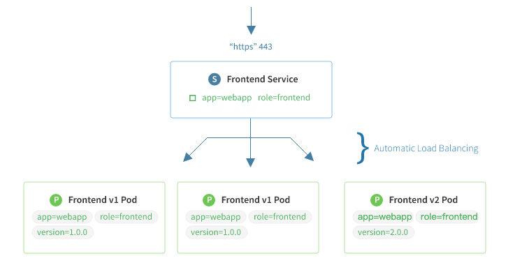
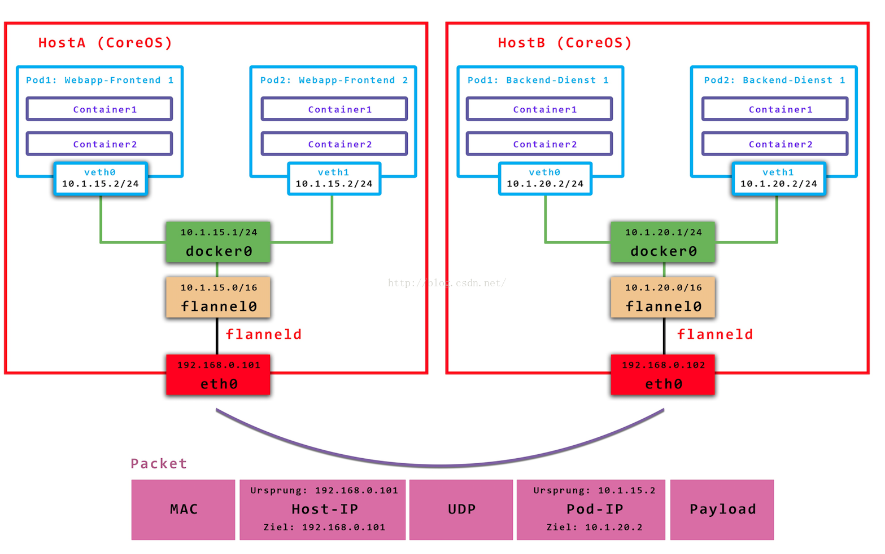
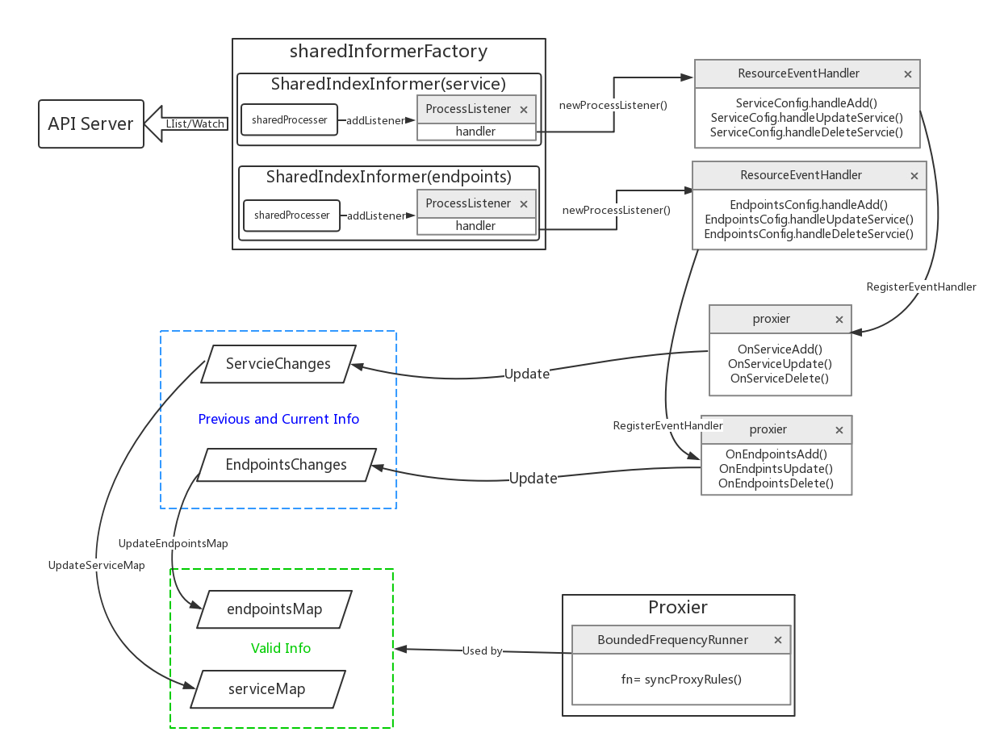
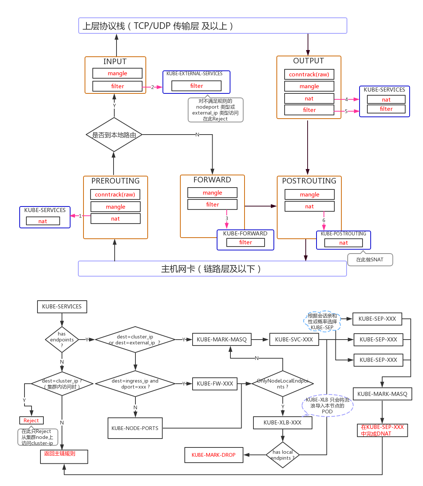

# 功能简介

kube-proxy 运行在 kubernetes 集群中每个 worker 节点上，负责实现 service 这个概念提供的功能。kube-proxy 会把访问 service VIP 的请求转发到运行的 pods 上，实现负载均衡。

当用户创建 service 的时候，endpointController 会根据 service 的 selector 找到对应的 pod，然后生成 endpoints 对象保存到 etcd 中。kube-proxy 的主要工作就是监听 etcd（通过 apiserver 的接口，而不是直接读取 etcd），来实时更新节点上的 iptables。

service 有关的信息保存在 etcd 的 /registry/services 目录，比如在我的集群中，这个目录的内容是这样的：

```
~]$ etcdctl ls --recursive  /registry/services
/registry/services/endpoints
/registry/services/endpoints/default
/registry/services/endpoints/default/whoami
/registry/services/endpoints/default/kubernetes
/registry/services/endpoints/kube-system
/registry/services/endpoints/kube-system/kube-controller-manager
/registry/services/endpoints/kube-system/container-log
/registry/services/endpoints/kube-system/container-terminal
/registry/services/endpoints/kube-system/kube-scheduler
/registry/services/endpoints/kube-system/kube-dns
/registry/services/specs
/registry/services/specs/default
/registry/services/specs/default/kubernetes
/registry/services/specs/default/whoami
/registry/services/specs/kube-system
/registry/services/specs/kube-system/kube-dns
/registry/services/specs/kube-system/container-log
/registry/services/specs/kube-system/container-terminal
```


# 架构

kube proxy是部署在 node 上的为应用容器提供代理转发的功能，


在Kubernetes中，kube proxy负责为Pod创建代理服务；引到访问至服务；并实现服务到Pod的路由和转发，以及通过应用的负载均衡。


# service 和 kube-proxy 原理

在 kubernetes 集群中，网络是非常基础也非常重要的一部分。对于大规模的节点和容器来说，要保证网络的连通性、网络转发的高效，同时能做的 ip 和 port 自动化分配和管理，并让用户用直观简单的方式来访问需要的应用，这是需要复杂且细致设计的。

kubernetes 在这方面下了很大的功夫，它通过 service、dns、ingress 等概念，解决了服务发现、负载均衡的问题，也大大简化了用户的使用和配置。

## 跨主机网络配置：flannel

一直以来，kubernetes 并没有专门的网络模块负责网络配置，它需要用户在主机上已经配置好网络。kubernetes 对网络的要求是：容器之间（包括同一台主机上的容器，和不同主机的容器）可以互相通信，容器和集群中所有的节点也能直接通信。

至于具体的网络方案，用户可以自己选择，目前使用比较多的是 flannel，因为它比较简单，而且刚好满足 kubernetes 对网络的要求。我们会使用 flannel vxlan 模式，具体的配置我在博客之前有文章介绍过，这里不再赘述。

以后 kubernetes 网络的发展方向是希望通过插件的方式来集成不同的网络方案， CNI 就是这一努力的结果，flannel 也能够通过 CNI 插件的形式使用。


## kube-proxy 和 service
配置好网络之后，集群是什么情况呢？我们可以创建 pod，也能通过 ReplicationController 来创建特定副本的 pod（这是更推荐也是生产上要使用的方法，即使某个 rc 中只有一个 pod 实例）。可以从集群中获取每个 pod ip 地址，然后也能在集群内部直接通过 podIP:Port 来获取对应的服务。

但是还有一个问题：pod 是经常变化的，每次更新 ip 地址都可能会发生变化，如果直接访问容器 ip 的话，会有很大的问题。而且进行扩展的时候，rc 中会有新的 pod 创建出来，出现新的 ip 地址，我们需要一种更灵活的方式来访问 pod 的服务。

### Service 和 cluster IP

针对这个问题，kubernetes 的解决方案是“服务”（service），每个服务都一个固定的虚拟 ip（这个 ip 也被称为 cluster IP），自动并且动态地绑定后面的 pod，所有的网络请求直接访问服务 ip，服务会自动向后端做转发。Service 除了提供稳定的对外访问方式之外，还能起到负载均衡（Load Balance）的功能，自动把请求流量分布到后端所有的服务上，服务可以做到对客户透明地进行水平扩展（scale）。



而实现 service 这一功能的关键，就是 kube-proxy。kube-proxy 运行在每个节点上，监听 API Server 中服务对象的变化，通过管理 iptables 来实现网络的转发。

### 实例启动和测试
我们可以在终端上启动 kube-proxy，也可以使用诸如 systemd 这样的工具来管理它，比如下面就是一个简单的 kube-proxy.service 配置文件


```shell
[root@localhost]# cat /usr/lib/systemd/system/kube-proxy.service
[Unit]
Description=Kubernetes Proxy Service
Documentation=http://kubernetes.com
After=network.target
Wants=network.target

[Service]
Type=simple
EnvironmentFile=-/etc/sysconfig/kube-proxy
ExecStart=/usr/bin/kube-proxy \
    --master=http://172.17.8.100:8080 \
    --v=4 \
    --proxy-mode=iptables
TimeoutStartSec=0
Restart=on-abnormal

[Install]
WantedBy=multi-user.target
```

为了方便测试，我们创建一个 rc，里面有三个 pod。这个 pod 运行的是 cizixs/whoami 容器，它是一个简单的 HTTP 服务器，监听在 3000 端口，访问它会返回容器的 hostname。

```shell
[root@localhost ~]# cat whoami-rc.yml
apiVersion: v1
kind: ReplicationController
metadata:
  name: whoami
spec:
  replicas: 3
  selector:
    app: whoami
  template:
    metadata:
      name: whoami
      labels:
        app: whoami
        env: dev
    spec:
      containers:
      - name: whoami
        image: cizixs/whoami:v0.5
        ports:
        - containerPort: 3000
        env:
          - name: MESSAGE
            value: viola
```

我们为每个 pod 设置了两个 label：app=whoami 和 env=dev，这两个标签很重要，也是后面服务进行绑定 pod 的关键。

为了使用 service，我们还要定义另外一个文件，并通过 kubectl create -f ./whoami-svc.yml 来创建出来对象：

```yaml
apiVersion: v1
kind: Service
metadata:
  labels:
    name: whoami
  name: whoami
spec:
  ports:
    - port: 3000
      targetPort: 3000
      protocol: TCP
  selector:
    app: whoami
    env: dev
```

其中 selector 告诉 kubernetes 这个 service 和后端哪些 pod 绑定在一起，这里包含的键值对会对所有 pod 的 labels 进行匹配，只要完全匹配，service 就会把 pod 作为后端。也就是说，service 和 rc 并不是对应的关系，一个 service 可能会使用多个 rc 管理的 pod 作为后端应用。

ports 字段指定服务的端口信息：

- port：虚拟 ip 要绑定的 port，每个 service 会创建出来一个虚拟 ip，通过访问 vip:port 就能获取服务的内容。这个 port 可以用户随机选取，因为每个服务都有自己的 vip，也不用担心冲突的情况
- targetPort：pod 中暴露出来的 port，这是运行的容器中具体暴露出来的端口，一定不能写错
- protocol：提供服务的协议类型，可以是 TCP 或者 UDP

创建之后可以列出 service ，发现我们创建的 service 已经分配了一个虚拟 ip (10.10.10.28)，这个虚拟 ip 地址是不会变化的（除非 service 被删除）。查看 service 的详情可以看到它的 endpoints 列出，对应了具体提供服务的 pod 地址和端口。

```
[root@localhost ~]# kubectl get svc
NAME         CLUSTER-IP    EXTERNAL-IP   PORT(S)    AGE
kubernetes   10.10.10.1    <none>        443/TCP    19d
whoami       10.10.10.28   <none>        3000/TCP   1d

[root@localhost ~]# kubectl describe svc whoami
Name:                   whoami
Namespace:              default
Labels:                 name=whoami
Selector:               app=whoami
Type:                   ClusterIP
IP:                     10.10.10.28
Port:                   <unset> 3000/TCP
Endpoints:              10.11.32.6:3000,10.13.192.4:3000,10.16.192.3:3000
Session Affinity:       None
No events.
```

默认的 service 类型是 ClusterIP，这个也可以从上面输出看出来。在这种情况下，只能从集群内部访问这个 IP，不能直接从集群外部访问服务。如果想对外提供服务，我们后面会讲解决方案。

测试一下，访问 service 服务的时候可以看到它会随机地访问后端的 pod，给出不同的返回：

```shell
[root@localhost ~]# curl http://10.10.10.28:3000
viola from whoami-8fpqp
[root@localhost ~]# curl http://10.10.10.28:3000
viola from whoami-c0x6h
[root@localhost ~]# curl http://10.10.10.28:3000
viola from whoami-8fpqp
[root@localhost ~]# curl http://10.10.10.28:3000
viola from whoami-dc9ds
```

默认情况下，服务会随机转发到可用的后端。如果希望保持会话（同一个 client 永远都转发到相同的 pod），可以把 service.spec.sessionAffinity 设置为 ClientIP。

**NOTE**: 需要注意的是，服务分配的 cluster IP 是一个虚拟 ip，如果你尝试 ping 这个 IP 会发现它没有任何响应，这也是刚接触 kubernetes service 的人经常会犯的错误。实际上，这个虚拟 IP 只有和它的 port 一起的时候才有作用，直接访问它，或者想访问该 IP 的其他端口都是徒劳。


### 外部能够访问的服务

上面创建的服务只能在集群内部访问，这在生产环境中还不能直接使用。如果希望有一个能直接对外使用的服务，可以使用 NodePort 或者 LoadBalancer 类型的 Service。我们先说说 NodePort ，它的意思是在所有 worker 节点上暴露一个端口，这样外部可以直接通过访问 nodeIP:Port 来访问应用。

我们先把刚才创建的服务删除：

```shell
[root@localhost ~]# kubectl delete rc whoami
replicationcontroller "whoami" deleted

[root@localhost ~]# kubectl delete svc whoami
service "whoami" deleted

[root@localhost ~]# kubectl get pods,svc,rc
NAME         CLUSTER-IP   EXTERNAL-IP   PORT(S)   AGE
kubernetes   10.10.10.1   <none>        443/TCP   14h
```

对我们原来的 Service 配置文件进行修改，把 spec.type 写成 NodePort 类型：

```shell
[root@localhost ~]# cat whoami-svc.yml
apiVersion: v1
kind: Service
metadata:
  labels:
    name: whoami
  name: whoami
spec:
  ports:
    - port: 3000
      protocol: TCP
      # nodePort: 31000
  selector:
    app: whoami
  type: NodePort
```

因为我们的应用比较简单，只有一个端口。如果 pod 有多个端口，也可以在 spec.ports中继续添加，只有保证多个 port 之间不冲突就行。

重新创建 rc 和 svc：

```shell
[root@localhost ~]# kubectl create -f ./whoami-svc.yml
service "whoami" created
[root@localhost ~]# kubectl get rc,pods,svc
NAME        DESIRED   CURRENT   READY     AGE
rc/whoami   3         3         3         10s

NAME              READY     STATUS    RESTARTS   AGE
po/whoami-8zc3d   1/1       Running   0          10s
po/whoami-mc2fg   1/1       Running   0          10s
po/whoami-z6skj   1/1       Running   0          10s

NAME             CLUSTER-IP     EXTERNAL-IP   PORT(S)          AGE
svc/kubernetes   10.10.10.1     <none>        443/TCP          14h
svc/whoami       10.10.10.163   <nodes>       3000:31647/TCP   7s
```

需要注意的是，因为我们没有指定 nodePort 的值，kubernetes 会自动给我们分配一个，比如这里的 31647（默认的取值范围是 30000-32767）。当然我们也可以删除配置中 # nodePort: 31000 的注释，这样会使用 31000 端口。

nodePort 类型的服务会在所有的 worker 节点（运行了 kube-proxy）上统一暴露出端口对外提供服务，也就是说外部可以任意选择一个节点进行访问。比如我本地集群有三个节点：172.17.8.100、172.17.8.101 和 172.17.8.102：

```
[root@localhost ~]# curl http://172.17.8.100:31647
viola from whoami-mc2fg
[root@localhost ~]# curl http://172.17.8.101:31647
viola from whoami-8zc3d
[root@localhost ~]# curl http://172.17.8.102:31647
viola from whoami-z6skj
```

有了 nodePort，用户可以通过外部的 Load Balance 或者路由器把流量转发到任意的节点，对外提供服务的同时，也可以做到负载均衡的效果。

nodePort 类型的服务并不影响原来虚拟 IP 的访问方式，内部节点依然可以通过 vip:port 的方式进行访问。

LoadBalancer 类型的服务需要公有云支持，如果你的集群部署在公有云（GCE、AWS等）可以考虑这种方式。

## service 原理解析 (iptables)

目前 kube-proxy 默认使用 iptables 模式，上述展现的 service 功能都是通过修改 iptables 实现的。

我们来看一下从主机上访问 service:port 的时候发生了什么（通过 iptables-save 命令打印出来当前机器上的 iptables 规则）。

所有发送出去的报文会进入 KUBE-SERVICES 进行处理

```
*nat
-A PREROUTING -m comment --comment "kubernetes service portals" -j KUBE-SERVICES
-A OUTPUT -m comment --comment "kubernetes service portals" -j KUBE-SERVICES
-A POSTROUTING -m comment --comment "kubernetes postrouting rules" -j KUBE-POSTROUTING
-A KUBE-MARK-MASQ -j MARK --set-xmark 0x4000/0x4000
```

KUBE-SERVICES 每条规则对应了一个 service，它告诉继续进入到某个具体的 service chain 进行处理，比如这里的 KUBE-SVC-OQCLJJ5GLLNFY3XB

```
-A KUBE-SERVICES -d 10.10.10.28/32 -p tcp -m comment --comment "default/whoami: cluster IP" -m tcp --dport 3000 -j KUBE-SVC-OQCLJJ5GLLNFY3XB
```

更具体的 chain 中定义了怎么转发到对应 endpoint 的规则，比如我们的 rc 有三个 pods，这里也就会生成三个规则。这里利用了 iptables 随机和概率转发的功能

```
-A KUBE-SVC-OQCLJJ5GLLNFY3XB -m comment --comment "default/whoami:" -m statistic --mode random --probability 0.33332999982 -j KUBE-SEP-VN72UHNM6XOXLRPW
-A KUBE-SVC-OQCLJJ5GLLNFY3XB -m comment --comment "default/whoami:" -m statistic --mode random --probability 0.50000000000 -j KUBE-SEP-YXCSPWPTUFI5WI5Y
-A KUBE-SVC-OQCLJJ5GLLNFY3XB -m comment --comment "default/whoami:" -j KUBE-SEP-FN74S3YUBFMWHBLF
```

我们来看第一个 chain，这个 chain 有两个规则，第一个表示给报文打上 mark；第二个是进行 DNAT（修改报文的目的地址），转发到某个 pod 地址和端口。

```
-A KUBE-SEP-VN72UHNM6XOXLRPW -s 10.11.32.6/32 -m comment --comment "default/whoami:" -j KUBE-MARK-MASQ
-A KUBE-SEP-VN72UHNM6XOXLRPW -p tcp -m comment --comment "default/whoami:" -m tcp -j DNAT --to-destination 10.11.32.6:3000
```

会匹配 chain 的第二条规则，因为地址是发送出去的，报文会根据路由规则进行处理，后续的报文就是通过 flannel 的网络路径发送出去的。

nodePort 类型的 service 原理也是类似的，在 KUBE-SERVICES chain 的最后，如果目标地址不是 VIP 则会通过 KUBE-NODEPORTS ：

```
Chain KUBE-SERVICES (2 references)
 pkts bytes target     prot opt in     out     source               destination
    0     0 KUBE-NODEPORTS  all  --  *      *       0.0.0.0/0            0.0.0.0/0            /* kubernetes service nodeports; NOTE: this must be the last rule in this chain */ ADDRTYPE match dst-type LOCAL
```

而 KUBE-NODEPORTS chain 和 KUBE-SERVICES chain 其他规则一样，都是转发到更具体的 service chain，然后转发到某个 pod 上面。

```
-A KUBE-NODEPORTS -p tcp -m comment --comment "default/whoami:" -m tcp --dport 31647 -j KUBE-MARK-MASQ
-A KUBE-NODEPORTS -p tcp -m comment --comment "default/whoami:" -m tcp --dport 31647 -j KUBE-SVC-OQCLJJ5GLLNFY3XB
```

**注意**：在流量转发出去的时候，就已经选择好了目的 Pod:TargetPod，而源IP是 node 的ip。


## 不足之处

看起来 service 是个完美的方案，可以解决服务访问的所有问题，但是 service 这个方案（iptables 模式）也有自己的缺点。

首先，如果转发的 pod 不能正常提供服务，它不会自动尝试另一个 pod，当然这个可以通过 readiness probes 来解决。每个 pod 都有一个健康检查的机制，当有 pod 健康状况有问题时，kube-proxy 会删除对应的转发规则。

另外，nodePort 类型的服务也无法添加 TLS 或者更复杂的报文路由机制。

proxy 的 iptables mode因为使用iptable NAT来完成转发，也存在不可忽视的性能损耗。另外，如果集群中存在上万的Service/Endpoint，那么Node上的iptables rules将会非常庞大，性能还会再打折扣。

这也导致，目前大部分企业用k8s上生产时，都不会直接用kube-proxy作为服务代理，而是通过自己开发或者通过Ingress Controller来集成HAProxy, Nginx来代替kube-proxy。

# 代码阅读

## 重要结构体说明

本文以iptables 代理模式为例,对proxy 的功能实现进行分析。基于iptables的kube-proxy的主要职责包括两大块：一块是侦听service更新事件，并更新service相关的iptables规则，一块是侦听endpoint更新事件，更新endpoint相关的iptables规则。也就是说kube-proxy只是作为controller 负责更新更新规则，实现转发服务的是内核的netfilter，体现在用户态则是iptables。

### ProxyServer

```go
type ProxyServer struct {
    // k8s client
    Client                 clientset.Interface
    EventClient            v1core.EventsGetter

	// 接口中定义了更新iptables 的方法集合，如DeleteChian,DeleteRule, EnsureChain,EnsureRule
    IptInterface           utiliptables.Interface
    IpvsInterface          utilipvs.Interface
    IpsetInterface         utilipset.Interface

	// 定义包装os/exec库中Command, Commandcontext, LookPath方法的接口
	execer                 exec.Interface
    // 处理同步时的处理器，有三种模式
    Proxier                proxy.ProxyProvider

	//接受Event，交于各个处理函数进行处理
	Broadcaster            record.EventBroadcaster

    // 代理模式，ipvs iptables userspace kernelspace(windows)四种
    ProxyMode              string
    // 配置同步周期
    ConfigSyncPeriod       time.Duration

    // service 与 endpoint 事件处理器
    ServiceEventHandler    config.ServiceHandler
    EndpointsEventHandler  config.EndpointsHandler
}
```

### Proxier

在每一种代理模式下，都定义了自己的Proxier 结构体，该结构体及方法实现了该模式下的代理规则的更新方法。在Iptables 模式下，Proxier 结构体定义如下：

```go
type Proxier struct {
    //EndpointChangeTracker中items属性为一个两级map,用来保存所有namespace 下endpoints 的变化信息。
    //第一级map以namespece 为key，value 值为该namespace下所有endpoints 更新前（previous)、后(current)的信息。
    //前、后信息分别为一个map ,即第二级map: ServiceMap。
    //第二级map的key为ServicePortName 结构，标记endpoints 对应的service，value为endpoint信息。
    // EndpointChangeTracker 中实现了更新endpoint 的方法
    endpointsChanges *proxy.EndpointChangeTracker

    // 同理，ServiceChangeTracker 中使用一个两级map保存所有namespace 下的service的变化信息，并定义了更新service的方法
    serviceChanges   *proxy.ServiceChangeTracker

    mu           sync.Mutex // protects the following fields

    serviceMap   proxy.ServiceMap // 同serviceChanges 的第二及map 结构，记录了所有namespace下需要更新iptables规则的service
    endpointsMap proxy.EndpointsMap //同endpointsChanges 的第二及map 结构，记录了所有namespace 需要更新iptables规则的endpoints

    portsMap     map[utilproxy.LocalPort]utilproxy.Closeable

    endpointsSynced bool  // Proxier 初始化时为False
    servicesSynced  bool // Proxier 初始化时为False
    initialized     int32

    syncRunner      *async.BoundedFrequencyRunner //async.BoundedFrequencyRunner 具有QPS功能，控制被托管方法的发生速率

    // These are effectively const and do not need the mutex to be held.
    iptables       utiliptables.Interface //iptables的执行器，定义了Iptables 的操作方法
    masqueradeAll  bool
    masqueradeMark string
    exec           utilexec.Interface // 抽象了 os/exec 中的方法
    clusterCIDR    string
    hostname       string
    nodeIP         net.IP
    portMapper     utilproxy.PortOpener //以打开的UDP或TCP端口
    recorder       record.EventRecorder
    healthChecker  healthcheck.Server
    healthzServer  healthcheck.HealthzUpdater

    precomputedProbabilities []string

    iptablesData             *bytes.Buffer
    existingFilterChainsData *bytes.Buffer
    filterChains             *bytes.Buffer
    filterRules              *bytes.Buffer
    natChains                *bytes.Buffer
    natRules                 *bytes.Buffer

    endpointChainsNumber int

    // Values are as a parameter to select the interfaces where nodeport works.
    nodePortAddresses []string
    // networkInterfacer defines an interface for several net library functions.
    // Inject for test purpose.
    networkInterfacer utilproxy.NetworkInterfacer
}
```


## Proxier 自定义的链
在iptables 原有的5个链上，k8s 又增加了以下自定义链，在自定义链上添加规则，以控制iptables 对k8s 数据包的转发。

```go
const (
    iptablesMinVersion = utiliptables.MinCheckVersion // 支持-C/--flag 参数的iptable 最低版本
    //对于Service type=ClusterIP的每个端口都会在KUBE-SERVICES中有一条对应的规则
    kubeServicesChain utiliptables.Chain = "KUBE-SERVICES"

    //
    kubeExternalServicesChain utiliptables.Chain="KUBE-EXTERNAL-SERVICES"

    //对于Service type=NodePort的每个端口都会在KUBE-NODEPORTS中有一条对应的规则
    kubeNodePortsChain utiliptables.Chain = "KUBE-NODEPORTS"

    //在KUBE-POSTROUTING链上，对(0x400)包做SNAT
    kubePostroutingChain utiliptables.Chain = "KUBE-POSTROUTING"

    //打标签链，对于进入此链的报文打标签(0x400)，预示被标签包要做NAT
    KubeMarkMasqChain utiliptables.Chain = "KUBE-MARK-MASQ"

    //打标签链，对于进入此链的报文打标签(0x800)，预示此包将要被放弃
    KubeMarkDropChain utiliptables.Chain = "KUBE-MARK-DROP"

    //跳转
    kubeForwardChain utiliptables.Chain = "KUBE-FORWARD"
)
```

## Proxy Server 启动

穿过cobra.Command 包装的一个启动命令，走到跟kube-proxy 服务相关的一个代码入口 Run()。在Run()中，主要就是两件事：

1. 生成一个ProxyServer 实例；

2. 运行ProxyServer 实例的Run 方法，运行服务。

kubernetes/cmd/kube-proxy/app/server.go

```go
func (o *Options) Run() error {
    if len(o.WriteConfigTo) > 0 {
        return o.writeConfigFile()
    }

    proxyServer, err := NewProxyServer(o)  //初始化结构体ProxyServer
    if err != nil {
        return err
    }

    return proxyServer.Run() // 运行ProxyServer
}
```

## ProxyServer 初始化

进入NewProxyServer(o) 方法，开始ProxyServer 的初始化过程初始化过程中，重要的一个环节就是根据不同的代理模式生成不通的Proxier。初始化过程中，主要变量的初始化及作用已在代码中说明。

```go
cmd/kube-proxy/app/server_others.go
func newProxyServer(
    config *proxyconfigapi.KubeProxyConfiguration,
    cleanupAndExit bool,
    cleanupIPVS bool,
    scheme *runtime.Scheme,
    master string) (*ProxyServer, error) {
    ...
    protocol := utiliptables.ProtocolIpv4 // 获取机器使用的IP协议版本，默认使用IPV4
    ...
    // Create a iptables utils.
    execer := exec.New()  // 包装了os/exec中的command,LookPath,CommandContext 方法，组装一个系统调用的命令和参数
    dbus = utildbus.New()
    //iptInterface 赋值为runner结构体，该结构体实现了接口utiliptables.Interface中定义的方法，
    //各方法中通过runContext()方法调用execer的命令包装方法返回一个被包装的iptables 命令
    iptInterface = utiliptables.New(execer, dbus, protocol)
    ...
    //EventBroadcaster会将收到的Event交于各个处理函数进行处理。接收Event的缓冲队列长为1000，不停地取走Event并广播给各个watcher;
    //watcher通过recordEvent()方法将Event写入对应的EventSink里，最大重试次数为12次，重试间隔随机生成(见staging/src/k8s.io/client-go/tools/record/event.go);
    // EnventSink  将在ProxyServer.Run() 中调用s.Broadcaster.StartRecordingToSink（） 传进来;
    // NewBroadcaster() 最后会启动一个goroutine 运行Loop 方法（staging/src/k8s.io/apimachinery/pkg/watch/mux.go),
    eventBroadcaster := record.NewBroadcaster()

    //EventRecorder通过generateEvent()实际生成各种Event，并将其添加到监视队列。
    recorder := eventBroadcaster.NewRecorder(scheme, v1.EventSource{Component: "kube-proxy", Host: hostname})
    ...
    if len(config.HealthzBindAddress) > 0 {//服务健康检查的 IP 地址和端口（IPv4默认为0.0.0.0:10256，对于所有 IPv6 接口设置为 ::）
        healthzServer = healthcheck.NewDefaultHealthzServer(config.HealthzBindAddress, 2*config.IPTables.SyncPeriod.Duration, recorder, nodeRef)
        healthzUpdater = healthzServer
    }
    ...
    proxyMode := getProxyMode(string(config.Mode), iptInterface, kernelHandler, ipsetInterface, iptables.LinuxKernelCompatTester{})
    ...
    if proxyMode == proxyModeIPTables {
        klog.V(0).Info("Using iptables Proxier.")
        if config.IPTables.MasqueradeBit == nil {
            // MasqueradeBit must be specified or defaulted.
            return nil, fmt.Errorf("unable to read IPTables MasqueradeBit from config")
        }

        // 返回一个Proxier 结构体实例
        proxierIPTables, err := iptables.NewProxier(...) //参数略
        if err != nil {
            return nil, fmt.Errorf("unable to create proxier: %v", err)
        }
        metrics.RegisterMetrics()
        proxier = proxierIPTables
        // Iptables Proxier 实现了 ServiceHandler 和 EndpointsHandler 的接口。
        serviceEventHandler = proxierIPTables
        endpointsEventHandler = proxierIPTables

        userspace.CleanupLeftovers(iptInterface)// 无条件强制清除之前userspace 模式的规则

        // 因为无法区分iptables 规则是否由IPVS 代理生成，因此由用户根据实际情况决定是否调用ipvs.CleanupLeftovers()
        if canUseIPVS {
            ipvs.CleanupLeftovers(ipvsInterface, iptInterface, ipsetInterface, cleanupIPVS)
        }
    } else if proxyMode == proxyModeIPVS {// 初始化IPVS Proxier

    } else { // 初始化 userspace Proxier

    }

    iptInterface.AddReloadFunc(proxier.Sync)

    return &ProxyServer{ // 赋值过程略
    ...
    }, nil
}
```

## Proxier 初始化

```go
// kubernetes/pkg/proxy/iptables/proxier.go

func NewProxier(...) (*Proxier, error) { //参数略
    ...
    //kube-proxy要求NODE节点操作系统中有/sys/module/br_netfilter模块，还要设置bridge-nf-call-iptables=1；
    //如果不满足要求，kube-proxy在运行过程中设置的某些iptables规则就不会工作。
    if val, err := sysctl.GetSysctl(sysctlBridgeCallIPTables); err == nil && val != 1 {
        klog.Warning("missing br-netfilter module or unset sysctl br-nf-call-iptables; proxy may not work as intended")
    }

    // Generate the masquerade mark to use for SNAT rules.
    masqueradeValue := 1 << uint(masqueradeBit) //masqueradeBit: Default 14
    // 输出一个8位16进制数值 ，默认即0x00004000/0x00004000,用来标记k8s管理的报文。
    //标记 0x4000的报文（即POD发出的报文)，在离开Node（物理机）的时候需要进行SNAT转换。
    masqueradeMark := fmt.Sprintf("%#08x/%#08x", masqueradeValue, masqueradeValue)

    healthChecker := healthcheck.NewServer(hostname, recorder, nil, nil) // use default implementations of deps

    isIPv6 := ipt.IsIpv6()
    proxier := &Proxier{
        portsMap:                 make(map[utilproxy.LocalPort]utilproxy.Closeable),
        serviceMap:               make(proxy.ServiceMap),
		...
        networkInterfacer:        utilproxy.RealNetwork{},
    }
    burstSyncs := 2
    ...
    //Default: syncPeriod=30s (--iptables-sync-period duration)，将proxier.syncProxyRules 托管至BoundedFrequencyRunner 结构体，
    //BoundedFrequencyRunner 中含有一个Limiter ，该Limiter 采用"桶令牌" 限流算法控制proxier.syncProxyRules 方法运行的频率。
    //minSyncPeriod=0 时，无速率限制。限流时，桶类初始令牌数量为burstSyncs。
    proxier.syncRunner = async.NewBoundedFrequencyRunner("sync-runner", proxier.syncProxyRules, minSyncPeriod, syncPeriod, burstSyncs)
    return proxier, nil
}
```

## 注册ResourceHandler


ProxyServer 及Proxier 这两个重要的结构体初始化完成以后，就进入了proxyServer.Run() 方法。在Run() 方法中，大致做了如下工作：

1. 准备工作，如设置OOMScoreAdj, 注册service 和endpoints 的处理方法

2. 使用list-watch 机制对service，endpoints资源监听。

3. 最后进入一个无限循环，对service与endpoints的变化进行iptables规则的同步。

在Run方法中，主要关注一下对service 和endpoints资源变化的处理方法的注册过程。

```go
// cmd/kube-proxy/app/server.go

func (s *ProxyServer) Run() error {
    ...

    //在用户空间通过写oomScoreAdj参数到/proc/self/oom_score_adj文件来改变进程的 oom_adj 内核参数；
    //oom_adj的值的大小决定了进程被 OOM killer，取值范围[-1000,1000] 选中杀掉的概率,值越低越不容易被杀死.此处默认值是-999。
    if s.OOMScoreAdj != nil {
        oomAdjuster = oom.NewOOMAdjuster()
        if err := oomAdjuster.ApplyOOMScoreAdj(0, int(*s.OOMScoreAdj)); err != nil {
            klog.V(2).Info(err)
        }
    }

    if len(s.ResourceContainer) != 0 {
        ...
        //
        resourcecontainer.RunInResourceContainer(s.ResourceContainer);
        ...
    }

    if s.Broadcaster != nil && s.EventClient != nil {
        // EventSinkImpl 包装了处理event 的方法create ,update, patchs
        //s.Broadcaster 已经在ProxyServer 初始化中作为一个goroutine 在运行。
        s.Broadcaster.StartRecordingToSink(&v1core.EventSinkImpl{Interface: s.EventClient.Events("")})
    }

    // Start up a healthz server if requested
    if s.HealthzServer != nil {
        s.HealthzServer.Run()
    }

    // Start up a metrics server if requested
    if len(s.MetricsBindAddress) > 0 {
    ...
    }

    // Tune conntrack, if requested
    // Conntracker is always nil for windows
    if s.Conntracker != nil {
        max, err := getConntrackMax(s.ConntrackConfiguration)
        ...
    }
    // Default: s.ConfigSyncPeriod =15m (--config-sync-period)
    //返回一个sharedInformerFactory结构体实例(staing/src/k8s.io/client-go/informers/factory.go)
    informerFactory := informers.NewSharedInformerFactory(s.Client, s.ConfigSyncPeriod)


    //ServiceConfig结构体跟踪记录Service配置信息的变化
    //informerFactory.Core().V1().Services() 返回一个 serviceInformer 结构体引用(staing/src/k8s.io/client-go/informers/core/v1/service.go
    serviceConfig := config.NewServiceConfig(informerFactory.Core().V1().Services(), s.ConfigSyncPeriod)

    //RegisterEventHandler 是将Service的处理方法追加到serviceConfig的eventHandlers 中，eventHandlers为一个列表，元素类型ServiceHandler接口
    // ServiceHandler接口定义了每个hanlder 处理service的api方法:OnServiceAdd,OnServiceUpdate,OnServiceDelete,OnServiceSynced
    // 此处s.ServiceEventHandler 为proxier，proxier实现了ServiceHandler接口定义的方法
    //serviceConfig 中的handleAddService,handleUpdateService,handleDeleteService 将会调用每个eventHandler的OnServiceAdd等方法
    serviceConfig.RegisterEventHandler(s.ServiceEventHandler)
    go serviceConfig.Run(wait.NeverStop)  //初始化同步service,调用了一次proxier.syncProxyRules()

    endpointsConfig := config.NewEndpointsConfig(informerFactory.Core().V1().Endpoints(), s.ConfigSyncPeriod)
    endpointsConfig.RegisterEventHandler(s.EndpointsEventHandler)
    go endpointsConfig.Run(wait.NeverStop)

    // This has to start after the calls to NewServiceConfig and NewEndpointsConfig because those
    // functions must configure their shared informer event handlers first.
    go informerFactory.Start(wait.NeverStop)

    // Birth Cry after the birth is successful
    s.birthCry()

    // Just loop forever for now...
    s.Proxier.SyncLoop()
    return nil
}
```

ServiceConfig 来跟踪 service 配置变化，通过 chan 接收到 `set`、`add`、`remove`的操作，然后调用相应的注册的 ServiceHandler。

```go
type ServiceConfig struct {
	lister        listers.ServiceLister
	listerSynced  cache.InformerSynced
	eventHandlers []ServiceHandler
}
```


上面以注释的方式描述了proxier中service处理方法的被调用流程：通过serviceConfig.RegisterEventHandler()方法实现了在serviceConfig中的handleAddService()等方法中调用proxier中的OnServiceAdd()等对应的方法。那么serviceConfig.handleAddService()等方法是在哪里以及何时被调用的呢？再次回看serviceConfig的实例化方法 NewServiceConfig() 挖掘handleAddService()的被调用处。

```go
// pkg/proxy/config/config.go

func NewServiceConfig(serviceInformer coreinformers.ServiceInformer, resyncPeriod time.Duration) *ServiceConfig {
    result := &ServiceConfig{
        lister:       serviceInformer.Lister(),
        listerSynced: serviceInformer.Informer().HasSynced,
    }
    //结构体cache.ResourceEventHandlerFuncs 是一个ResourceEventHandler接口类型(staing/src/k8s.io/client-go/tools/cache/controller.go)
    //将ServicConfig 结构体的handleAddService 等方法赋予了cache.ResourceEventHandlerFuncs,实现一个ResourceEventHandler实例
    //serviceInformer.Informer() 返回一个sharedIndexInformer 实例(staing/src/k8s.io/client-go/tools/cache/shared_informer.go)
    //通过AddEventHandlerWithResyncPeriod() 方法，将ResourceEventHandler实例赋值给processorListener结构体的handler属性
    serviceInformer.Informer().AddEventHandlerWithResyncPeriod(
        cache.ResourceEventHandlerFuncs{
            AddFunc:    result.handleAddService,
            UpdateFunc: result.handleUpdateService,
            DeleteFunc: result.handleDeleteService,
        },
        resyncPeriod,
    )
    return result
}
```

看完上面的注释，大概就明白了proxier 中的OnServiceAdd() 等法法的调用流程 在上边代码serviceInformer.Informer()返回之前，还将调用InformerFor()方法给informerFactory的informers属性赋值f.informers[informerType] = informer, 此行代码的意义可理解为：从api server 监听到 informerType类型资源变化的处理者记录(映射)为informer。此处的资源类型即为service, informer 便为sharedIndexInformer。

```go
func (c *ServiceConfig) handleAddService(obj interface{}) {
	service, ok := obj.(*v1.Service)
	...
	for i := range c.eventHandlers {
		klog.V(4).Info("Calling handler.OnServiceAdd")
		c.eventHandlers[i].OnServiceAdd(service)
	}
}
```

在调用 handleAddService() 中遍历调用 eventHandlers 的 OnServiceAdd() 方法


具体的调用时机和最上层方法入口还要从informerFactory这个东西说起，这又是k8s 中另一个比较系统的公共组件的实现原理了，即client-go的SharedInformer。


```
pkg/proxy/apis/config/register.go
const GroupName = "kubeproxy.config.k8s.io"
```

> 这个用途是什么？


## 记录资源变化

上面介绍了ResourceHandler 的注册及被调用过程。 Proxier 实现了 services 和 endpoints 事件各种最终的观察者，最终的事件触发都会在 proxier 中进行处理。对于通过监听 API Server 变化的信息，通过调用ResourceHandler将变化的信息保存到 endpointsChanges 和 serviceChanges。那么一个ResourceHandler是如何实现的呢？service 和endpoints 的变化如何记录为servriceChanges 和endpointsChanges？回看上边源码中被注册的对象s.ServiceEventHandler，s.EndpointsEventHandler的具体实现便可明白。

service 和endpoints 的处理原则相似，以对servcie 的处理为例，看一下对service 的处理方法。

service 和endpoints 的处理原则相似，以对servcie 的处理为例，看一下对service 的处理方法。

```go
//pkg/proxy/iptables/proxier.go

func (proxier *Proxier) OnServiceAdd(service *v1.Service) {
    proxier.OnServiceUpdate(nil, service)
}

func (proxier *Proxier) OnServiceUpdate(oldService, service *v1.Service) {
    if proxier.serviceChanges.Update(oldService, service) && proxier.isInitialized() {
        proxier.syncRunner.Run() // 通过channel 发送一个信号，调用tryRun()
    }
}

func (proxier *Proxier) OnServiceDelete(service *v1.Service) {
    proxier.OnServiceUpdate(service, nil)
}
```


从上边代码中，可以看到，对service的处理方法大致分为三种：

增加一个service
删除一个service
处理一个已存在的service的变化。


其中，增加、删除service 都是给OnServiceUpdate() 传入参数后，由OnServiceUpdate() 方法处理。因此，重点看一下OnServiceUpdate()调用的update() 方法的实现。

proxy 用 ServiceChangeTracker 来记录资源的变化情况，ServiceChangeTracker 是在 NewProxier() 函数中创建的，它用了一个双重的 map，外面一层 map 如下：

```go
type ServiceChangeTracker struct {
	items map[types.NamespacedName]*serviceChange
}
```

其中每个服务用 `<namespace>/<name>` 来标识，服务的变化存储在  `serviceChange` 中。

```go
type serviceChange struct {
	previous ServiceMap
	current  ServiceMap
}
```

previous 是变化之前的状态，current 是变化之后的状态。

```go
type ServiceMap map[ServicePortName]ServicePort

// ServicePortName carries a namespace + name + portname.  This is the unique
// identifier for a load-balanced service.
type ServicePortName struct {
	types.NamespacedName
	Port string
}

// ServicePort is an interface which abstracts information about a service.
type ServicePort interface {
	// String returns service string.  An example format can be: `IP:Port/Protocol`.
	String() string
	// ClusterIPString returns service cluster IP in string format.
	ClusterIPString() string
	// GetProtocol returns service protocol.
	GetProtocol() v1.Protocol
	// GetHealthCheckNodePort returns service health check node port if present.  If return 0, it means not present.
	GetHealthCheckNodePort() int
	// GetNodePort returns a service Node port if present. If return 0, it means not present.
	GetNodePort() int
}
```

通过 ServicePort 来表示一个服务。

通过 ServiceChangeTracker.Update() 来实现服务的更新。


```go
//pkg/proxy/service.go

func (sct *ServiceChangeTracker) Update(previous, current *v1.Service) bool {
    svc := current
    if svc == nil {
        svc = previous
    }
    // previous == nil && current == nil is unexpected, we should return false directly.
    if svc == nil {
        return false
    }
    namespacedName := types.NamespacedName{Namespace: svc.Namespace, Name: svc.Name}

    sct.lock.Lock()
    defer sct.lock.Unlock()

    change, exists := sct.items[namespacedName]
    if !exists { // 在serviceChanges 中不存在一个以namespacedName 为key 的资源
        change = &serviceChange{}  // 初始化一个serviceChange
        change.previous = sct.serviceToServiceMap(previous)
        sct.items[namespacedName] = change
    }
    change.current = sct.serviceToServiceMap(current)
    // if change.previous equal to change.current, it means no change
    if reflect.DeepEqual(change.previous, change.current) { // 从update传递进来的资源没有变化，则从serviceChanges中删除。
        delete(sct.items, namespacedName)
    }
    return len(sct.items) > 0
}
```

update 方法就是根据previous ,current 参数新生成一个change 或者修改一个存在的change。并且把无变化的资源从serviceChanges 中删除。serviceChanges.items 会在将变化信息更新到proxier.serviceMap 后清空。


## 限流同步机制

在对proxy server 关心的资源变化进行了监听记录之后，最后从s.Proxier.SyncLoop()进入proxier.syncRunner.Loop()方法，由proxier.syncRunner 对托管syncProxyRules() ，syncProxyRules() 实现了修改iptables规则的具体流程。此处值得留意的是proxier.syncRunner采用“令牌桶”算法实现了限流的同步控制。


```go
func (proxier *Proxier) SyncLoop() {
	proxier.syncRunner.Loop(wait.NeverStop)
}
```


```go
//pkg/utils/async/bounded_frequency_runner.go
func (bfr *BoundedFrequencyRunner) Loop(stop <-chan struct{}) {
    klog.V(3).Infof("%s Loop running", bfr.name)
    bfr.timer.Reset(bfr.maxInterval)
    for {
        select {
        case <-stop:
            bfr.stop()
            klog.V(3).Infof("%s Loop stopping", bfr.name)
            return
        //先确认是否到了运行时机，如果可以运行，就调用syncProxyRules()，之后重新计时。
        //具体参考Timer 的实现机制
        case <-bfr.timer.C():
            bfr.tryRun()
        case <-bfr.run: //收到一个channel信号
            bfr.tryRun()
        }
    }
}
```


## 修改 Iptables 规则

介绍了资源监听、记录和同步机制，再来看一下kube-proxy是如何将资源的变化反馈到iptables规则中的。在iptables的代理模式中，syncProxyRule()方法实现了修改iptables规则的细节流程。走读分析该方法，能将明白在node节点观察到的新链及规则产生的方式及目的。

syncProxyRules()这一单个方法的代码较长（约700+ 行），具体的细节功能也多，本节将对syncProxyRules()里的代码执行流程分开介绍。

1. 更新proxier.endpointsMap，proxier.servieMap。

	proxier.serviceMap：把sercvieChanges.current 写入proxier.serviceMap，再把存在于sercvieChanges.previous 但不存在于sercvieChanges.current 的service 从 proxier.serviceMap中删除，并且删除的时候，把使用UDP协议的cluster_ip 记录于UDPStaleClusterIP 。

	proxier.endpointsMap：把endpointsChanges.previous 从proxier.endpointsMap 删除，再把endpointsChanges.current 加入proxier.endpointsMap。把存在于endpointsChanges.previous 但不存在于endpointsChanges.current 的endpoint 组装为ServiceEndpoint 结构，把该结构记录于staleEndpoints。

	​具体相关代码流程如下：

	```go
	//kubernetes/pkg/proxy/iptables/proxier.go
	func (proxier *Proxier) syncProxyRules() {
	    ...
	    serviceUpdateResult := proxy.UpdateServiceMap(proxier.serviceMap, proxier.serviceChanges)
	    endpointUpdateResult := proxy.UpdateEndpointsMap(proxier.endpointsMap, proxier.endpointsChanges)

	    staleServices := serviceUpdateResult.UDPStaleClusterIP

	    // 利用endpointUpdateResult.StaleServiceNames，再次更新 staleServices
	    for _, svcPortName := range endpointUpdateResult.StaleServiceNames {
	        if svcInfo, ok := proxier.serviceMap[svcPortName]; ok && svcInfo != nil && svcInfo.GetProtocol() == v1.ProtocolUDP {
	            klog.V(2).Infof("Stale udp service %v -> %s", svcPortName, svcInfo.ClusterIPString())
	            staleServices.Insert(svcInfo.ClusterIPString())
	        }
	    }
	    ...
	}

	//kubernetes/pkg/proxy/servcie.go
	func UpdateServiceMap(serviceMap ServiceMap, changes *ServiceChangeTracker) (result UpdateServiceMapResult) {
	    result.UDPStaleClusterIP = sets.NewString()
	    // apply 方法中，继续调用了merge，filter, umerge
	    // merge:将change.current的servicemap 信息合入proxier.servicemap中。
	    // filter:将change.previous和change.current共同存在的servicemap从将change.previous删除
	    // unmerge: 将change.previous 中使用UDP 的servicemap 从 proxier.serviceMap 中删除，并记录删除的服务IP 到UDPStaleClusterIP
	    //apply中最后重置了proxy.serviceChanges.items
	    serviceMap.apply(changes, result.UDPStaleClusterIP)

	    //HCServiceNodePorts 保存proxier.serviceMap 中所有服务的健康检查端口
	    result.HCServiceNodePorts = make(map[types.NamespacedName]uint16)
	    for svcPortName, info := range serviceMap {
	        if info.GetHealthCheckNodePort() != 0 {
	            result.HCServiceNodePorts[svcPortName.NamespacedName] = uint16(info.GetHealthCheckNodePort())
	        }
	    }
	    return result
	}

	//kubernetes/pkg/proxy/endpoints.go
	func UpdateEndpointsMap(endpointsMap EndpointsMap, changes *EndpointChangeTracker) (result UpdateEndpointMapResult) {
	    result.StaleEndpoints = make([]ServiceEndpoint, 0)
	    result.StaleServiceNames = make([]ServicePortName, 0)

	    //从proixer.endpointsMap 中删除和change.previous 相同的elelment.
	    // 将change.current 添加至proixer.endpointsMap
	    // StaleEndpoints 保存了存在于previous 但不存在current的endpoints
	    // StaleServicenames保存了一种ServicePortName,这样的ServicePortName在change.previous不存在对应的endpoints，在change.current存在endpoints。
	    // 最后重置了了proxy.endpointsChanges.items
	    endpointsMap.apply(changes, &result.StaleEndpoints, &result.StaleServiceNames)

	    // computing this incrementally similarly to endpointsMap.
	    result.HCEndpointsLocalIPSize = make(map[types.NamespacedName]int)
	    localIPs := GetLocalEndpointIPs(endpointsMap)
	    for nsn, ips := range localIPs {
	        result.HCEndpointsLocalIPSize[nsn] = len(ips)
	    }
	    return result
	}
	```

2. 在准好了更新iptables需要的资源变量后，接下来就是调用iptables 命令建立了自定义链，并在对应的内核链上引用这些自定义链。这些自定义链在k8s 服务中是必须的，不会跟随资源变化而变化，所以在更新规则之前，提前无条件生成这些链，做好准备工作，随后会在这些自定义链上创建相应的规则。

	相关代码如下：

	```go
	    for _, chain := range iptablesJumpChains {
	        if _, err := proxier.iptables.EnsureChain(chain.table, chain.chain); err != nil { //创建链
	            klog.Errorf("Failed to ensure that %s chain %s exists: %v", chain.table, kubeServicesChain, err)
	            return
	        }
	        args := append(chain.extraArgs,
	            "-m", "comment", "--comment", chain.comment,
	            "-j", string(chain.chain),
	        )
	        if _, err := proxier.iptables.EnsureRule(utiliptables.Prepend,  chain.table, chain.sourceChain, args...); err != nil { // 引用链
	            klog.Errorf("Failed to ensure that %s chain %s jumps to %s: %v", chain.table, chain.sourceChain, chain.chain, err)
	            return
	        }
	    }
	```

	上边代码完成的iptables命令如下：

	```
	iptables -w -N KUBE-EXTERNAL-SERVICES  -t filter
	iptables -w -I  INPUT -t filter -m conntrack --ctstate NEW  -m  comment --comment -j KUBE-EXTERNAL-SERVICES  kubernetes externally-visible service portals

	iptables -w -N KUBE-SERVICES  -t filter
	iptables -w -I OUTPUT -t filter  -m conntrack --ctstate NEW  -m  comment --comment -j  KUBE-SERVICES  kubernetes service portals

	iptables -w -N KUBE-SERVICES  -t nat
	iptables -w -I OUTPUT -t nat  -m conntrack --ctstate NEW  -m  comment --comment -j  KUBE-SERVICES  kubernetes service portals

	iptables -w -N KUBE-SERVICES  -t nat
	iptables -w -I PREROUTING -t nat  -m conntrack --ctstate NEW  -m  comment --comment -j  KUBE-SERVICES  kubernetes service portals

	iptables -w -N KUBE-POSTROUTING  -t nat
	iptables -w -I POSTROUTING -t nat  -m conntrack --ctstate NEW  -m  comment --comment -j  KUBE-POSTROUTING  kubernetes postrouting rules

	iptables -w -N KUBE-FORWARD  -t filter
	iptables -w -I FORWARD -t filter  -m conntrack --ctstate NEW  -m  comment --comment -j KUBE-FORWARD  kubernetes forwarding rules
	```

3. 将当前内核中filter表和nat 表中的全部规则临时导出到数个buffer，具体的：

	- 使用 proxier.existingFilterChainsData 保存filter表的信息
	- 使用 existingFilterChains保存 proxier.existingFilterChainsData 的chain 信息
	- 使用 proxier.iptablesData 保存nat 表的信息
	- 使用 existingNATChains 保存 proxier.iptablesData 的chain 信息
	- 重置 proxier.filterChains，proxier.filterRules，proxier.natChains，proxier.natRules 四个buffer , 这四个buffer 用来缓存最新的关于k8s 服务于endpoints 的 iptables 信息。

4. 在上面准备工作做好之后，开始向上述四个buffer中根据条件不断追加内容，缓存内容在同步规则的最后环节刷入内核。


# 问题

1. kube proxy 读取到的数据结构是怎样的？ （输入）

	读取到的数据是监听 API server 的 Service 和 Endpoint 的数据。

2.  kube proxy 写出的数据机构是怎样的？ （输出）

	通过 Service 和 Endpoint 组装 iptables rules。

3. pod 如何发现和路由到远端的 pod？ （egress）

	参考问题 1 和 2 的答案

4. node 接收到流量后怎么路由到相应的 pod 上的？ （ingress）

	收到的报文的目的 IP 是 Pod 的 IP，Node 上有到 Pod 的路由直接转发给 Pod。

5. kube-proxy 有多种实现方式：userspace、iptables、ipvs，如何分别实现的？

	可以在命令行中指定模式，用 `interface ProxyProvider `，每种模式都会有一个 Proxier 来实现这个 interface。

6. Proxy 如何解决了同一主宿机相同服务端口冲突的问题？

	Pod 的 IP 不一样，即使端口冲突也没关系。

7. ServiceInformer 是如何工作的？

	list-watch 机制如何实现的？

8. ServicePortName 为什么是负载均衡的唯一标识？

	// ServicePortName carries a namespace + name + portname.  This is the unique
	// identifier for a load-balanced service.
	type ServicePortName struct {
		types.NamespacedName
		Port string
	}

9. 既然 kube-proxy 能够自动监听 apiserver 的变化，并更新 iptables，为什么这里还要再每隔一段时间强制同步一次呢？

	我的看法是这只是安全防护措施，来规避有些情况（比如代码 bug，或者网络、环境问题等原因）下数据可能没有及时同步。

10. 更新 iptable rule 的时候用什么策略？如果直接更新规则会影响正在转发的流量吗？

	只会影响有变化的配置，已经存在的规则不会变，先写入更新后的规则，然后删除旧的规则。


# 总结

node节点上的iptables中有到达所有service的规则，service 的cluster IP并不是一个实际的IP，它的存在只是为了找出实际的endpoint地址，对达到cluster IP的报文都要进行DNAT为Pod IP(+port)，不同node上的报文实际上是通过POD IP传输的，cluster IP只是本node节点的一个概念，用于查找并DNAT，即目的地址为clutter IP的报文只是本node发送的，其他节点不会发送(也没有路由支持)，即默认下cluster ip仅支持本node节点的service访问，如果需要跨node节点访问，可以使用插件实现，如flannel，它将pod  ip进行了封装



最后用两张图总结一下 kube-proxy 更新iptables 的流程

1) 资源更新信息来源




2) 链建立及规则导向




另外：对于数据包的出入口，有这么一句心得：只要你站在内核的角度理解，无论从虚拟网卡还是物理网卡收到一个包，对内核来说都是收包，都是prerouting链开始。无论一个包去往物理网卡还是虚拟网卡，对内核来说都是发出，都是从postrouting结束。本机进程收到就是input链，本机进程发出就是output链。

# 参考

[我是怎么阅读kubernetes源代码的？](http://dockone.io/article/895)

[kube-proxy 源码解析](https://cizixs.com/2017/04/07/kube-proxy-source-code-analysis/)

[理解kubernetes环境的iptables](https://www.cnblogs.com/charlieroro/p/9588019.html)

[kube-proxy 源码分析](https://rootdeep.github.io/posts/kube-proxy-code-analysis/)
