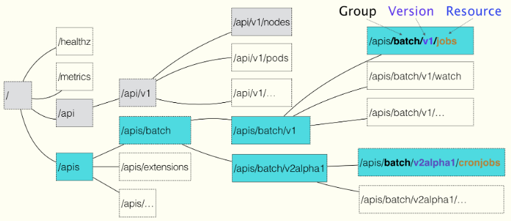
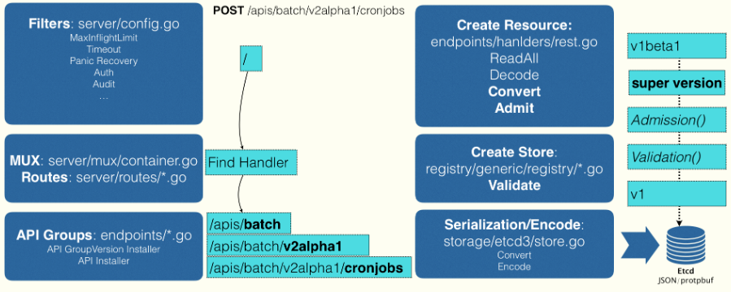

+++
title = "Kubernetes声明式API"
subtitle = "声明式API是Kubernetes成为容器编排事实标准的利器"
summary = "声明式API是Kubernetes成为容器编排事实标准的利器"
date = 2018-12-26
draft = false

tags = ["Kubernetes"]

[header]
image = "headers/post/201804-istio-achilles-heel.jpg"
caption = ""
+++


## API对象

在Kubernetes中API对象是以树形结构表示的，一个API对象在Etcd里完整资源路径，是由Group（API组）、Version（API版本）和Resource（API资源类型）三个部分组成的。



如果现在要声明一个CronJob对象，那么YAML的开始部分会这么写，CronJob就是这个API对象的资源类型，Batch就是它们的组，v2alpha1就是它的版本

```yaml
apiVersion: batch/v2alpha1
kind: CronJob
...
```

### API解析

Kubernetes通过对API解析找到对应的对象，分为如下3步：

1. 解析API的组
	Kubernetes的对象分两种：
	- 核心API对象（如Pod、Node），是不需要Group的，直接在 `/api`这个下面进行解析
	- 非核心API对象，在 `/apis` 下先解析出Group，根据batch这个Group找到 `/apis/batch`，API Group的分类是以对象功能为依据的。
2. 解析API对象的版本号
3. 匹配API对象的资源类型


### 创建对象

在前面匹配到正确的版本之后，Kubernetes就知道要创建的是一个/apis/batch/v2alpha1下的CronJob对象，APIServer会继续创建这个Cronjob对象。创建过程如下图



1. 当发起创建CronJob的POST请求之后，YAML的信息就被提交给了APIServer，APIServer的第一个功能就是过滤这个请求，并完成一些前置性的工作，比如授权、超时处理、审计等
2. 请求进入MUX和Routes流程，MUX和Routes是APIServer完成URL和Handler绑定的场所。APIServer的Handler要做的事情，就是按照上面介绍的匹配过程，找到对应的CronJob类型定义。
3. 根据这个CronJob类型定义，使用用户提交的YAML文件里的字段，创建一个CronJob对象。这个过程中，APIServer会把用户提交的YAML文件，转换成一个叫做Super Version的对象，它正是该API资源类型所有版本的字段全集，这样用户提交的不同版本的YAML文件，就都可以用这个SuperVersion对象来进行处理了。
4. APIServer会先后进行Admission（如Admission Controller 和 Initializer）和Validation操作（负责验证这个对象里的各个字段是否何方，被验证过得API对象都保存在APIServer里一个叫做Registry的数据结构中）。
5. APIServer会把验证过得API对象转换成用户最初提交的版本，进行系列化操作，并调用Etcd的API把它保存起来。  

### CRD

API插件CRD（Custom Resource Definition） 允许用户在Kubernetes中添加一个跟Pod、Node类似的、新的API资源类型，即：自定义API资源

举个栗子，添加一个叫Network的API资源类型，它的作用是一旦用户创建一个Network对象，那么Kubernetes就可以使用这个对象定义的网络参数，调用真实的网络插件，为用户创建一个真正的网络，这个过程分为两步

1. 首先定义CRD

定义一个group为samplecrd.k8s.io， version为v1的API信息，指定了这个CR的资源类型叫做Network，定义的这个Network是属于一个Namespace的对象，类似于Pod。

```yaml
apiVersion: apiextensions.k8s.io/v1beta1
kind: CustomResourceDefinition
metadata:
name: networks.samplecrd.k8s.io
spec:
    group: samplecrd.k8s.io
    version: v1
    names:
    kind: Network
    plural: networks
    scope: Namespaced
```

2. 对象实例化

实例化名为example-network的Network对象，API组是samplecrd.k8s.io，版本是v1。

```yaml
apiVersion: samplecrd.k8s.io/v1
kind: Network
metadata:
name: example-network
spec:
    cidr: "192.168.0.0/16"
    gateway: "192.168.0.1"
```

Network对象YAML文件，名叫example-network.yaml,API资源类型是Network，API组是samplecrd.k8s.io，版本是v1

Kubernetes的声明式API能够对API对象进行增量的更新操作：

- 定义好期望的API对象后，Kubernetes来尽力让对象的状态符合预期
- 允许多个YAML表达，以PATCH的方式对API对象进行修改，而不用关心原始YAML的内容

基于上面两种特性，Kubernetes可以实现基于API对象的更删改查，完成预期和定义的协调过程。

因此Kubernetes项目编排能力的核心是声明式API。

Kubernetes编程范式即：如何使用控制器模式，同Kubernetes里的API对象的“增、删、改、查”进行协作，进而完成用户业务逻辑的编写过程。

## kubectl apply

kubectl apply是声明式的请求，下面一个Deployment的YAML的例子

```yaml
apiVersion: apps/v1
kind: Deployment
metadata:
  name: nginx-deployment
spec:
  selector:
    matchLabels:
      app: nginx
  replicas: 2
  template:
    metadata:
      labels:
        app: nginx
    spec:
      containers:
      - name: nginx
        image: nginx
        ports:
        - containerPort: 80
```

然后用kubectl apply创建这个Deployment

	$ kubectl apply -f nginx.yaml

修改一下nginx里定义的镜像

```yaml
apiVersion: apps/v1
kind: Deployment
...
    spec:
      containers:
      - name: nginx
        image: nginx:1.7.9
```

执行kubectl apply命令，触发滚动更新

	$ kubectl apply -f nginx.yaml

后面一次的 `kubectl apply`命令执行了一个对原有API对象的PATCH操作，这是声明式命令同时可以进行多个写操作，具有Merge的能力；而像 `kubectl replace`命令是用新的YAML替换旧的，这种响应式命令每次只能处理一次写操作。

## 声明式API的应用

Istio通过声明式API实现对应用容器所在POD注入Sidecar，然后通过iptables劫持POD的进站和出站流量到Sidecar，Istio通过对Sidecar下发策略来实现对应用流量的管控，继而实现微服务治理。

在微服务治理中，对Envoy容器的部署和对Envoy代理的配置，应用容器都是不感知的。Istio是使用Kubernetes的[Dynamic Admission Control](http://docs.kubernetes.org.cn/709.html)来实现的。

在APIServer收到API对象的提交请求后，在正常处理这些操作之前会做一些初始化的操作，比如为某些pod或容器加上一些label。这些初始化操作是通过Kubernetes的Admission Controller实现的，在APIServer对象创建之后调用，但这种方式的缺陷是需要将Admission Controller的代码编译到APIServer中，这不是很方便。Kubernetes 1.7引入了热插拔的Admission机制，它就是Dynamic Admission Control，也叫做Initializer。

如下定义的应用的Pod，包含一个myapp-container的容器。

```yaml
apiVersion: v1
kind: Pod
metadata:
  name: myapp-pod
  labels:
    app: myapp
spec:
  containers:
  - name: myapp-container
    image: busybox
    command: ['sh', '-c', 'echo Hello Kubernetes! && sleep 3600']
```

Istio要做的就是在这个Pod YAML被提交给Kubernetes之后，在它对应的API对象里自动加上Envoy容器的配置，使对象变成如下的样子：

```yaml
apiVersion: v1
kind: Pod
metadata:
  name: myapp-pod
  labels:
    app: myapp
spec:
  containers:
  - name: myapp-container
    image: busybox
    command: ['sh', '-c', 'echo Hello Kubernetes! && sleep 3600']
  - name: envoy
    image: lyft/envoy:845747b88f102c0fd262ab234308e9e22f693a1
    command: ["/usr/local/bin/envoy"]
    ...
```

这个pod多了一个envoy的容器，Istio具体的做法是

- 定义Envoy容器的Initializer，并以ConfigMap的方式保存到Kubernetes中
- Istio将编写好的Initializer作为一个Pod部署在Kubernetes中


Envoy容器的ConfigMap定义，

```yaml
apiVersion: v1
kind: ConfigMap
metadata:
  name: envoy-initializer
data:
  config: |
    containers:
      - name: envoy
        image: lyft/envoy:845747db88f102c0fd262ab234308e9e22f693a1
        command: ["/usr/local/bin/envoy"]
        args:
          - "--concurrency 4"
          - "--config-path /etc/envoy/envoy.json"
          - "--mode serve"
        ports:
          - containerPort: 80
            protocol: TCP
        resources:
          limits:
            cpu: "1000m"
            memory: "512Mi"
          requests:
            cpu: "100m"
            memory: "64Mi"
        volumeMounts:
          - name: envoy-conf
            mountPath: /etc/envoy
    volumes:
      - name: envoy-conf
        configMap:
          name: envoy
```

这个ConfigMap的data部分，正是一个Pod对象的一部分定义，其中可以看到Envoy容器对应的Container字段，以及一个用来声明Envoy配置文件的volumes字段。Initializer要做的就是把这部分Envoy相关的字段，自动添加到用户提交的Pod的API对象里。但是用户提交的Pod里本来就有containers和volumes字段，所以Kubernetes在处理这样的更新请求时，就必须使用类似于git merge这样的操作，才能将这两部分内容合并在一起。即Initializer更新用户的Pod对象时，必须使用PATCH API来完成。

Envoy Initializer的pod定义

```yaml
apiVersion: v1
kind: Pod
metadata:
  labels:
    app: envoy-initializer
  name: envoy-initializer
spec:
  containers:
    - name: envoy-initializer
      image: envoy-initializer:0.0.1
      imagePullPolicy: Always
```	  

`envoy-initializer:0.0.1` 镜像是一个自定义控制器（Custom Controller）。Kubernetes的控制器实际上是一个死循环：它不断地获取实际状态，然后与期望状态作对比，并以此为依据决定下一步的操作。

对Initializer控制器，不断获取的实际状态，就是用户新创建的Pod，它期望的状态就是这个Pod里被添加了Envoy容器的定义。它的控制逻辑如下：

```go
for {
  // 获取新创建的 Pod
  pod := client.GetLatestPod()
  // Diff 一下，检查是否已经初始化过
  if !isInitialized(pod) {
    // 没有？那就来初始化一下
   //istio要往这个Pod里合并的字段，就是ConfigMap里data字段的值
    doSomething(pod)
  }
}

func doSomething(pod) {
  //调用APIServer拿到ConfigMap
  cm := client.Get(ConfigMap, "envoy-initializer")

  //把ConfigMap里存在的containers和volumes字段，直接添加进一个空的Pod对象
  newPod := Pod{}
  newPod.Spec.Containers = cm.Containers
  newPod.Spec.Volumes = cm.Volumes

  // Kubernetes的API库，提供一个方法使我们可以直接使用新旧两个Pod对象，生成 patch 数据
  patchBytes := strategicpatch.CreateTwoWayMergePatch(pod, newPod)

  // 发起 PATCH 请求，修改这个 pod 对象
  client.Patch(pod.Name, patchBytes)  
}
```

Envoy机制正是利用了Kubernetes能够对API对象做增量更新，这是Kubernetes声明式API的独特之处。


## 参考

[Dynamic Admission Control](http://docs.kubernetes.org.cn/709.html)

[【Kubernetes】深入解析声明式API](https://www.cnblogs.com/yuxiaoba/p/9803284.html)
