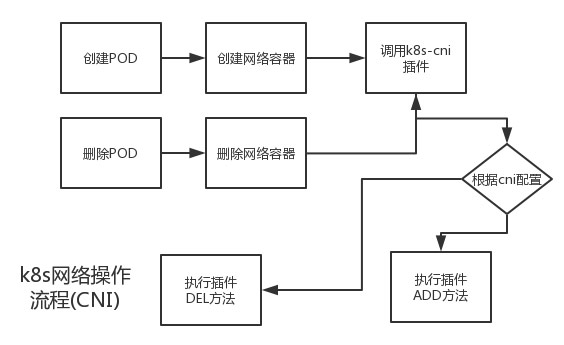
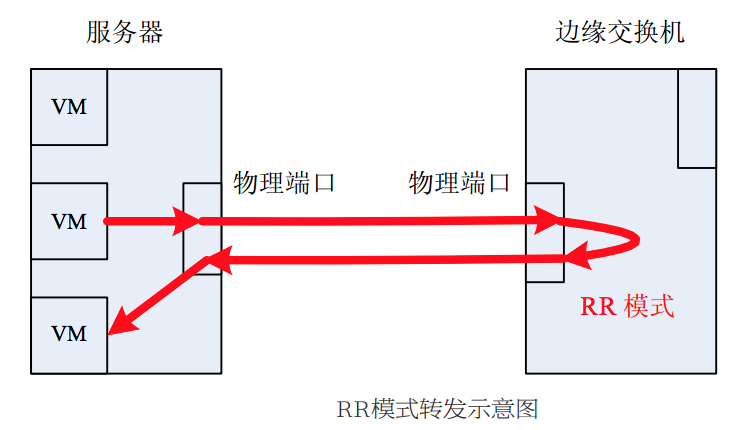
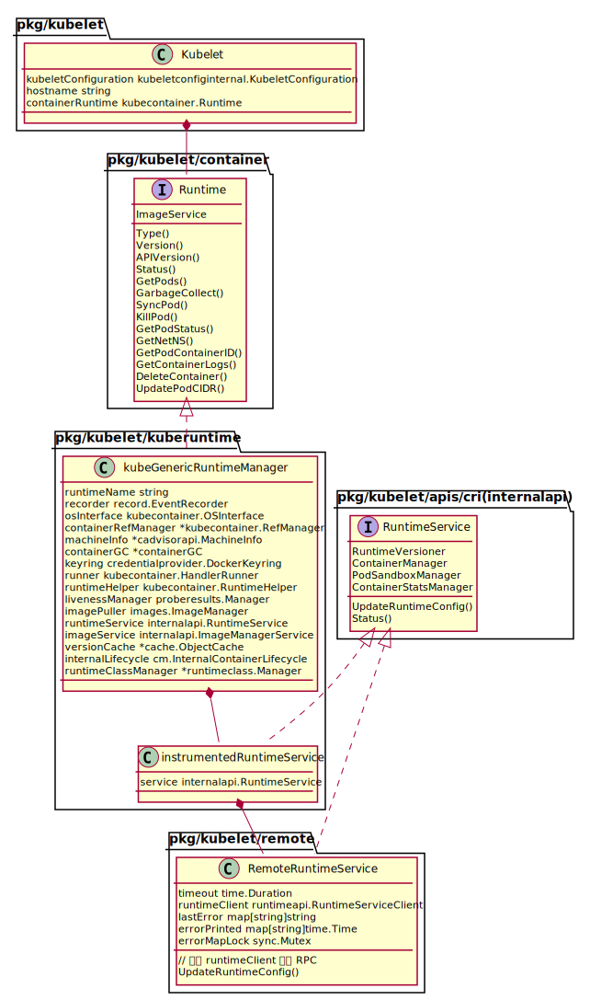

Kubernetes 本身不提供容器网络, 但是实现了一套支持多种网络插件的框架代码, 通过调用网络插件来为容器设置网络环境。

而约束网络插件的是 CNI（Container Network Interface），一种标准的容器网络接口，定义了如何将容器加入网络和将容器从网络中删除。



CNI 接口由 runtime 在创建容器和删除容器时调用。具体的接口定义如下：

```go
// vendor/github.com/containernetworking/cni/libcni/api.go

type CNI interface {
	AddNetworkList(net *NetworkConfigList, rt *RuntimeConf) (types.Result, error)
	DelNetworkList(net *NetworkConfigList, rt *RuntimeConf) error

	AddNetwork(net *NetworkConfig, rt *RuntimeConf) (types.Result, error)
	DelNetwork(net *NetworkConfig, rt *RuntimeConf) error
}
```

# Kubernetes plugin 接口

kubelet 是通过 NetworkPlugin interface 来调用底层的网络插件为容器设置网络环境.

```go
// kubelet/dockershim/network/plugins.go
// Plugin is an interface to network plugins for the kubelet
type NetworkPlugin interface {
	// Init initializes the plugin.  This will be called exactly once
	// before any other methods are called.
	Init(host Host, hairpinMode kubeletconfig.HairpinMode, nonMasqueradeCIDR string, mtu int) error

	// Called on various events like:
	// NET_PLUGIN_EVENT_POD_CIDR_CHANGE
	Event(name string, details map[string]interface{})

	// Name returns the plugin's name. This will be used when searching
	// for a plugin by name, e.g.
	Name() string

	// Returns a set of NET_PLUGIN_CAPABILITY_*
	Capabilities() utilsets.Int

	// SetUpPod is the method called after the infra container of
	// the pod has been created but before the other containers of the
	// pod are launched.
	SetUpPod(namespace string, name string, podSandboxID kubecontainer.ContainerID, annotations, options map[string]string) error

	// TearDownPod is the method called before a pod's infra container will be deleted
	TearDownPod(namespace string, name string, podSandboxID kubecontainer.ContainerID) error

	// GetPodNetworkStatus is the method called to obtain the ipv4 or ipv6 addresses of the container
	GetPodNetworkStatus(namespace string, name string, podSandboxID kubecontainer.ContainerID) (*PodNetworkStatus, error)

	// Status returns error if the network plugin is in error state
	Status() error
}
```

实现了 NetworkPlugin interface 就可以新增一种 Kubernetes 的 Network plugin。这个 interface 也并没有具体容器网络的实现，而是做了一层封装，具体的容器网络由独立的二进制实现，比如官方提供的 bridge、host-local 或者第三方的 calico、flannel 等，也可以是自己定制的实现。

K8S 支持两种 plugin：

- cniNetworkPlugin
- kubenetNetworkPlugin

下面讲述 plugin 是如何初始化和工作的

# kubelet 启动

kubelet 启动后会调用 `run()` 进入处理流程，在进入主处理流程之前的初始化阶段会根据用户配置的网络插件名选择对应的网络插件。

```go
// cmd/kubelet/app/server.go

func run(s *options.KubeletServer, kubeDeps *kubelet.KubeletDeps) (err error) {
    ...
    // 创建 kubelete
    // 根据 kubelet 的运行参数运行 kubelet
    // 这里会根据用户配置的网络插件名选择网络插件
    if err := RunKubelet(&s.KubeletConfiguration, kubeDeps, s.RunOnce, standaloneMode); err != nil {
        return err
    }
    ...
}
```

```go
// cmd/kubelet/app/server.go
func RunKubelet(kubeServer *options.KubeletServer, kubeDeps *kubelet.Dependencies, runOnce bool) error {

	...
	k, err := CreateAndInitKubelet(&kubeServer.KubeletConfiguration,
		kubeDeps,
		...)

	...
}
```

```go
func CreateAndInitKubelet(kubeCfg *kubeletconfiginternal.KubeletConfiguration,
	...) {

	k, err = kubelet.NewMainKubelet(kubeCfg,
		kubeDeps,
		crOptions
		...
	)

	k.BirthCry()

	k.StartGarbageCollection()
}
```


```go
// NewMainKubelet instantiates a new Kubelet object along with all the required internal modules.
// No initialization of Kubelet and its modules should happen here.
func NewMainKubelet(kubeCfg *kubeletconfiginternal.KubeletConfiguration,
	kubeDeps *Dependencies
	...) {

	klet := &Kubelet{
		hostname:                                hostname,
		hostnameOverridden:                      len(hostnameOverride) > 0,
		...
	}

	switch containerRuntime {
   	case kubetypes.DockerContainerRuntime:
   		// Create and start the CRI shim running as a grpc server.
   		streamingConfig := getStreamingConfig(kubeCfg, kubeDeps, crOptions)
   		ds, err := dockershim.NewDockerService(kubeDeps.DockerClientConfig, crOptions.PodSandboxImage, streamingConfig,
   			&pluginSettings, runtimeCgroups, kubeCfg.CgroupDriver, crOptions.DockershimRootDirectory, !crOptions.RedirectContainerStreaming)
		...
   		server := dockerremote.NewDockerServer(remoteRuntimeEndpoint, ds)
   		if err := server.Start(); err != nil {
   			return nil, err
   		}

   	case kubetypes.RemoteContainerRuntime:
   		// No-op.
   		break
   	default:
   		return nil, fmt.Errorf("unsupported CRI runtime: %q", containerRuntime)
   	}
	// 向 k8s network plugin 通报 NET_PLUGIN_EVENT_POD_CIDR_CHANGE 事件
    // 该事件将会被 NetworkPlugin interface 的 Event 方法捕获
	if _, err := klet.updatePodCIDR(kubeCfg.PodCIDR); err != nil {
		klog.Errorf("Pod CIDR update failed %v", err)
	}

	...
	}

```

目前只支持 CRI 为 docker。

## 根据用户配置选择 CNI

```go
// pkg/kubelet/dockershim/docker_service.go
// NOTE: Anything passed to DockerService should be eventually handled in another way when we switch to running the shim as a different process.
func NewDockerService(config *ClientConfig, podSandboxImage string, ...) (DockerService, error) {

	ds := &dockerService{
		client:          c,
		os:              kubecontainer.RealOS{},
		podSandboxImage: podSandboxImage,
		streamingRuntime: &streamingRuntime{
			client:      client,
			execHandler: &NativeExecHandler{},
		},
		containerManager:          cm.NewContainerManager(cgroupsName, client),
		checkpointManager:         checkpointManager,
		startLocalStreamingServer: startLocalStreamingServer,
		networkReady:              make(map[string]bool),
	}

	// Determine the hairpin mode.
	if err := effectiveHairpinMode(pluginSettings); err != nil {
		// This is a non-recoverable error. Returning it up the callstack will just
		// lead to retries of the same failure, so just fail hard.
		return nil, err
	}

	// 根据配置配置 CNI
	// dockershim currently only supports CNI plugins.
	pluginSettings.PluginBinDirs = cni.SplitDirs(pluginSettings.PluginBinDirString)
	cniPlugins := cni.ProbeNetworkPlugins(pluginSettings.PluginConfDir, pluginSettings.PluginBinDirs)
	// 加了一个默认的 CNI 插件 kubenet
	cniPlugins = append(cniPlugins, kubenet.NewPlugin(pluginSettings.PluginBinDirs))
	netHost := &dockerNetworkHost{
		&namespaceGetter{ds},
		&portMappingGetter{ds},
	}
	// 根据用户配置选择对应的网络插件对象，做 init() 初始化
	plug, err := network.InitNetworkPlugin(cniPlugins, pluginSettings.PluginName, netHost, pluginSettings.HairpinMode, pluginSettings.NonMasqueradeCIDR, pluginSettings.MTU)

	ds.network = network.NewPluginManager(plug)
	klog.Infof("Docker cri networking managed by %v", plug.Name())

	return ds, nil
}
```

**Hairpin 模式**

发夹式转发模式 (Hairpin mode)又称反射式转发模式 (Reflective Relay) ，指交换机可以将报文的接受端口同时作为发送端口, 即报文可以从它的入端口转发出去, 如下图所示:



NewDockerService() 函数首先通过 effectiveHairpinMode() 计算出有效的 Hairpin 模式, 然后根据 NetworkPluginName 从插件列表中选择对应的网络插件对象.

ProbeNetworkPlugins() 根据配置的 CNI 插件的路径生成 network.NetworkPlugin interface 的实现 cniNetworkPlugin。


InitNetworkPlugin() 负责从网络插件对象列表中根据用户配置的网络插件名选择对应的网络插件对象，调用插件的 init() 执行初始化。

```go
// pkg/kubelet/dockershim/network/plugins.go
// InitNetworkPlugin inits the plugin that matches networkPluginName. Plugins must have unique names.
func InitNetworkPlugin(plugins []NetworkPlugin, networkPluginName string, host Host, hairpinMode kubeletconfig.HairpinMode, nonMasqueradeCIDR string, mtu int) (NetworkPlugin, error) {
	// 如果用户没有配置网络插件名, 默认就是NoopNetworkPlugin, 不会提供任何容器网络
	// NoopNetworkPlugin 是 NetworkPlugin interface 的实现
	if networkPluginName == "" {
		// default to the no_op plugin
		plug := &NoopNetworkPlugin{}
		plug.Sysctl = utilsysctl.New()
		if err := plug.Init(host, hairpinMode, nonMasqueradeCIDR, mtu); err != nil {
			return nil, err
		}
		return plug, nil
	}
	...
	chosenPlugin := pluginMap[networkPluginName]
	if chosenPlugin != nil {
		// 执行插件的初始化操作
		err := chosenPlugin.Init(host, hairpinMode, nonMasqueradeCIDR, mtu)
	}
	...

}
```

## 通告 Pod CIDR 的更新

k8s 对 Pod 的管理是通过 runtime 来操作的，因此对 CIDR 的更新也是通过 runtime 实现。当 Pod 的 CIDR 更新时调用 runtime 的 UpdatePodCIDR()。

```go
// pkg/kubelet/kubelet_network.go
// updatePodCIDR updates the pod CIDR in the runtime state if it is different
// from the current CIDR. Return true if pod CIDR is actually changed.
func (kl *Kubelet) updatePodCIDR(cidr string) (bool, error) {

	// 配置与当前状态比较，没有变化直接返回
	podCIDR := kl.runtimeState.podCIDR()
	if podCIDR == cidr {
		return false, nil
	}

	// kubelet -> generic runtime -> runtime shim -> network plugin
	// docker/non-cri implementations have a passthrough UpdatePodCIDR
	if err := kl.getRuntime().UpdatePodCIDR(cidr); err != nil {
		// If updatePodCIDR would fail, theoretically pod CIDR could not change.
		// But it is better to be on the safe side to still return true here.
		return true, fmt.Errorf("failed to update pod CIDR: %v", err)
	}

	// 更新当前状态，以便以后比较
	kl.runtimeState.setPodCIDR(cidr)
	return true, nil
}
```

## runtime

要先讲下 k8s runtime 的管理。

k8s 通过 kubeGenericRuntimeManager 来做统一的 RC 管理，该类会调用对应的 RC shim 来做下发操作。

kubelet 的 `containerRuntime` 是在 NewMainKubelet() 函数中如下代码片段配置的。

```go
runtime, err := kuberuntime.NewKubeGenericRuntimeManager(
	kubecontainer.FilterEventRecorder(kubeDeps.Recorder),
	...)

klet.containerRuntime = runtime
klet.streamingRuntime = runtime
klet.runner = runtime
```


```go
// kuberuntime/kuberuntime_manager.go
// UpdatePodCIDR is just a passthrough method to update the runtimeConfig of the shim
// with the podCIDR supplied by the kubelet.
func (m *kubeGenericRuntimeManager) UpdatePodCIDR(podCIDR string) error {
	// TODO(#35531): do we really want to write a method on this manager for each
	// field of the config?
	klog.Infof("updating runtime config through cri with podcidr %v", podCIDR)
	return m.runtimeService.UpdateRuntimeConfig(
		&runtimeapi.RuntimeConfig{
			NetworkConfig: &runtimeapi.NetworkConfig{
				PodCidr: podCIDR,
			},
		})
}
```

kubeGenericRuntimeManager 的 runtimeService 在初始化时设置的是 instrumentedRuntimeService，这个结构是对 RuntimeService interface 的一个封装和实现，用来记录操作和错误的 metrics。


```go
// instrumentedRuntimeService wraps the RuntimeService and records the operations
// and errors metrics.
type instrumentedRuntimeService struct {
	service internalapi.RuntimeService
}
```


而真正的 RuntimeService interface 的实现是在 NewMainKubelet() 的如下片段中赋值的。

```go
runtimeService, imageService, err := getRuntimeAndImageServices(remoteRuntimeEndpoint, remoteImageEndpoint, kubeCfg.RuntimeRequestTimeout)
klet.runtimeService = runtimeService
```

remoteRuntimeEndpoint 是在 kubelet 启动命令中指定的值为 `unix:///var/run/dockershim.sock`
，kubelet 就是通过这个 socket 与 runtime 进行gRPC 通信的。保存在 KubeletFlags 中，该参数在

```go
type KubeletFlags struct {
	KubeConfig          string
	...
	RemoteRuntimeEndpoint string
	RemoteImageEndpoint string
}
```


getRuntimeAndImageServices() 调用 NewRemoteRuntimeService() 根据 RC 的 endpoint 创建一个 gRPC 的 client 封装到 RemoteRuntimeService 中，这是一个 internalapi.RuntimeService interface 的具体实现。


```go

// NewRemoteRuntimeService creates a new internalapi.RuntimeService.
func NewRemoteRuntimeService(endpoint string, connectionTimeout time.Duration) (internalapi.RuntimeService, error) {
	addr, dailer, err := util.GetAddressAndDialer(endpoint)
	ctx, cancel := context.WithTimeout(context.Background(), connectionTimeout)
	defer cancel()

	conn, err := grpc.DialContext(ctx, addr, grpc.WithInsecure(), grpc.WithDialer(dailer), grpc.WithDefaultCallOptions(grpc.MaxCallRecvMsgSize(maxMsgSize)))

	return &RemoteRuntimeService{
		timeout:       connectionTimeout,
		runtimeClient: runtimeapi.NewRuntimeServiceClient(conn),
		lastError:     make(map[string]string),
		errorPrinted:  make(map[string]time.Time),
	}, nil
}
```


runtime 主要提供两种服务：RuntimeService 和 ImageService 用来管理容器的镜像。 k8s 与 runtime 通过 RPC 通信，在配置 podCIDR 时调用的是 RuntimeService 的 UpdateRuntimeConfig rpc：

```go
// pkg/kubelet/apis/cri/runtime/v1alpha2/api.proto
service RuntimeService {
	...
	// UpdateRuntimeConfig updates the runtime configuration based on the given request.
	rpc UpdateRuntimeConfig(UpdateRuntimeConfigRequest) returns (UpdateRuntimeConfigResponse) {}
}
```

这样网络配置就下发给了 runtime，runtime 调用 CNI 插件来做网络配置变更。


```go
// pkg/kubelet/dockershim/docker_service.go
// UpdateRuntimeConfig updates the runtime config. Currently only handles podCIDR updates.
func (ds *dockerService) UpdateRuntimeConfig(_ context.Context, r *runtimeapi.UpdateRuntimeConfigRequest) (*runtimeapi.UpdateRuntimeConfigResponse, error) {
	runtimeConfig := r.GetRuntimeConfig()
	if runtimeConfig == nil {
		return &runtimeapi.UpdateRuntimeConfigResponse{}, nil
	}

	klog.Infof("docker cri received runtime config %+v", runtimeConfig)
	if ds.network != nil && runtimeConfig.NetworkConfig.PodCidr != "" {
		event := make(map[string]interface{})
		event[network.NET_PLUGIN_EVENT_POD_CIDR_CHANGE_DETAIL_CIDR] = runtimeConfig.NetworkConfig.PodCidr
		ds.network.Event(network.NET_PLUGIN_EVENT_POD_CIDR_CHANGE, event)
	}

	return &runtimeapi.UpdateRuntimeConfigResponse{}, nil
}
```

下图是 kubelet runtime UML




# kubenet plugin 实现

前面知道网络插件的接口是 NetworkPlugin interface，k8s kubenet 网络框架用 embed network.NoopNetworkPlugin 的 kubenetNetworkPlugin 实现了接口。

kubenet 利用的是官方提供的三个 cni 类型插件: `bridge`, `host-local`, `loopback` (参考 [cni plugins](https://github.com/containernetworking/plugins/tree/master/plugins/main), [cni ipam](https://github.com/containernetworking/plugins/tree/master/plugins/ipam)), 这个插件一般位于每个 Node 的 `/opt/cni/bin` 目录。


```go
type kubenetNetworkPlugin struct {
	network.NoopNetworkPlugin

	host            network.Host
	netConfig       *libcni.NetworkConfig
	loConfig        *libcni.NetworkConfig
	cniConfig       libcni.CNI
	bandwidthShaper bandwidth.BandwidthShaper
	mu              sync.Mutex //Mutex for protecting podIPs map, netConfig, and shaper initialization
	podIPs          map[kubecontainer.ContainerID]string
	mtu             int
	execer          utilexec.Interface
	nsenterPath     string
	hairpinMode     kubeletconfig.HairpinMode
	// kubenet can use either hostportSyncer and hostportManager to implement hostports
	// Currently, if network host supports legacy features, hostportSyncer will be used,
	// otherwise, hostportManager will be used.
	hostportSyncer  hostport.HostportSyncer
	hostportManager hostport.HostPortManager
	iptables        utiliptables.Interface
	sysctl          utilsysctl.Interface
	ebtables        utilebtables.Interface
	// binDirs is passed by kubelet cni-bin-dir parameter.
	// kubenet will search for CNI binaries in DefaultCNIDir first, then continue to binDirs.
	binDirs           []string
	nonMasqueradeCIDR string
	podCidr           string
	gateway           net.IP
}
```
kubenet 直接利用了官方提供的三个 cni plugin:

```go
// pkg/kubelet/network/kubenet/kubenet_linux.go
// CNI plugins required by kubenet in /opt/cni/bin or vendor directory
var requiredCNIPlugins = [...]string{"bridge", "host-local", "loopback"}
```

kubenet 网络框架原理非常的简单, 主要利用 "bridge", "host-local", "loopback" (位于 /opt/cni/bin 目录下) 这三个 cni plugin主要的功能：

- 在每个 Node 上创建一个 cbr0 网桥
- 根据 PodCIDR 为每个 Pod 的 interface 分配一个 ip,
- 将该 interface 连接到 cbr0 网桥上.

当然, 对于 kubernetes 集群来说, 还需要解决两个问题:

1. Node 的 PodCIDR 设置

	k8s kubenet 网络框架中，必须给每个 node 配置一个 podCIDR.

	那么, 每个 Node 的 PodCIDR 如何设置呢? 这个需要参考 kubenet 网络的配置文档了:

	> The node must be assigned an IP subnet through either the --pod-cidr kubelet command-line option or the --allocate-node-cidrs=true --cluster-cidr=<cidr> controller-manager command-line options.

	其实就是两种方式:
	- 通过 --pod-cidr 为每个 Node 上的 kubelet 配置好 PodCIDR
	- 通过 --allocate-node-cidrs=true --cluster-cidr=<cluster_cidr> 让 controller-manager 来为每个 Node 分配 PodCIDR.


2. Node 之间的路由设置

	虽然现在每个 Node 都配置好了 PodCIDR, 比如:

		Node1: 192.168.0.0/24 Node2: 192.168.1.0/24

	但是 Node1 和 Node2 上的容器如何通信呢?

	> It is typically used together with a cloud provider that sets up routing rules for communication between nodes, or in single-node environments.

	通常情况下, kubenet 网络插件会跟 cloud provider 一起使用, 从而利用 cloud provider 来设置节点间的路由. kubenet 网络插件也可以用在单节点环境, 这样就不需要考虑 Node 间的路由了. 另外, 我们还可以通过实现一个 network controller 来保证 Node 间的路由.


## kubenet Init

```go
// pkg/kubelet/dockershim/network/kubenet/kubenet_linux.go
func NewPlugin(networkPluginDirs []string) network.NetworkPlugin {
	protocol := utiliptables.ProtocolIpv4
	execer := utilexec.New()
	dbus := utildbus.New()
	sysctl := utilsysctl.New()
	iptInterface := utiliptables.New(execer, dbus, protocol)
	return &kubenetNetworkPlugin{
		podIPs:            make(map[kubecontainer.ContainerID]string),
		execer:            utilexec.New(),
		iptables:          iptInterface,
		sysctl:            sysctl,
		binDirs:           append([]string{DefaultCNIDir}, networkPluginDirs...),
		hostportSyncer:    hostport.NewHostportSyncer(iptInterface),
		hostportManager:   hostport.NewHostportManager(iptInterface),
		nonMasqueradeCIDR: "10.0.0.0/8",
	}
}

```

在前面的 InitNetworkPlugin() 流程中会调用各个插件的 Init() 来初始化插件。

```go
// pkg/kubelet/dockershim/network/kubenet/kubenet_linux.go
func (plugin *kubenetNetworkPlugin) Init(host network.Host, hairpinMode kubeletconfig.HairpinMode, nonMasqueradeCIDR string, mtu int) error {

	...
	// 确认加载了 br-netfilter，设置 bridge-nf-call-iptables=1
	plugin.execer.Command("modprobe", "br-netfilter").CombinedOutput()
	err := plugin.sysctl.SetSysctl(sysctlBridgeCallIPTables, 1)

	// 配置 loopback cni 插件
	plugin.loConfig, err = libcni.ConfFromBytes([]byte(`{
  "cniVersion": "0.1.0",
  "name": "kubenet-loopback",
  "type": "loopback"
}`))
	plugin.nsenterPath, err = plugin.execer.LookPath("nsenter")
	// 下发 SNAT 的 ipatable rule
	// Need to SNAT outbound traffic from cluster
	if err = plugin.ensureMasqRule(); err != nil {
		return err
	}
	return nil
}
```

> 在 kubenet 中有个 MTU 的配置选项，`network-plugin-mtu` 指定 MTU，设置合理的 MTU 能有一个更好的网络性能。仅在 kubenet plugin 中支持。

## kubenet Event

kubelet 启动到 NewMainKubelet 时, 根据用户配置通过 klet.updatePodCIDR(kubeCfg.PodCIDR) 向 k8s network plugin 通报 NET_PLUGIN_EVENT_POD_CIDR_CHANGE 事件, 该事件将会被 Event 方法捕获.

```go
// pkg/kubelet/network/kubenet/kubenet_linux.go

const NET_CONFIG_TEMPLATE = `{
  "cniVersion": "0.1.0",
  "name": "kubenet",
  "type": "bridge",
  "bridge": "%s",
  "mtu": %d,
  "addIf": "%s",
  "isGateway": true,
  "ipMasq": false,
  "hairpinMode": %t,
  "ipam": {
    "type": "host-local",
    "subnet": "%s",
    "gateway": "%s",
    "routes": [
      { "dst": "0.0.0.0/0" }
    ]
  }
}`

func (plugin *kubenetNetworkPlugin) Event(name string, details map[string]interface{}) {

	podCIDR, ok := details[network.NET_PLUGIN_EVENT_POD_CIDR_CHANGE_DETAIL_CIDR].(string)


	_, cidr, err := net.ParseCIDR(podCIDR)
	if err == nil {
		setHairpin := plugin.hairpinMode == kubeletconfig.HairpinVeth
		// Set bridge address to first address in IPNet
		cidr.IP[len(cidr.IP)-1] += 1

		// 更新 cni 网络配置
        // 从 NET_CONFIG_TEMPLATE 中看出, host-local ipam 的 subnet 就是 podCIDR
        // 这其实也就是为什么 k8s kubenet 网络插件需要为每个 node 分配 podCIDR 的原因
		json := fmt.Sprintf(NET_CONFIG_TEMPLATE, BridgeName, plugin.mtu, network.DefaultInterfaceName, setHairpin, podCIDR, cidr.IP.String())
		// 网络配置都保存在 netConfig 中
		plugin.netConfig, err = libcni.ConfFromBytes([]byte(json))
		if err == nil {
			klog.V(5).Infof("CNI network config:\n%s", json)

			// Ensure cbr0 has no conflicting addresses; CNI's 'bridge'
			// plugin will bail out if the bridge has an unexpected one
			plugin.clearBridgeAddressesExcept(cidr)
		}
		plugin.podCidr = podCIDR
		plugin.gateway = cidr.IP
	}

}
```

> todo: Event() 也只是更新了 `podCidr` 和 `netConfig`，哪里下发了更新？

根据配置的改变设置 kubenetNetworkPlugin 对应的变量。


## kubenet SetUpPod

创建 Pod 的时候会调用该方法，该方法调用 `setup()` 来完成配置，这个接口最重要的功能是将容器的 eth0 接口加入到了 namespace 中

```go
// setup sets up networking through CNI using the given ns/name and sandbox ID.
func (plugin *kubenetNetworkPlugin) setup(namespace string, name string, id kubecontainer.ContainerID, annotations map[string]string) error {

	// 添加 loopback interface 到 pod 的 network namespace
	// Bring up container loopback interface
	if _, err := plugin.addContainerToNetwork(plugin.loConfig, "lo", namespace, name, id); err != nil {
		return err
	}

	// 添加 DefaultInterfaceName eth0 到 pod 的 network namespace
	// Hook container up with our bridge
	resT, err := plugin.addContainerToNetwork(plugin.netConfig, network.DefaultInterfaceName, namespace, name, id)
	if err != nil {
		return err
	}
	// Coerce the CNI result version
	res, err := cnitypes020.GetResult(resT)
	ip4 := res.IP4.IP.IP.To4()

	// 为了配置 hairpin 设置网卡混杂模式
	...

	plugin.podIPs[id] = ip4.String()


	// TODO: replace with CNI port-forwarding plugin
	// TODO: portMappings 的用途是什么？
	portMappings, err := plugin.host.GetPodPortMappings(id.ID)
	if err != nil {
		return err
	}
	if portMappings != nil && len(portMappings) > 0 {
		if err := plugin.hostportManager.Add(id.ID, &hostport.PodPortMapping{
			Namespace:    namespace,
			Name:         name,
			PortMappings: portMappings,
			IP:           ip4,
			HostNetwork:  false,
		}, BridgeName); err != nil {
			return err
		}
	}
	return nil
}
```

接着看看 addContainerToNetwork() 方法:


```go
// pkg/kubelet/dockershim/network/kubenet/kubenet_linux.go

func (plugin *kubenetNetworkPlugin) addContainerToNetwork(config *libcni.NetworkConfig, ifName, namespace, name string, id kubecontainer.ContainerID) (cnitypes.Result, error) {
	rt, err := plugin.buildCNIRuntimeConf(ifName, id, true)
	if err != nil {
		return nil, fmt.Errorf("Error building CNI config: %v", err)
	}

	// The network plugin can take up to 3 seconds to execute,
	// so yield the lock while it runs.
	plugin.mu.Unlock()
	res, err := plugin.cniConfig.AddNetwork(config, rt)
	plugin.mu.Lock()
	return res, nil
}
```

由前面 CNI 库接口可知, plugin.cniConfig.AddNetwork() 实际上调用的是 cni plugin 去实现容器网络配置. kubenet plugin 主要通过 loopback 和 bridge cni 插件将容器的 lo 和 eth0 添加到容器网络中. bridge 插件负责 Node 上 cbr0 的创建, 然后创建 veth 接口对, 通过 veth 接口对, 将容器添加到容器网络中. 另外, host-local IPAM plugin 负责为 eth0 分配 ip 地址.

## kubenet TearDownPod

删除 Pod 的时候会被调用。主要是通过函数 teardown() 实现。主要的流程是调用 CNI 删除网络配置。

```go

// Tears down as much of a pod's network as it can even if errors occur.  Returns
// an aggregate error composed of all errors encountered during the teardown.
func (plugin *kubenetNetworkPlugin) teardown(namespace string, name string, id kubecontainer.ContainerID, podIP string) error {
	errList := []error{}

	if err := plugin.delContainerFromNetwork(plugin.netConfig, network.DefaultInterfaceName, namespace, name, id); err != nil {
		// This is to prevent returning error when TearDownPod is called twice on the same pod. This helps to reduce event pollution.
		if podIP != "" {
			klog.Warningf("Failed to delete container from kubenet: %v", err)
		} else {
			errList = append(errList, err)
		}
	}

	portMappings, err := plugin.host.GetPodPortMappings(id.ID)
	if err != nil {
		errList = append(errList, err)
	} else if portMappings != nil && len(portMappings) > 0 {
		if err = plugin.hostportManager.Remove(id.ID, &hostport.PodPortMapping{
			Namespace:    namespace,
			Name:         name,
			PortMappings: portMappings,
			HostNetwork:  false,
		}); err != nil {
			errList = append(errList, err)
		}
	}
	return utilerrors.NewAggregate(errList)
}
```

由前面 CNI 库接口可知, plugin.cniConfig.DelNetwork() 实际上调用的是 cni plugin 去删除容器网络配置. bridge 插件负责调用 host-local IPAM plugin 释放该容器的 ip, 然后删除容器的网络接口等.


# CNI plugin 实现

CNI plugin 是一种更通用的实现，允许用户自定义插件。cniNetworkPlugin 是 NetworkPlugin interface 的一个实现，具体的代码如下。

```go
// pkg/kubelet/dockershim/network/cni/cni.go

type cniNetworkPlugin struct {
	network.NoopNetworkPlugin
	loNetwork *cniNetwork
	sync.RWMutex
	defaultNetwork *cniNetwork
	host        network.Host
	execer      utilexec.Interface
	nsenterPath string
	confDir     string
	binDirs     []string
	podCidr     string
}
```

通过 cniNetwork 类型的 loNetwork 和 defaultNetwork 来调用 CNI 插件，cniNetwork 定义如下。

```go
// pkg/kubelet/dockershim/network/cni/cni.go

type cniNetwork struct {
	name          string
	NetworkConfig *libcni.NetworkConfigList
	CNIConfig     libcni.CNI
}
```

## CNI Init


在 NewDockerService() 函数中调用 ProbeNetworkPlugins() 根据配置的 CNI 插件的路径生成 network.NetworkPlugin interface 的实现 cniNetworkPlugin。

```go
// pkg/kubelet/dockershim/network/cni/cni.go
func ProbeNetworkPlugins(confDir string, binDirs []string) []network.NetworkPlugin {
	old := binDirs
	binDirs = make([]string, 0, len(binDirs))
	for _, dir := range old {
		if dir != "" {
			binDirs = append(binDirs, dir)
		}
	}

	plugin := &cniNetworkPlugin{
		defaultNetwork: nil,
		loNetwork:      getLoNetwork(binDirs),
		execer:         utilexec.New(),
		confDir:        confDir,
		binDirs:        binDirs,
	}

	// sync NetworkConfig in best effort during probing.
	plugin.syncNetworkConfig()
	return []network.NetworkPlugin{plugin}
}
```

主要是对 loNetwork 和 defaultNetwork 变量的配置。

```go
// pkg/kubelet/dockershim/network/cni/cni_others.go
func getLoNetwork(binDirs []string) *cniNetwork {
	loConfig, err := libcni.ConfListFromBytes([]byte(`{
  "cniVersion": "0.2.0",
  "name": "cni-loopback",
  "plugins":[{
    "type": "loopback"
  }]
}`))
	loNetwork := &cniNetwork{
		name:          "lo",
		NetworkConfig: loConfig,
		CNIConfig:     &libcni.CNIConfig{Path: binDirs},
	}

	return loNetwork
}
```
Init() 做的就是配置 defaultNetwork

```go

func getDefaultCNINetwork(confDir string, binDirs []string) (*cniNetwork, error) {
		// 从配置文件获取 confList
		network := &cniNetwork{
			name:          confList.Name,
			NetworkConfig: confList,
			CNIConfig:     &libcni.CNIConfig{Path: binDirs},
		}
		return network, nil
	}
}
```


## CNI Event

收到 `NET_PLUGIN_EVENT_POD_CIDR_CHANGE` 事件时只是更新了 `podCidr` 的值

```go
func (plugin *cniNetworkPlugin) Event(name string, details map[string]interface{}) {

	podCIDR, ok := details[network.NET_PLUGIN_EVENT_POD_CIDR_CHANGE_DETAIL_CIDR].(string)

	plugin.podCidr = podCIDR
}
```

可见 k8s cni 网络方式并没有规定使用 podCidr 来配置 node 上容器的网络 ip 段, 而把 pod 的 ip 分配完全交给 IPAM, 这样使得 IPAM 更加灵活, 多样化和定制化

## CNI SetUpPod

```go
// pkg/kubelet/dockershim/network/cni/cni.go
func (plugin *cniNetworkPlugin) SetUpPod(namespace string, name string, id kubecontainer.ContainerID, annotations, options map[string]string) error {

	...
	// Windows doesn't have loNetwork. It comes only with Linux
	if plugin.loNetwork != nil {
		if _, err = plugin.addToNetwork(plugin.loNetwork, name, namespace, id, netnsPath, annotations, options); err != nil {
			return err
		}
	}

	_, err = plugin.addToNetwork(plugin.getDefaultNetwork(), name, namespace, id, netnsPath, annotations, options)
	return err
}
```

```go

func (plugin *cniNetworkPlugin) addToNetwork(network *cniNetwork, podName string, podNamespace string, podSandboxID kubecontainer.ContainerID, podNetnsPath string, annotations, options map[string]string) (cnitypes.Result, error) {
	netConf, cniNet := network.NetworkConfig, network.CNIConfig
	res, err := cniNet.AddNetworkList(netConf, rt)
}
```

由前面 CNI 库接口可知, cninet.AddNetwork() 实际上调用的是底层用户配置的 cni plugin 去实现容器网络配置.

## CNI TearDownPod

与前面的流程类似，最终调用底层的 cni plugin 删掉配置。代码略。


# kubernets network

## plugin 安装

kubelet 有一个默认的 plugin，然后为整个集群提供一个默认的网络。当启动时探测到插件后就可以在 pod 整个生命周期里调换用。有两个启动参数：

- `cni-bin-dir`：启动时加载这个参数指定的路径里的 plugin
- `network-plugin`：插件的名字，要能匹配上面路径中的插件，比如 CNI 配置为 "cni"

## network plugin 需求

plguin 除了要提供 NetworkPlugin interface 添加和删除 pod 的网络之外，还要实现对 `kube-proxy` 的支持。proxy 依赖 iptables，plugin 需要确保容器流量可以使用 iptables。比如 plugin 将容器添加到 Linux bridge，就需要通过 sysctl 设置 `net/bridge/bridge-nf-call-iptables = 1` 来确保 iptables proxy 功能正常。

如果没有指定 network plugin，就使用 `noop` plugin 设置 `net/bridge/bridge-nf-call-iptables=1`。


## CNI

在 kubelet 命令行中 `--network-plugin=cni` 指定了采用 CNI 插件，kubelet 从 `--cni-conf-dir`（默认 /etc/cni/net.d）读取配置文件来配置 pod 网络。CNI 配置文件要遵循 [CNI specification](https://github.com/containernetworking/cni/blob/master/SPEC.md#network-configuration)，配置文件中指定的 CNI 插件的执行程序要放在 --`cni-bin-dir` (default /opt/cni/bin)。

如果目录下有多个 CNI 配置文件，按字典序采用第一个配置文件。

除了配置文件中指定的 CNI 插件外，K8S 还需要标准的 [lo](https://github.com/containernetworking/plugins/blob/master/plugins/main/loopback/loopback.go) 插件。

### hostPort 支持

CNI plugin 支持 `hostPort`，可以采用官方的 [portmap](https://github.com/containernetworking/plugins/tree/master/plugins/meta/portmap)，也可以自己实现。

需要在 `cni-conf-dir` 中开启 `portMappings capability` 来支持 `hostPort`。

```yaml
{
  "name": "k8s-pod-network",
  "cniVersion": "0.3.0",
  "plugins": [
    {
      "type": "calico",
      "log_level": "info",
      "datastore_type": "kubernetes",
      "nodename": "127.0.0.1",
      "ipam": {
        "type": "host-local",
        "subnet": "usePodCidr"
      },
      "policy": {
        "type": "k8s"
      },
      "kubernetes": {
        "kubeconfig": "/etc/cni/net.d/calico-kubeconfig"
      }
    },
    {
      "type": "portmap",
      "capabilities": {"portMappings": true}
    }
  ]
}
```

### traffic shaping 支持

CNI plugin 支持 pod ingress 和 egress 整形，可以使用官方提供的 [bandwidth](https://github.com/containernetworking/plugins/tree/master/plugins/meta/bandwidth) 或自定义的插件。同样需要在配置文件（默认在 `/etc/cni/net.d`）中配置。

```yaml
{
  "name": "k8s-pod-network",
  "cniVersion": "0.3.0",
  "plugins": [
    {
      "type": "calico",
      "log_level": "info",
      "datastore_type": "kubernetes",
      "nodename": "127.0.0.1",
      "ipam": {
        "type": "host-local",
        "subnet": "usePodCidr"
      },
      "policy": {
        "type": "k8s"
      },
      "kubernetes": {
        "kubeconfig": "/etc/cni/net.d/calico-kubeconfig"
      }
    },
    {
      "type": "bandwidth",
      "capabilities": {"bandwidth": true}
    }
  ]
}
```

现在你可以向 pod 中添加  `kubernetes.io/ingress-bandwidth` 和 `kubernetes.io/egress-bandwidth` 的 annotations，例如：

```yaml
apiVersion: v1
kind: Pod
metadata:
  annotations:
    kubernetes.io/ingress-bandwidth: 1M
    kubernetes.io/egress-bandwidth: 1M
...
```


# CNI 演进

[Multi CNI and Containers with Multi Network Interfaces on Kubernetes with CNI-Genie](https://www.linkedin.com/pulse/multi-cni-containers-network-interfaces-kubernetes-gokul-chandra)

[multus-cni](https://github.com/intel/multus-cni)

# 参考

[k8s network](https://github.com/keontang/k8s-notes/blob/master/kubernetes-network.md)

[Network Plugins](https://kubernetes.io/docs/concepts/extend-kubernetes/compute-storage-net/network-plugins/#kubenet)


# 问题

1. dockerService 用途是什么？

2. 在一个集群里不同的 Node 上可以配置不同的 plugin 吗？
