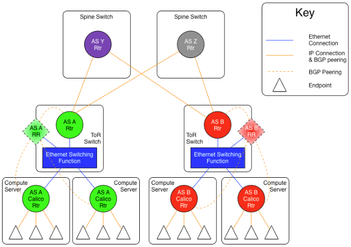
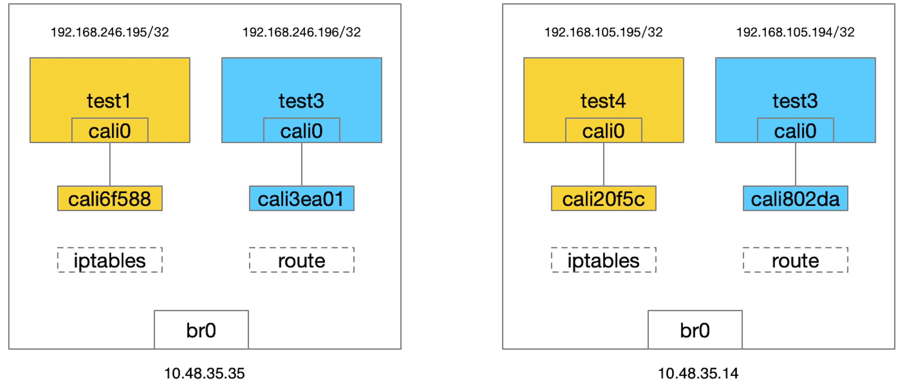
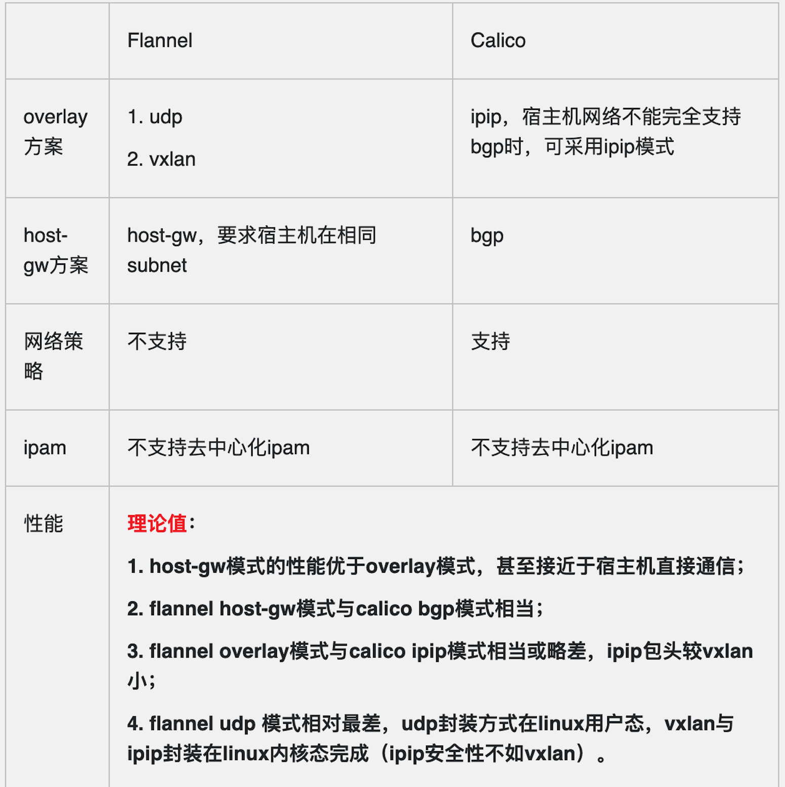

## calico

calico是一个比较有趣的虚拟网络解决方案，适用于容器的解决方案，完全利用路由规则实现动态组网，通过BGP协议通告路由。

calico的好处是endpoints组成的网络是单纯的三层网络，报文的流向完全通过路由规则控制，没有overlay等额外开销。

calico的endpoint可以漂移，并且实现了acl。

calico的缺点是路由的数目与容器数目相同，非常容易超过路由器、三层交换、甚至node的处理能力，从而限制了整个网络的扩张。

calico的每个node上会设置大量（海量)的iptables规则、路由，运维、排障难度大。

calico的原理决定了它不可能支持VPC，容器只能从calico设置的网段中获取ip。

calico目前的实现没有流量控制的功能，会出现少数容器抢占node多数带宽的情况。

calico的网络规模受到BGP网络规模的限制。


### 名词解释

- endpoint:  接入到calico网络中的网卡称为endpoint
- AS:        网络自治系统，通过BGP协议与其它AS网络交换路由信息
- ibgp:      AS内部的BGP Speaker，与同一个AS内部的ibgp、ebgp交换路由信息。
- ebgp:      AS边界的BGP Speaker，与同一个AS内部的ibgp、其它AS的ebgp交换路由信息。
- workloadEndpoint:  虚拟机、容器使用的endpoint
- hostEndpoints:     物理机(node)的地址


### calico在ip fabric中的部署方式

如果底层的网络是ip fabric的方式，三层网络是可靠的，只需要部署一套calico。

剩下的关键点就是怎样设计BGP网络，[calico over ip fabrics](https://docs.projectcalico.org/v2.1/reference/private-cloud/l3-interconnect-fabric)中给出两种设计方式:

1. AS per rack:   每个rack(机架)组成一个AS，每个rack的TOR交换机与核心交换机组成一个AS
2. AS per server: 每个node做为一个AS，TOR交换机组成一个transit AS

这两种方式采用的是[Use of BGP for routing in large-scale data centers](https://tools.ietf.org/html/draft-ietf-rtgwg-bgp-routing-large-dc-11)中的建议。


#### AS per rack

1. 一个机架作为一个AS，分配一个AS号，node是ibgp，TOR交换机是ebgp
2. node只与TOR交换机建立BGP连接，TOR交换机与机架上的所有node建立BGP连接
3. 所有TOR交换机之间以node-to-node mesh方式建立BGP连接


TOR三层联通：



每个机架上node的数目是有限的，BGP压力转移到了TOR交换机。当机架数很多，TOR交换机组成BGP mesh压力会过大。

endpoints之间的通信过程:

	EndpointA发出报文  --> nodeA找到了下一跳地址nodeB --> 报文送到TOR交换机A --> 报文送到核心交换机
	                                                                                      |
	                                                                                      v
	EndpointB收到了报文 <--  nodeB收到了报文 <-- TOR交换机B收到了报文 <--  核心交换机将报文送达TOR交换机B


#### 优化：“Downward Default model”减少需要记录的路由
Downward Default Model在上面的几种组网方式的基础上，优化了路由的管理。

在上面的方式中，每个node、每个TOR交换机、每个核心交换机都需要记录全网路由。

“Downward Default model”模式中:

1. 每个node向上(TOR)通告所有路由信息，而TOR向下(node)只通告一条默认路由
2. 每个TOR向上(核心交换机)通告所有路由，核心交换机向下(TOR)只通告一条默认路由
3. node只知晓本地的路由
4. TOR只知道接入到自己的所有node上的路由
5. 核心交换机知晓所有的路由

这种模式减少了TOR交换机和node上的路由数量，但缺点是，发送到无效IP的流量必须到达核心交换机以后，才能被确定为无效。

endpoints之间的通信过程:

	EndpointA发出报文  --> nodeA默认路由到TOR交换机A --> TOR交换机A默认路由到核心交换机 --+
	                                                                                      |
	                                                                                      v
	EndpointB收到了报文 <--  nodeB收到了报文 <-- TOR交换机B收到了报文 <-- 核心交换机找到了下一跳地址nodeB


## calico验证


### etcd


在节点上执行

	docker run -d -p 2379:2379 -p 2380:2380 --name calico_etcd elcolio/etcd \
	-name etcd1 \
	-advertise-client-urls http://10.48.35.14:2379 \
	-listen-client-urls http://0.0.0.0:2379 \
	-initial-advertise-peer-urls http://10.48.35.14:2380 \
	-listen-peer-urls http://0.0.0.0:2380 \
	-initial-cluster-token etcd-cluster \
	-initial-cluster "etcd1=http://10.48.35.14:2380" \
	-initial-cluster-state new

查看集群状态

	# curl 10.48.35.14:2379/version
	etcd 2.0.10

设置多个节点共用相同的store

	vim /etc/docker/daemon.json
	{
	    "cluster-store":"etcd://10.48.35.14:2379",
	}


重启docker服务

	systemctl restart  docker

	sudo service docker restart

#### etcd保存的calico信息

	$ sudo etcdctl ls /calico
	/calico/v1
	/calico/bgp
	/calico/ipam


	$ curl http://127.0.0.1:2379/v2/keys/
	{"action":"get","node":{"dir":true,"nodes":[{"key":"/docker","dir":true,"modifiedIndex":3,"createdIndex":3},{"key":"/calico","dir":true,"modifiedIndex":7,"createdIndex":7}]}}

	$ curl 10.48.35.14:2379/v2/keys/calico/bgp/v1/host/k8s-/ip_addr_v4 | python -m json.tool
	  % Total    % Received % Xferd  Average Speed   Time    Time     Time  Current
	                                 Dload  Upload   Total   Spent    Left  Speed
	100   156  100   156    0     0   119k      0 --:--:-- --:--:-- --:--:--  152k
	{
	    "action": "get",
	    "node": {
	        "createdIndex": 74,
	        "key": "/calico/bgp/v1/host/k8s-/ip_addr_v4",
	        "modifiedIndex": 74,
	        "value": "10.48.35.14"
	    }
	}

	$ sudo etcdctl get /calico/bgp/v1/host/k8s-/ip_addr_v4
	10.48.35.14


### calico安装

直接下载预编译好的可执行文件就可以直接使用了


	sudo wget -O /bin/calicoctl https://github.com/projectcalico/calicoctl/releases/download/v1.6.1/calicoctl
	sudo chmod +x /bin/calicoctl

	curl -O -L https://github.com/projectcalico/calicoctl/releases/download/v3.1.5/calicoctl
	chmod +x calicoctl
	mv calicoctl /user/local/bin/


下载 `calico node` 镜像

	docker pull calico/node


### 启动calico服务:

在每台主机上均运行命令：


	sudo calicoctl node run --ip=10.48.35.14 --name node01 --node-image quay.io/calico/node:v2.6.0

其中 calicoctl 命令里的 name 和 ip，每台主机均可以根据自身情况来填写。 命令实际使用 calico/node 镜像启动了一个容器，执行输出内容如下：

	sudo calicoctl node run --name node01 --ip=10.48.32.5
	Running command to load modules: modprobe -a xt_set ip6_tables
	Enabling IPv4 forwarding
	Enabling IPv6 forwarding
	Increasing conntrack limit
	Removing old calico-node container (if running).
	Running the following command to start calico-node:

	docker run --net=host --privileged --name=calico-node -d --restart=always -e IP=10.48.32.5 -e ETCD_ENDPOINTS=http://127.0.0.1:2379 -e NODENAME=node01 -e CALICO_NETWORKING_BACKEND=bird -e CALICO_LIBNETWORK_ENABLED=true -v /var/log/calico:/var/log/calico -v /var/run/calico:/var/run/calico -v /lib/modules:/lib/modules -v /run:/run -v /run/docker/plugins:/run/docker/plugins -v /var/run/docker.sock:/var/run/docker.sock quay.io/calico/node:latest

	Image may take a short time to download if it is not available locally.
	Container started, checking progress logs.

	2019-03-03 05:40:10.424 [INFO][9] startup.go 256: Early log level set to info
	2019-03-03 05:40:10.424 [INFO][9] startup.go 272: Using NODENAME environment for node name
	2019-03-03 05:40:10.424 [INFO][9] startup.go 284: Determined node name: node01
	2019-03-03 05:40:10.425 [INFO][9] startup.go 97: Skipping datastore connection test
	2019-03-03 05:40:10.473 [INFO][9] startup.go 367: Building new node resource Name="node01"
	2019-03-03 05:40:10.473 [INFO][9] startup.go 382: Initialize BGP data
	2019-03-03 05:40:10.473 [INFO][9] startup.go 476: Using IPv4 address from environment: IP=10.48.32.5
	2019-03-03 05:40:10.476 [INFO][9] startup.go 509: IPv4 address 10.48.32.5 discovered on interface br0
	2019-03-03 05:40:10.476 [INFO][9] startup.go 452: Node IPv4 changed, will check for conflicts
	2019-03-03 05:40:10.477 [INFO][9] startup.go 647: No AS number configured on node resource, using global value
	2019-03-03 05:40:10.477 [WARNING][9] startup_linux.go 47: Expected /var/lib/calico to be mounted into the container but it wasn't present. Node name may not be detected properly
	2019-03-03 05:40:10.493 [INFO][9] startup.go 536: CALICO_IPV4POOL_NAT_OUTGOING is true (defaulted) through environment variable
	2019-03-03 05:40:10.493 [INFO][9] startup.go 781: Ensure default IPv4 pool is created. IPIP mode:
	2019-03-03 05:40:10.494 [INFO][9] startup.go 791: Created default IPv4 pool (192.168.0.0/16) with NAT outgoing true. IPIP mode:
	2019-03-03 05:40:10.495 [INFO][9] startup.go 536: FELIX_IPV6SUPPORT is true (defaulted) through environment variable
	2019-03-03 05:40:10.495 [INFO][9] startup_linux.go 79: IPv6 supported on this platform: true
	2019-03-03 05:40:10.495 [INFO][9] startup.go 536: CALICO_IPV6POOL_NAT_OUTGOING is false (defaulted) through environment variable
	2019-03-03 05:40:10.495 [INFO][9] startup.go 781: Ensure default IPv6 pool is created. IPIP mode: Never
	2019-03-03 05:40:10.496 [INFO][9] startup.go 791: Created default IPv6 pool (fdb3:cdc5:a7b8::/48) with NAT outgoing false. IPIP mode: Never
	2019-03-03 05:40:10.498 [INFO][9] startup.go 181: Using node name: node01
	Starting libnetwork service
	Calico node started successfully

calico/node 中的进程

	$ sudo docker exec -it calico-node ps aux
	PID   USER     TIME   COMMAND
	1 root       0:00 /sbin/runsvdir -P /etc/service/enabled
	198 root       0:00 runsv bird6
	199 root       0:00 runsv confd
	200 root       0:00 runsv bird
	201 root       0:00 runsv felix
	202 root       0:00 runsv libnetwork
	203 root       0:00 svlogd /var/log/calico/confd
	204 root       0:01 svlogd /var/log/calico/felix
	205 root       0:00 svlogd -tt /var/log/calico/bird6
	206 root       0:00 svlogd /var/log/calico/libnetwork
	207 root       0:00 svlogd -tt /var/log/calico/bird
	208 root       0:13 bird6 -R -s /var/run/calico/bird6.ctl -d -c /etc/calico/c
	209 root       0:07 confd -confdir=/etc/calico/confd -interval=5 -watch --log
	210 root      22:38 calico-felix
	211 root       0:13 bird -R -s /var/run/calico/bird.ctl -d -c /etc/calico/con
	212 root       0:05 libnetwork-plugin


### 创建calico网络

先创建两个网络：

	# sudo docker network create --driver calico --ipam-driver calico-ipam net1
	# sudo docker network create --driver calico --ipam-driver calico-ipam net2

docker 创建网络的时候，会调用 calico 的网络驱动，由驱动完成具体的工作。注意这个网络是跨主机的，因此无论在哪台机器创建，在其他机器上都能看到：

	$ sudo docker network ls
	NETWORK ID          NAME                DRIVER              SCOPE
	0887c53db680        bridge              bridge              local
	2e0533ba7fad        host                host                local
	e8a0a439868f        net1                calico              global
	d8af5a88e634        net2                calico              global
	285e1438e0e7        none                null                local

### 创建calico网络的容器

然后分别在网络中运行容器：

node01:

	sudo docker run -tid --name=test1 --net=net1 busybox
	sudo docker run --net net2 --name test2 -tid busybox

node02:

	sudo docker run -tid --name=test3 --net=net2 busybox
	sudo docker run --net net1 --name test4 -tid busybox

### calico网络连通性

组网的拓扑如图



test1和test4都在net1中，可以连通。通过如下配置test1可以ping通test4。

	$ sudo docker exec -it test1 ping 192.168.105.195 -c 3
	PING 192.168.105.195 (192.168.105.195): 56 data bytes
	64 bytes from 192.168.105.195: seq=0 ttl=62 time=0.229 ms
	64 bytes from 192.168.105.195: seq=1 ttl=62 time=0.274 ms
	64 bytes from 192.168.105.195: seq=2 ttl=62 time=0.256 ms

	--- 192.168.105.195 ping statistics ---
	3 packets transmitted, 3 packets received, 0% packet loss
	round-trip min/avg/max = 0.229/0.253/0.274 ms


同一个网络 docker 会保存各自的名字和 IP 的对应关系，而不同网络的容器无法解析，而且不能相互通信。
test1与test2在不同的网络中，无法ping通。

	$ sudo docker exec -it test1 ping 192.168.246.196 -c 3
	PING 192.168.246.196 (192.168.246.196): 56 data bytes

	--- 192.168.246.196 ping statistics ---
	3 packets transmitted, 0 packets received, 100% packet loss

#### 路由

##### node1

**主机网卡**

	$ ip addr show
	16: cali6f588e66d6f@if15: <BROADCAST,MULTICAST,UP,LOWER_UP> mtu 1500 qdisc noqueue state UP
	    link/ether 52:f7:01:67:89:90 brd ff:ff:ff:ff:ff:ff link-netnsid 2
	18: cali3ea014c6cc8@if17: <BROADCAST,MULTICAST,UP,LOWER_UP> mtu 1500 qdisc noqueue state UP
	    link/ether 02:2a:51:4f:26:c0 brd ff:ff:ff:ff:ff:ff link-netnsid 1

**容器test1 网卡**

	$ sudo docker exec test1 ip addr show
	1: lo: <LOOPBACK,UP,LOWER_UP> mtu 65536 qdisc noqueue qlen 1000
	    link/loopback 00:00:00:00:00:00 brd 00:00:00:00:00:00
	    inet 127.0.0.1/8 scope host lo
	       valid_lft forever preferred_lft forever
	    inet6 ::1/128 scope host
	       valid_lft forever preferred_lft forever
	15: cali0@if16: <BROADCAST,MULTICAST,UP,LOWER_UP,M-DOWN> mtu 1500 qdisc noqueue
	    link/ether ee:ee:ee:ee:ee:ee brd ff:ff:ff:ff:ff:ff
	    inet 192.168.246.195/32 scope global cali0
	       valid_lft forever preferred_lft forever
	    inet6 fe80::ecee:eeff:feee:eeee/64 scope link
	       valid_lft forever preferred_lft forever

- 容器网卡cali0即16号网卡，对接host节点15号网卡；
- 也再次印证容器获取的是/32位主机地址；
- 注意容器网卡的mac地址”ee:ee:ee:ee:ee:ee”, 这是1个固定的特殊地址（所有calico生成的容器mac地址均一样），因为calico只关心三层的ip地址，而不关心二层mac地址


**主机路由**

	$ ip route
	default via 10.48.35.1 dev br0
	10.48.35.0/24 dev br0 proto kernel scope link src 10.48.35.14
	169.254.0.0/16 dev br0 scope link metric 1005
	172.17.0.0/16 dev docker0 proto kernel scope link src 172.17.0.1
	192.168.105.192/26 via 10.48.35.35 dev br0 proto bird
	blackhole 192.168.246.192/26 proto bird
	192.168.246.195 dev cali6f588e66d6f scope link
	192.168.246.196 dev cali3ea014c6cc8 scope link

calico默认在每个节点上创建一个 26 位掩码的子网，该子网可以有64个IP地址。在本机可以通过calico学习到到其他节点虚拟的路由，在本例中，如图第5条路由。

最后两条路由是到本机容器的路由，发送到对应的网卡。

第二条路由是到hulk容器的路由。


**容器test1 路由**

	$ sudo docker exec test1 ip route
	default via 169.254.1.1 dev cali0
	169.254.1.1 dev cali0 scope link

- 容器网关“169.254.1.1”是1个预留本地ip地址，通过cali0端口发送到网关；
- calico为简化网络配置,将容器的网关设置为1个固定的本地保留地址，容器内路由规则都是一样的，不需要动态更新；
- 确定下一跳后，容器会发送查询下一跳”169.254.1.1”的mac地址的ARP

这个 ARP 请求发到哪里了呢？要回答这个问题，就要知道 cali0 是 veth pair 的一端，其对端是主机上 caliXXXX 命名的 interface，可以通过 ethtool -S cali0 列出对端的 interface idnex。

	$ sudo docker exec test1 ip neigh show
	169.254.1.1 dev cali0 lladdr 52:f7:01:67:89:90 used 0/0/0 probes 1 STALE

默认网卡 169.254.1.1 的mac地址是 cali0 对接网卡的mac地址，也就是host节点的16号网卡的mac地址。

	$ sudo tcpdump -i cali6f588e66d6f -e -nn
	11:11:15.375778 ee:ee:ee:ee:ee:ee > 52:f7:01:67:89:90, ethertype ARP (0x0806), length 42: Request who-has 169.254.1.1 tell 192.168.246.195, length 28
	11:11:15.375795 52:f7:01:67:89:90 > ee:ee:ee:ee:ee:ee, ethertype ARP (0x0806), length 42: Reply 169.254.1.1 is-at 52:f7:01:67:89:90, length 28

通过在host节点”cali6f588e66d6f”网卡上抓二层包发现，容器的”cali0”网卡（mac地址”ee:ee:ee:ee:ee:ee”）发出的request包，host节点的”cali6f588e66d6f”网卡直接以本地mac地址”52:f7:01:67:89:90”回复；
如果清除容器的arp表，可以更清晰的看到容器的arp请求报文被host节点对应的网卡响应

换句话说，它把自己的 MAC 地址作为应答返回给容器。容器的后续报文 IP 地址还是目的容器，但是 MAC 地址就变成了主机上该 interface 的地址，也就是说所有的报文都会发给主机，然后主机根据 IP 地址进行转发。

主机这个 interface 不管 ARP 请求的内容，直接用自己的 MAC 地址作为应答的行为被成为 ARP proxy，是 calico 开启的，可以通过下面的命令确认：

	$ cat /proc/sys/net/ipv4/conf/cali6f588e66d6f/proxy_arp
	1

总的来说，可以认为 calico 把主机作为容器的默认网关来使用，所有的报文发到主机，然后主机根据路由表进行转发。和经典的网络架构不同的是，calico 并没有给默认网络配置一个 IP 地址（这样每个网络都会额外消耗一个 IP 资源，而且主机上也会增加对应的 IP 地址和路由信息），而是通过 arp proxy 和修改容器路由表来实现。

在calico中，IP被称为Endpoint，宿主机上的容器IP称为workloadEndpoint，物理机IP称为hostEndpoint。ipPool等一同被作为资源管理。

查看默认的地址段:

	$ sudo calicoctl get ippool -o wide
	CIDR                       NAT     IPIP
	192.168.0.0/16             true    false
	fd80:24e2:f998:72d6::/64   false   false

会创建默认一个IP地址池为容器使用，这里用的是 `192.168.0.0/16`。

calico为每个宿主机的容器分配了一个网段
宿主机上每个容器都有一条对应的路由表项，下一跳是veth pair，

### 组件和架构

calico 做的事情：
- 分配和管理 IP
- 配置上容器的 veth pair 和容器内默认路由
- 根据集群网络情况实时更新节点上路由表

从部署过程可以知道，除了 etcd 保存了数据之外，节点上也就只运行了一个 calico-node 的容器，所以推测是这个容器实现了上面所有的功能。calico/node 这个容器运行如下的进程

```shell
[root@node00 ~]# docker exec -it calico-node sh
/ # ps aux
PID   USER     TIME   COMMAND
    1 root       0:01 /sbin/runsvdir -P /etc/service/enabled
   75 root       0:00 runsv felix
   76 root       0:00 runsv bird
   77 root       0:00 runsv bird6
   78 root       0:00 runsv confd
   79 root       0:00 runsv libnetwork
   80 root       0:02 svlogd /var/log/calico/felix
   81 root      30:49 calico-felix
   82 root       0:00 svlogd /var/log/calico/confd
   83 root       0:05 confd -confdir=/etc/calico/confd -interval=5 -watch --log-level=debug -node=http://172.17.8.100:2379 -client-key= -client-cert= -client-ca-keys=
   84 root       0:00 svlogd -tt /var/log/calico/bird
   85 root       0:20 bird -R -s /var/run/calico/bird.ctl -d -c /etc/calico/confd/config/bird.cfg
   86 root       0:00 svlogd -tt /var/log/calico/bird6
   87 root       0:18 bird6 -R -s /var/run/calico/bird6.ctl -d -c /etc/calico/confd/config/bird6.cfg
   94 root       0:00 svlogd /var/log/calico/libnetwork
   95 root       0:04 libnetwork-plugin
```

runsv 是一个 minimal 的 init 系统提供的命令，用来管理多个进程，可以看到它运行的进程包括：felix、bird、bird6、confd 和 libnetwork，这部分就介绍各个进程的功能。


#### libnetwork plugin

libnetwork-plugin 是 calico 提供的 docker 网络插件，主要提供的是 IP 管理和网络管理的功能。

默认情况下，当网络中出现第一个容器时，calico 会为容器所在的节点分配一段子网（子网掩码为 /26，比如192.168.196.128/26），后续出现在该节点上的容器都从这个子网中分配 IP 地址。这样做的好处是能够缩减节点上的路由表的规模，按照这种方式节点上 2^6 = 64 个 IP 地址只需要一个路由表项就行，而不是为每个 IP 单独创建一个路由表项。节点上创建的子网段可以在etcd 中 /calico/ipam/v2/host/<node_name>/ipv4/block/ 看到。

calico 还允许创建容器的时候指定 IP 地址，如果用户指定的 IP 地址不在节点分配的子网段中，calico 会专门为该地址添加一个 /32 的网段。

#### BIRD
BIRD（BIRD Internet Routing Daemon） 是一个常用的网络路由软件，支持很多路由协议（BGP、RIP、OSPF等），calico 用它在节点之间共享路由信息。

关于 BIRD 如何配置 BGP 协议，可以参考官方文档，对应的配置文件在 /etc/calico/confd/config/ 目录。

NOTE：至于为什么选择 BGP 协议而不是其他的路由协议，官网上也有介绍: [Why BGP?](https://www.projectcalico.org/why-bgp/)

默认所有的节点使用相同的 AS number 64512，因为 AS number 是一个32 比特的字段，所以有效取值范围是 [0-4294967295]，可以通过 calicoctl config get asNumber 命令查看当前节点使用的 AS number。

默认情况下，每个 calico 节点会和集群中其他所有节点建立 BGP peer 连接，也就是说这是一个 O(n^2) 的增长趋势。在集群规模比较小的情况下，这种模式是可以接受的，但是当集群规模扩展到百个节点、甚至更多的时候，这样的连接数无疑会带来很大的负担。为了解决集群规模较大情况下 BGP client 连接数膨胀的问题，calico 引入了 RR（Router Reflector） 的功能。

RR 的基本思想是选择一部分节点（一个或者多个）作为 Global BGP Peer，它们和所有的其他节点互联来交换路由信息，其他的节点只需要和 Global BGP Peer 相连就行，不需要之间再两两连接。更多的组网模式也是支持的，不管怎么组网，最核心的思想就是所有的节点能获取到整个集群的路由信息。

calico 对 BGP 的使用还是相对简单的，BGP 协议的原理不是一两句话能解释清楚的，以后有机会单独写篇文章来说吧。

**bird**

bird -R -s /var/run/calico/bird.ctl -d -c /etc/calico/confd/config/bird.cfg

-R 选项指定启动后恢复
-s 指定通信的socket
-d 指定 debug信息
-c 指定配置文件


bird配置

```
/ # cat /etc/calico/confd/config/bird.cfg
# Generated by confd
include "bird_aggr.cfg";
include "custom_filters.cfg";
include "bird_ipam.cfg";

router id 10.48.35.14;

# Configure synchronization between routing tables and kernel.
protocol kernel {
  learn;             # Learn all alien routes from the kernel
  persist;           # Don't remove routes on bird shutdown
  scan time 2;       # Scan kernel routing table every 2 seconds
  import all;
  export filter calico_ipip; # Default is export none
  graceful restart;  # Turn on graceful restart to reduce potential flaps in
                     # routes when reloading BIRD configuration.  With a full
                     # automatic mesh, there is no way to prevent BGP from
                     # flapping since multiple nodes update their BGP
                     # configuration at the same time, GR is not guaranteed to
                     # work correctly in this scenario.
}

# Watch interface up/down events.
protocol device {
  debug { states };
  scan time 2;    # Scan interfaces every 2 seconds
}

protocol direct {
  debug { states };
  interface -"cali*", "*"; # Exclude cali* but include everything else.
}

# Template for all BGP clients
template bgp bgp_template {
  debug { states };

  description "Connection to BGP peer";
  local as 64512;
  multihop;
  gateway recursive; # This should be the default, but just in case.
  import all;        # Import all routes, since we don't know what the upstream
                     # topology is and therefore have to trust the ToR/RR.
  export filter calico_pools;  # Only want to export routes for workloads.
  next hop self;     # Disable next hop processing and always advertise our
                     # local address as nexthop
  source address 10.48.35.14;  # The local address we use for the TCP connection
  add paths on;
  graceful restart;  # See comment in kernel section about graceful restart.
}

# For peer /host/k8s-ep133./ip_addr_v4
protocol bgp Mesh_10_48_32_5 from bgp_template {
  neighbor 10.48.32.5 as 64512;
}

# For peer /host/k8s-ep98./ip_addr_v4
protocol bgp Mesh_10_48_35_35 from bgp_template {
  neighbor 10.48.35.35 as 64512;
}

# For peer /host/k8s-/ip_addr_v4
# Skipping ourselves (10.48.35.14)

```

#### confd

因为 bird 的配置文件会根据用户设置的变化而变化，因此需要一种动态的机制来实时维护配置文件并通知 bird 使用最新的配置，这就是 confd 的工作。confd 监听 etcd 的数据，用来更新 bird 的配置文件，并重新启动 bird 进程让它加载最新的配置文件。confd 的工作目录是 /etc/calico/confd，里面有三个目录：

conf.d：confd 需要读取的配置文件，每个配置文件告诉 confd 模板文件在什么，最终生成的文件应该放在什么地方，更新时要执行哪些操作等
config：生成的配置文件最终放的目录
templates：模板文件，里面包括了很多变量占位符，最终会替换成 etcd 中具体的数据
具体的配置文件很多，我们只看一个例子：

它会监听 etcd 的 /calico/bgp/v1 路径，一旦发现更新，就用其中的内容更新模板文件 bird.cfg.mesh.template，把新生成的文件放在 /etc/calico/confd/config/bird.cfg，文件改变之后还会运行 reload_cmd 指定的命令重启 bird 程序。

NOTE：关于 confd 的使用和工作原理请参考[它的官方 repo](https://github.com/kelseyhightower/confd)。

#### felix
felix 负责最终网络相关的配置，也就是容器网络在 linux 上的配置工作，比如：

更新节点上的路由表项
更新节点上的 iptables 表项
它的主要工作是从 etcd 中读取网络的配置，然后根据配置更新节点的路由和 iptables，felix 的代码在 [github projectcalico/felix](https://github.com/projectcalico/felix)。

#### etcd
etcd 已经在前面多次提到过，它是一个分布式的键值存储数据库，保存了 calico 网络元数据，用来协调 calico 网络多个节点。可以使用 etcdctl 命令行来读取 calico 在 etcd 中保存的数据：

```
etcdctl -C 172.17.8.100:2379 ls /calico
/calico/ipam
/calico/v1
/calico/bgp
```

每个目录保存的数据大致功能如下：
- `/calico/ipam`：IP 地址分配管理，保存了节点上分配的各个子网段以及网段中 IP 地址的分配情况
- `/calico/v1`：profile 和 policy 的配置信息，节点上运行的容器 endpoint 信息（IP 地址、veth pair interface 的名字等），
- `/calico/bgp`：和 BGP 相关的信息，包括 mesh 是否开启，每个节点作为 gateway 通信的 IP 地址，AS number 等


### 强大的防火墙功能
从前面的实验我们不仅知道了 calico 容器网络的报文流程是怎样的，还发现了一个事实：默认情况下，同一个网络的容器能通信（不管容器是不是在同一个主机上），不同网络的容器是无法通信的。

这个行为是 calico 强大的防火墙实现的，默认情况下 calico 为每个网络创建一个 profile：

```
$ sudo calicoctl get profile net1 -o yaml
- apiVersion: v1
  kind: profile
  metadata:
    name: net1
    tags:
    - net1
  spec:
    egress:
    - action: allow
      destination: {}
      source: {}
    ingress:
    - action: allow
      destination: {}
      source:
        tag: net1
```

- profile 是和网络对应的，比如上面 metadata.name 的值是 net1，代表它匹配 net1网络，并应用到所有的 net1 网络容器中
- calico 使用 label 来增加防火墙规则的灵活性，源地址和目的地址都可以通过 label 匹配
- profile 中 metadata.tags 会应用到网络中所有的容器上
- 如果有定义，profile中的 metadata.labels 也会应用到网络中所有的容器上
- spec 指定 profile 默认的网络规则，egress 没有限制，ingress 表示只运行 tag 为 net1 容器（也就是同一个网络的容器）的访问
- 每一个加入到网络的容器都会加上这个 profile，以此来实现网络之间的隔离。可以通过查看 endpoints 的详情得到它上面绑定的 profiles：

```
$ sudo calicoctl get workloadEndpoint 6f588e66d6fef025fe7edb404ffb1684465b20f9454869089bcda08fbf5bc33e -o yaml
- apiVersion: v1
  kind: workloadEndpoint
  metadata:
    name: 6f588e66d6fef025fe7edb404ffb1684465b20f9454869089bcda08fbf5bc33e
    node: k8s-
    orchestrator: libnetwork
    workload: libnetwork
  spec:
    interfaceName: cali6f588e66d6f
    ipNetworks:
    - 192.168.246.195/32
    mac: ee:ee:ee:ee:ee:ee
    profiles:
    - net1
```

#### iptables


```
$ sudo iptables -L
Chain INPUT (policy ACCEPT)
target     prot opt source               destination
cali-INPUT  all  --  anywhere             anywhere             /* cali:Cz_u1IQiXIMmKD4c */
KUBE-FIREWALL  all  --  anywhere             anywhere

Chain FORWARD (policy ACCEPT)
target     prot opt source               destination
cali-FORWARD  all  --  anywhere             anywhere             /* cali:wUHhoiAYhphO9Mso */

Chain OUTPUT (policy ACCEPT)
target     prot opt source               destination
cali-OUTPUT  all  --  anywhere             anywhere             /* cali:tVnHkvAo15HuiPy0 */
KUBE-FIREWALL  all  --  anywhere             anywhere

```


用户也可以根据需求修改 profile 和 policy，可以参考[官方教程](https://docs.projectcalico.org/v2.6/getting-started/docker/tutorials/security-using-calico-profiles-and-policy)。

不过上面的防火墙都是针对网络的（网络中的容器的规则都是相同的），不能精细化到容器，也就是说只能做到网络之间的隔离和连通。不过 calico 也提供了对容器级别防火墙的支持，它主要是借助 docker 容器上的 label，通过匹配这些键值对来精细化控制防火墙。启动 docker label 支持需要在 calicoctl node run 命令运行时加上 --use-docker-networking-container-labels 参数，而且一旦启用后原来的 profile 就被废弃不能用了（可以用纯 policy 实现原来的 profile 功能）。容器启动的时候需要添加上 label 用来作为 policy 的标识，比如 --label org.projectcalico.label.role=frontend，具体的使用案例请参考[这个教程](https://docs.projectcalico.org/v2.6/getting-started/docker/tutorials/security-using-docker-labels-and-calico-policy)。

如果只要提供网络之间的隔离，可以使用 profile 和 policy；如果要实现精细化的容器之间的隔离，就需要启用容器的 label 功能了。在底层，calico 的 flelix 组件会实时跟踪 profile 和 policy 的内容，并更新各个节点的 iptables。

## 总结
calico 的核心是通过维护路由规则实现容器的通信，路由信息的传播是 BIRD 软件通过 BGP 协议完成的，而节点上路由和防火墙规则是 felix 维护的。

从 calico 本身的特性来说，它没有办法实现 VPC 网络，并且需要维护大量的路由表项和 iptables 表项，如果要部署在规模很大的生产环境中，需要预先规划系统的 iptables 和路由表项的上限。

在我看来，calico 最大的优点有两个：直接三层互联的网络，不需要报文封装，因此性能更好而且能和原来的网络设施直接融合；强大的防火墙规则，利用 label 机制灵活地匹配容器，几乎可以设置任何需求的防火墙。

但 calico 并非没有缺点，首先是它引入了 BGP 协议，虽然 bird 的配置很简单，但是运维这个系统需要熟悉 BGP 协议，这无疑会增加了人力、时间和金钱方面的投入；其次，calico 能支持的网络规模也有上限，虽然可以通过 Router Reflector 来缓解，但这么做又大大增加了网络规划、使用和排查的复杂度；最后 calico 无法用来实现 VPC 网络，IP 地址空间是所有租户共享的，租户之间是通过防火墙隔离的。


### 针对flannel与calico网络方案做简单的对比





## 命令

### 创建/查看/更新/删除资源

分别使用creat/get/replace/delete来创建/查看/更新/删除资源。

创建资源:

calicoctl create --filename=<FILENAME> [--skip-exists] [--config=<CONFIG>]
资源使用yaml文件描述，可以创建以下资源:

	node                //物理机
	bgpPeer             //与本机建立了bgp连接的node
	hostEndpoint
	workloadEndpoint
	ipPool
	policy
	profile

查看资源:

	calicoctl get ([--scope=<SCOPE>] [--node=<NODE>] [--orchestrator=<ORCH>]
	          [--workload=<WORKLOAD>] (<KIND> [<NAME>]) |
	          --filename=<FILENAME>)
	          [--output=<OUTPUT>] [--config=<CONFIG>]

可以通过下面命令查看所有资源:

	calicoctl  get  [资源类型］

例如:

    calicoctl get node
	calicoctl delete node node01

### IP地址管理

	calicoctl ipam <command> [<args>...]

	  release      Release a calico assigned IP address.         
	  show         Show details of a calico assigned IP address.

### 运行时设置

`calicoctl config` 获取和更改calico的配置项.


## 日志

/var/log/calico/libnetwork/current


## 参考资料
[Calico网络的原理、组网方式与使用](http://www.lijiaocn.com/%E9%A1%B9%E7%9B%AE/2017/04/11/calico-usage.html)

[Kubernetes Networking: Part 2 - Calico](http://leebriggs.co.uk/blog/2017/02/18/kubernetes-networking-calico.html)

[calico: Frequently Asked Questions](https://docs.projectcalico.org/v2.6/usage/troubleshooting/faq)
