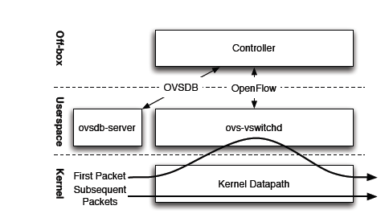
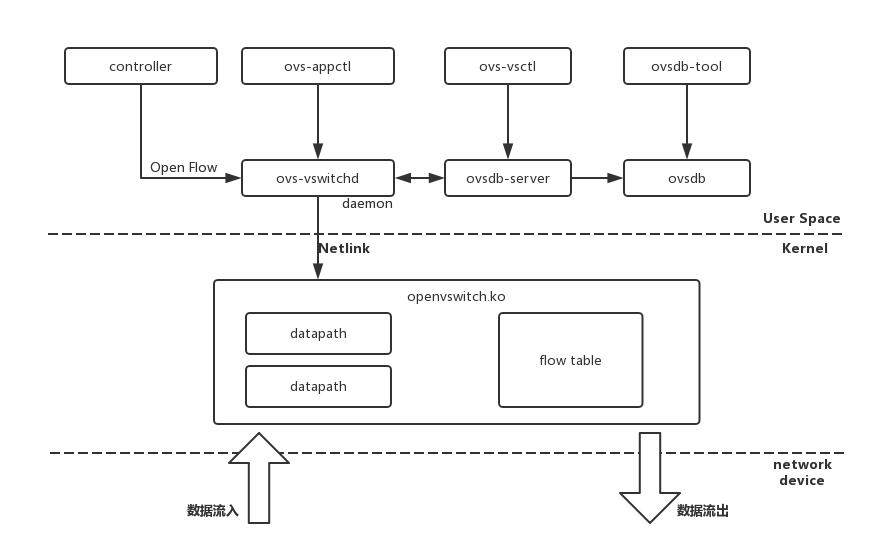
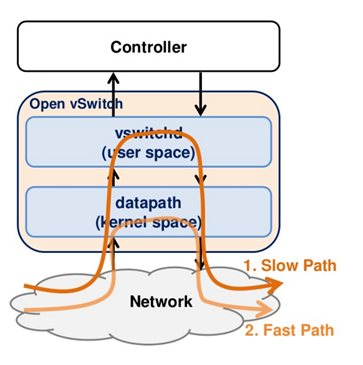
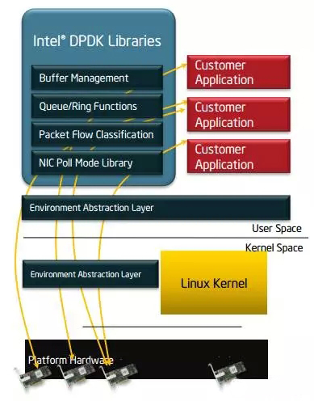
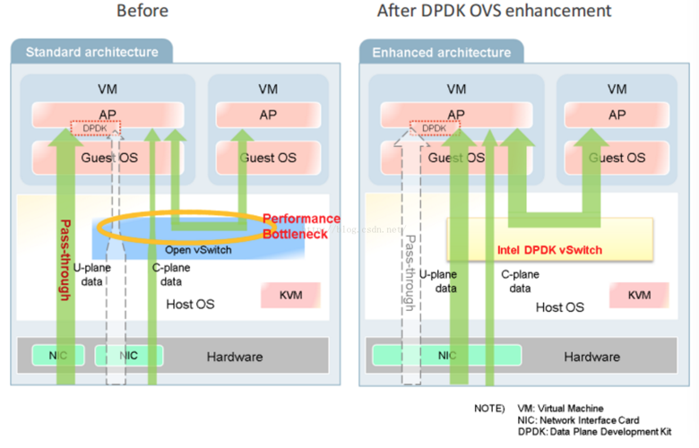
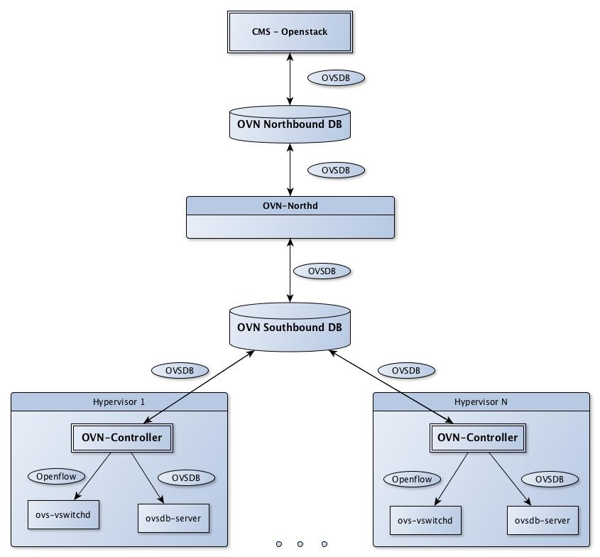

在云计算之前，应用程序直接运行在数据中心服务器的操作系统上，网络流量通过与服务器相连的硬件交换机转发。随着云计算虚拟化技术的发展，在服务器中可以运行大量的虚拟机或者容器，应用程序运行在虚拟环境中对虚拟网络提出了新的要求，需要一张连通性、隔离性、安全性更好，以及灵活的虚拟网络。需要在服务器中运行虚拟交换机，连接虚拟机和宿主机网络，有几种虚拟交换机方案：Linux bridge, VMware virtual switch, Cisco Nexus 1000V 和 Open vSwitch。

[OVS（Open vSwitch）](https://www.openvswitch.org/) 是运行在虚拟化平台的虚拟交换机，OVS 是由 Nicira Networks 公司用 C 语言开发的高质量、多层虚拟交换机，为连接虚拟主机构建复杂网络应用提供支持，支持多种数据面和管理面协议，如：VxLAN、sFlow、CLI、LACP 等。

OVS 支持 Openflow 协议，可以使用任何支持 Openflow 协议的控制器集成，比如可以与 OpenStack Neutron 的网络插件对接；在没有 Openflow 控制器的情况下 OVS 可以作为传统的二层交换机通过 MAC 学习来完成二层数据转发。Linux Bridge 也可以通过 MAC 地址学习实现二层转发，但是功能比较简单，而 OVS 支持更多的高级特性，比如 Openflow、QoS、ACL 及多种隧道封装，这也是 OVS 更加适用于 SDN 的原因。

OVS 主要支持如下的 [特性](http://www.openvswitch.org//features/)：

- VM 通信的网络可视化，通过 NetFlow, sFlow(R), IPFIX, SPAN, RSPAN 和 GRE 隧道镜像的方式
- LACP，802.1Q VLAN
- 组播
- BFD 双向转发检测和 802.1ag 链路监控
- STP 和 RSTP
- 精细的 QoS 控制
- 基于端口的流量策略
- 网卡绑定，主备切换和四层负载均衡
- 支持 Openflow
- 支持 IPv6
- 多种隧道协议支持，GRE, VXLAN, STT, and Geneve, with IPsec support
- 支持用户控件和内核转发引擎的选项配置
- flow-caching 引擎的多流表转发
- 转发层的抽象更易于移植到新的软硬件平台。

# OVS 架构

先看下 OVS 整体架构，内核空间运行着转发功能的 datapath，用户空间运行着 ovs-vswitchd，第一条报文要上送 ovs-vswitchd 转发，ovsdb-server 保存着数据信息。OVS 控制器可以通过 OVSDB 或者 Openflow 协议与 OVS 通信。

OVS 包括以下的核心模块：

- ovs-vswitchd 主要模块，实现switch的daemon，包括一个支持流交换的Linux内核模块；
- ovsdb-server 轻量级数据库服务器，提供ovs-vswitchd获取配置信息；
- openvswitch.ko Linux 内核模块中的转发实现

提供了一些工具来方便管理和配置：

- ovs-dpctl：用来配置交换机内核模块
- ovs-vsctl：用于查询和更新ovs-vswitchd的配置信息，操作对象为ovsdb-server。更新配置时，命令会等待配置在ovs-vswitchd生效后才返回。
- ovs-appctl：向ovs-vswitchd发送命令。
- ovs-ofctl: 用来配置交换机的flow相关。

## 组件关系

- ovs-vswitchd 和 ovsdb-server 运行在用户空间，ovs-vswitchd 通过 unix domain socket 向 ovsdb-server 获取和更新配置信息，ovsdb 通常是一个文件 `/etc/openvswitch/conf.db`。
- openvswitch.ko 运行在内核空间实现报文的转发，与 ovs-vswitchd 通过 netlink 交互。
- 数据交换是通过内核空间的 datapath 转发的，datapath 通过 flow table 来指导转发，当收到一个报文时，按照匹配到的 flow 的 action 来转发。

## 转发路径

当收到新的一条报文时，在 datapath 中的 flow table 中找不到匹配项，发送给用户空间的 ovs-vswitchd，后者查询数据库判断转发 action，然后把匹配的actions返回给datapath并设置一条datapath flows到 datapath 中，这样后续进入的同类型的数据包因为缓存匹配会被 datapath 直接处理，不用再次进入用户空间。

datapath 专注于数据交换，它不需要知道 OpenFlow 的存在。与 OpenFlow 打交道的是 ovs-vswitchd，ovs-vswitchd 存储所有 Flow 规则供 datapath 查询或缓存。

转发路径参考下图

# OVS 常用操作

以下操作都需要root权限运行，在所有命令中br0表示网桥名称，eth0为网卡名称。

## ovs-vsctl

添加网桥：

	#ovs-vsctl add-br br0

列出open vswitch中的所有网桥：

	#ovs-vsctl list-br

判断网桥是否存在

	#ovs-vsctl br-exists br0

将物理网卡挂接到网桥：

	#ovs-vsctl add-port br0 eth0

列出网桥中的所有端口：

	#ovs-vsctl list-ports br0

列出所有挂接到网卡的网桥：

	#ovs-vsctl port-to-br eth0

查看open vswitch的网络状态：

	#ovs-vsctl show

删除网桥上已经挂接的网口：

	#vs-vsctl del-port br0 eth0

删除网桥：

	#ovs-vsctl del-br br0

# OVS DPDK

## DPDK 介绍

DPDK是X86平台报文快速处理的库和驱动的集合，不是网络协议栈，不提供二层，三层转发功能，不具备防火墙ACL功能，但通过DPDK可以轻松的开发出上述功能。

DPDK的优势在于，可以将用户态的数据，不经过内核直接转发到网卡，实现加速目的。主要架构如图所示：

DPDK关键技术点：

- 使用大页缓存支持来提高内存访问效率。
- 利用UIO支持，提供应用空间下驱动程序的支持，也就是说网卡驱动是运行在用户空间的，减小了报文在用户空间和应用空间的多次拷贝。
- 利用 Linux 亲和性支持，把控制面线程及各个数据面线程绑定到不同的CPU核，节省了线程在各个CPU核来回调度。
- Lockless， 提供无锁环形缓存管理，加快内存访问效率。
- 收发包批处理 ，多个收发包集中到一个cache line，在内存池中实现，无需反复申请和释放。
- PMD驱动，用户态轮询驱动，可以减小上下文切换开销，方便实现虚拟机和主机零拷贝。

## OVS 流表转发

OVS 工作在内核态，与 guest virtio 的数据传输需要多次内核态和用户态的数据切换, 带来性能瓶颈。

OVS当前版本采用Megaflow Cache+Microflow Cache的流Cache组织形式，仍保留了Microflow Cache作为一级Cache，即报文进入后首先查这一级Cache，获取到一个索引值，指向的是最近一次查Megaflow Cache表项。那么报文的首次查表就不需要进行线性地链式搜索，可直接对应到其中一张Megaflow的元组表。这样提高了查表效率和转发性能。

ovs-dpdk 结合了DPDK和vhost-user技术的优势，vhost-user是一个用户态的vhost-backend程序，从虚拟机到host上实现了数据的zero copy。DPDK 高性能(user space) 网卡驱动、大页内存、无锁化结构设计，可以实现万兆网卡线速的性能。ovs-dpdk使vm到vm和nic到vm的整个数据传输都工作在用户态，极大的提升了ovs的性能。

## 转发性能

ovs-dpdk的小包处理能力是原ovs的约3~4倍，网络处理性能有了显著提高。高带宽用户vm，部署在ovs-dpdk上，能降低公网IP网络访问延迟，提高网络并发量。

# OVN

[OVN (Open Virtual Network)](http://openvswitch.org/support/dist-docs/ovn-architecture.7.html) 是 OVS 的控制平面，为 OVS 提供的原生虚拟化网络方案，旨在解决传统SDN架构的性能问题。其主要功能包括：

- L2/L3虚拟网络以及逻辑交换机(logical switch)
- L2/L3/L4 ACL
- IPv4/IPv6分布式L3路由
- ARP and IPv6 Neighbor Discovery suppression for known IP-MAC bindings
- Native support for NAT and load balancing using OVS connection tracking
- Native fully distributed support for DHCP
- Works with any OVS datapath (such as the default Linux kernel datapath, DPDK, or Hyper-V) that supports all required features (namely Geneve tunnels and OVS connection tracking)
- Supports L3 gateways from logical to physical networks
- Supports software-based L2 gateways
- Supports TOR (Top of Rack) based L2 gateways that implement the hardware_vtep schema
- Can provide networking for both VMs and containers running inside of those VMs, without a second layer of overlay networking

## OVN架构
OVN由以下组件构成：

- northbound database：存储逻辑交换机、路由器、ACL、端口等的信息，目前基于ovsdb-server，未来可能会支持etcd v3
- ovn-northd: 集中式控制器，负责把northbound database数据分发到各个ovn-controller
- ovn-controller: 运行在每台机器上的本地SDN控制器，将配置转换为流表
- southbound database：基于ovsdb-server（未来可能会支持etcd v3），包含三类数据
	- 物理网络数据，比如VM的IP地址和隧道封装格式
	- 逻辑网络数据，比如报文转发方式
	- 物理网络和逻辑网络的绑定关系

## OVN Kubernetes

[ovn-kubernetes](https://github.com/openvswitch/ovn-kubernetes) 提供了一个 OVN CNI 网络插件，支持underlay和overlay两种模式。

- underlay：容器运行在虚拟机中，而ovs则运行在虚拟机所在的物理机上，OVN将容器网络和虚拟机网络连接在一起
- overlay：OVN通过logical overlay network连接所有节点的容器，此时ovs可以直接运行在物理机或虚拟机上

### CNI插件原理

**ADD操作**

- 从ovn annotation获取ip/mac/gateway
- 在容器netns中配置接口和路由
- 添加ovs端口

	ovs-vsctl add-port br-int veth_outside \
	  --set interface veth_outside \
	    external_ids:attached_mac=mac_address \
	    external_ids:iface-id=namespace_pod \
	    external_ids:ip_address=ip_address

**DEL操作**

	ovs-vsctl del-port br-int port
