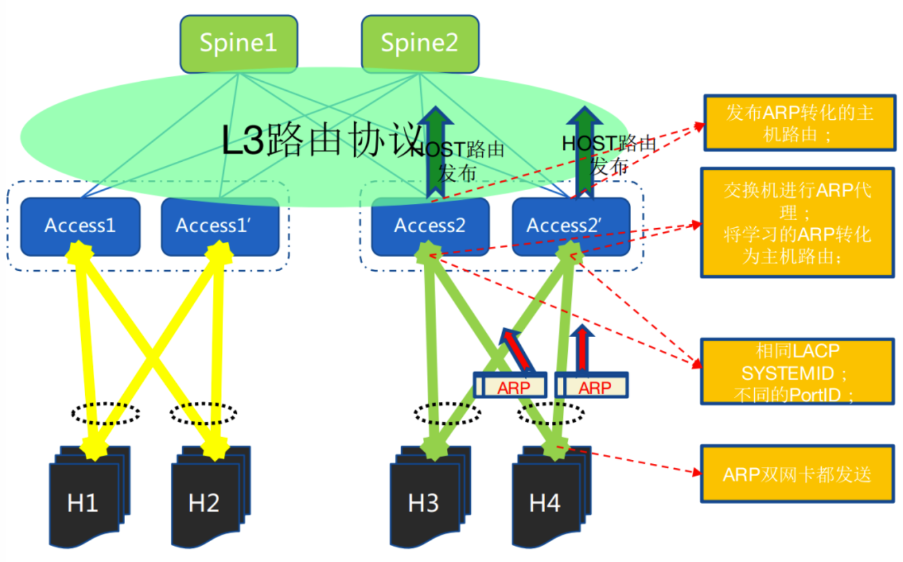

基础网络就好比建筑的地基一样，是保证业务，乃至公司正常运转的第一道防线，要做到基础网络的高可用，这个目标看起来简单，却并不是那么容易做到。本文介绍一种双上联去堆叠设计，为高可用的目标增加了强有力的支撑。

# 为什么去堆叠？

为了支持业务的高可用，物理网络架构往往采用双上行接入的方式，ToR 交换机采用了堆叠机构，从 Server 的接入 link 到 ToR 的层面实现了双活备份，当一台TOR的故障或者单网卡，单条网线的故障时，对于业务系统的可用性影响降到最低，当然对上层业务也会有一定影响，会出现高水位时性能的损失，但是不会出现服务不可用。

传统的双活接入的方式主要有如下几种：

- 堆叠（常用，各厂商私有）
- VPC（思科私有）
- M-LAG（各厂商私有）

传统双活接入技术的缺点：

- 多设备统一控制面，可靠性低、升级困难
- 数量受限，规模受限
- 横向连接浪费端口

上述的技术都是要求两台交换机之间通过协议交互共享转发表项信息，甚至堆叠技术要求两台 ToR 在管理和转发层面都 merge 成为一台设备，这在无形中增加了技术复杂度和出问题的概率。实际运行过程中也体现了这一点，两台 ToR 由于堆叠系统的软硬件 bug 原因导致同时宕机的情况屡见不鲜，对业务系统的稳定性形成了很大的挑战。

需要一种技术能够增加带宽提高网卡冗余的同时，真正解决了交换机接入硬件和软件同时冗余。目前在国内的 BAT 都有一些落地实践。

# 去堆叠组网

服务器双网卡采用 bond + mod4，依靠捆绑实现分担与保护，交换机依靠 ECMP 实现负载分担与保护，此方式依赖：

- 接入交换机独立，但作为网关，需要配置相同的 IP & MAC
- 服务器网卡捆绑做负载分担
- 服务器网卡与交换机运行 LACP
- 交换机做 LACP 欺骗，两台交换机配置相同的 LACP SystemID，不同的 PortID
- 交换机支持 ARP 代理，所有的 ARP 请求都以网关 MAC 回应，将交换机的流量都转成路由转发
- 交换机将 ARP 转化为主机路由并发布
- 服务器网卡双发 ARP，确保交换机都学习到 ARP
