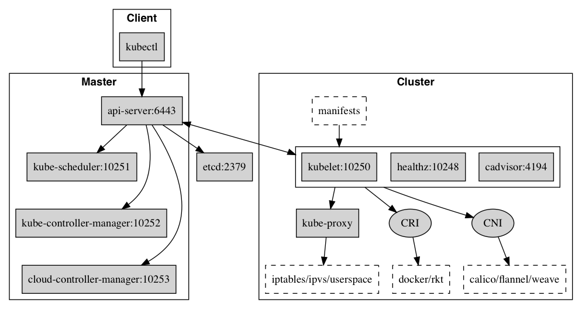

CNI (Container Network Interface) 插件是可执行文件，最早是由CoreOS发起的容器网络规范，现被CNCF(Cloud Native Computing Foundation)接管，是Kubernetes网络插件的基础。其基本思想为：Container Runtime在创建容器时，先创建好network namespace，然后调用CNI插件为这个netns配置网络，其后再启动容器内的进程。CNI仅关心容器创建时的网络分配，容器被删除时释放网络资源。



每个节点(Node)都运行kubelet，接受master的命令并向master汇报运行状态

kubelet通过CNI控制Pod的网络配置

CNI网络插件，网络配置(JSON格式)默认放置在/etc/cni/net.d目录，可执行二进制插件文件放置在/opt/cni/bin目录；知名的CNI插件包括bridge、calico等

CNI插件包括两部分：

- CNI Plugin负责给容器配置网络，它包括两个基本的接口

	- 配置网络: AddNetwork(net NetworkConfig, rt RuntimeConf) (types.Result, error)

	- 清理网络: DelNetwork(net NetworkConfig, rt RuntimeConf) error

- IPAM(IP Adress Management) Plugin负责给容器分配IP地址，主要实现包括host-local和dhcp


# CNI 框架

## 配置文件解析结果

网络配置文件的解析结果存放在 `NetworkConfigList` 中，有如下的数据结构来表示。

可以对照如下的网络配置来看

```json
{
    "cniVersion": "0.4.0",
    "name": "mynet",
    "type": "sriov",
    "bridge": "cni0",
    "pf": ["p4p1"],
    "ibgp": false,
    "ipam": {
        "type": "static",
	"addresses": [
	    {"address": "10.10.0.1/32"}
	],
	"routes": [
	    {"dst": "0.0.0.0/0", "gw":"1.1.0.1"}
	]
    }
}
```

```go
type IPAM struct {
	Type string `json:"type,omitempty"`
}

type NetConf struct {
	CNIVersion string `json:"cniVersion,omitempty"`                  #cni版本号

	Name         string          `json:"name,omitempty"`             #网络名
	Type         string          `json:"type,omitempty"`             #可执行cni插件名
	Capabilities map[string]bool `json:"capabilities,omitempty"`     #本网络支持的特殊能力
	IPAM         IPAM            `json:"ipam,omitempty"`             #ipam配置
	DNS          DNS             `json:"dns"`                        #dns配置

	RawPrevResult map[string]interface{} `json:"prevResult,omitempty"`
	PrevResult    Result                 `json:"-"`                  #调用cni插件前，被赋值；第一次调用cni插件为空结构，第二次调用为上一次执行结果

	#runtimeConfig:{}                                                #调用cni插件前，被buildOneConfig()赋值，根据配置项Capabilities，
                                                                   #从参数CAP_ARGS传入中（临时存储在RuntimeConf.CapabilityA
}

###.conf/.json配置文件解析结果
#配置文件格式
#{
#  "cniVersion":"0.4.0",
#  "name":"mynet",
#  "type":"sriov",
#  ...
#  "ipam":{...}
#}

// libcni/api.go
type NetworkConfig struct {
	Network *types.NetConf           #CNI标准中的网络配置字段
	Bytes   []byte                   #本网络配置的字节流
}

type NetworkConfigList struct {
	Name         string              #网络名
	CNIVersion   string              #cni版本号
	DisableCheck bool                #禁止运行时执行CHECK动作，通常用于某些一定返回错误的cni插件，json字段"disableCheck"
	Plugins      []*NetworkConfig    #网络配置
	Bytes        []byte              #整个配置文件的字节流
}

###.conflist配置文件解析结果
#配置文件格式
#{
#  "name":"mynet",
#  "cniVersion":"0.4.0",
#  "plugins":[
#    {"cniVersion":"0.4.0", "name":"mynet", "type":"sriov", ..., "ipam":{...}}
#  ]
#}
```

## 存储调用cni插件时的参数


```go
// libcni/api.go
type RuntimeConf struct {
	ContainerID string             #格式"cnitool-网络命名空间hash值"
	NetNS       string             #网络命名空间，os.Args[3]
	IfName      string             #接口名，通过变量CNI_IFNAME指定，默认eth0
	Args        [][2]string        #通过变量CNI_ARGS="key=val;key=val"传入，如果cni插件不识别可忽略
	CapabilityArgs map[string]interface{}   #通过变量CAP_ARGS={key:val, key:val}传入，指定某特定key应该取的特定值
                                          #后续通过函数buildOneConfig()构建key为runtimeConfig的字典，存放插件支持的特定值
	CacheDir string                #缓存cni插件执行结果，默认值"/var/lib/cni"
}                                #一般情况下，执行结果以文件形式存储到目录：/var/lib/cni/results/网络名-容器ID-容器接口名
```

## cni插件返回结果

```go
// 路由信息，pkg/types/types.go
type Route struct {
	Dst net.IPNet
	GW  net.IP
}
// cni插件返回结果(0.4.0版本)，pkg/types/current/types.go
type IPConfig struct {          ##配置的IP
	Version string        #“4”/“6”
	Interface *int        #对应的接口，0-n, Index into Result structs Interfaces list
	Address   net.IPNet   #IP+掩码, "10.22.0.4/16"
	Gateway   net.IP      #IP地址, "10.22.0.1"
}
type Interface struct {         ##创建的接口
	Name    string `json:"name"`
	Mac     string `json:"mac,omitempty"`
	Sandbox string `json:"sandbox,omitempty"`  #容器的网络命名空间路径，如"/var/run/netns/cni_test"
}
type Result struct {            ##cni插件返回结果
	CNIVersion string         `json:"cniVersion,omitempty"`
	Interfaces []*Interface   `json:"interfaces,omitempty"`  #接口数组
	IPs        []*IPConfig    `json:"ips,omitempty"`         #IP地址数组
	Routes     []*types.Route `json:"routes,omitempty"`      #路由信息
	DNS        types.DNS      `json:"dns,omitempty"`         #DNS信息
}
```

# cnitool 框架

```
###运行cnitool命令行如下，需提供三个参数，并根据需要指定搜索路径（配置文件、插件在默认路径不需前置变量）
###三个参数：动作(os.Args[1]) 网络名(os.Args[2]) 网络命名空间(os.Args[3])
#NETCONFPATH=$NETCONFPATH CNI_PATH=$CNI_PATH $CNI_PATH/cnitool add mynet /var/run/netns/cni_test
-main()                               入口，cnitool/cnitool.go
  -LoadConfList()                     查找、加载配置文件，libcni/conf.go
    -ConfFiles()                         搜索".conflist"后缀配置文件
    -ConfListFromFile()                  粗略解析，查找"Name"字段=os.Args[2]的配置文件
    -LoadConf()                          搜索".conf"/".json"后缀配置文件
    -ConfListFromConf()                  转换为NetworkConfigList类型
  -sha512.Sum512()                    将网络命名空间路径hash，作为容器ID："cnitool-hash值"
  0-AddNetworkList()                  添加网络，libcni/api.go
    -addNetwork()                       构建执行上下文，libcni/api.go
      -FindInPath()                     查找cni插件
      -buildOneConfig()                 配置信息中添加"runtimeConfig:{}",以支持约定能力
      -ExecPluginWithResult()           pkg/invoke/exec.go
        1-ExecPlugin()
          -os.exec.CommandContext()     调用具体插件，pkg/invoke/raw_exec.go
                                        环境变量如下os.Cmd.Env
                                            CNI_COMMAND=ADD
                                            CNI_CONTAINERID="cnitool-网络命名空间hash值"
                                            CNI_NETNS=os.Args[3]
                                            CNI_ARGS=命令行变量(CNI_ARGS)
                                            CNI_IFNAME=命令行变量(CNI_IFNAME)
                                            CNI_PATH=命令行变量(CNI_PATH)
                                            os.Environ()                #也传入系统参数，且放置在最后，避免覆盖用户自定义参数
                                        标准输入输出
                                            os.Cmd.Stdin=配置文件字节流
                                            os.Cmd.Stdout=设定的bytes.Buffer，以便接收返回结果
                                            os.Cmd.Stderr=执行环境的.Stderr
        1-version.NewResult()           处理返回结果, pkg/version/version.go
          -NewResult()                      版本>=0.3.0，pkg/types/current/types.go
                                            版本<=0.2.0，pkg/types/020/types.go
    -setCachedResult()                存储返回信息，缓存文件名："/var/lib/cni/results/网络名-容器ID-容器接口名",libcni/api.go

###注意点：
#1. 配置文件后缀支持.conflist/.conf/.json，其中.conflist为新版本配置形式，而.conf/.json为老版本配置形式
#   因此，查找网络名对应的配置文件后，都统一转换为NetworkConfigList内存形式
#2. 可通过变量CAP_ARGS={key:val, key:val}，传入特定能力
#3. 可通过变量CNI_ARGS="key=val;key=val"，传入可忽略参数
#4. 可通过变量CNI_IFNAME=eth0，作为容器内接口名，默认eth0
#5. 可通过变量CNI_PATH传入插件搜索路径
#6. 可通过变量NETCONFPATH传入网络配置搜索路径
#7. 如果配置了plugins，即执行多个cni插件，调用每个cni插件前将上次执行结果带入，最后cni插件的执行结果返回到stdout

0-DelNetworkList()                删除网络，libcni/api.go
  -getCachedResult()                读取对应的缓存文件，"/var/lib/cni/results/网络名-容器ID-容器接口名"
  -delNetwork()
    -buildOneConfig()
    -ExecPluginWithoutResult()      删除配置，pkg/invoke/exec.go
      -ExecPlugin()                 和添加不同点：1）参数CNI_COMMAND=DEL；
                                               2）配置文件NetworkConfigList.Plugins[xxx].NetConf.PrevResult预置为ADD命令缓存结果
  -delCachedResult()
    -os.Remove()                    删除缓存文件

0-CheckNetworkList()              检查网络，libcni/api.go
                                  和DelNetworkList()流程完全一致，仅在执行插件时，参数CNI_COMMAND=CHECK
```


# bridge 插件

Bridge是最简单的CNI网络插件，它首先在Host创建一个网桥，然后再通过veth pair连接该网桥到container netns

Bridge模式下，多主机网络通信需要额外配置主机路由，或使用overlay网络(如下图绿色粗体标识)


## bridge 流程

```
###命令行参数、stdin、stdout、stderr可参考 ***REMOVED***
-main()                                  bridge插件入口，plugins/main/bridge/bridge.go
  -PluginMain()                          插件框架入口，vendor/github.com/containernetworking/cni/pkg/skel/skel.go
    -PluginMainWithError()
      -pluginMain()
        -getCmdArgsFromEnv()             获取命令、参数、stdin输入等，组织到"CmdArgs"
        -checkVersionAndCall()           ADD/DEL命令入口
          -VersionReconciler.Check()     检查stdin传入的配置文件版本号是否支持，vendor/github.com/containernetworking/cni/pkg/version/reconcile.go
          -cmdAdd/cmdDel()               插件执行函数，入参"CmdArgs"，plugins/main/bridge/bridge.go


###添加网络配置
-cmdAdd()                                         bridge插件添加命令入口，plugins/main/bridge/bridge.go
  -loadNetConf()                                  解析配置文件
#----------------------------以下为二层配置---------------------
  -setupBridge()
    -ensureBridge()                               构建宿主机网桥，<TK!!!>如果不存在新建，存在仅读取属性
      -netlink.LinkAdd()                            创建网桥，$(netlink)/link_linux.go
      -netlink.SetPromiscOn()                       根据需要设置混杂模式
      -bridgeByName()                               如果网桥已存在，则读取其属性
        -netlink.LinkByName()
      -netlink.LinkSetUp()                          启动网桥，link up
  -ns.GetNS()                                     打开网络空间（其实就是文件），pkg/ns/ns_linux.go
  -setupVeth()                                    创建vetp接口
    1-NetNS.Do()                                    在容器网络命名空间执行，pkg/ns/ns_linux.go
      -ip.SetupVeth()                               pkg/ip/link_linux.go
        -makeVeth()
          -RandomVethName()                         构建宿主机侧接口名，"veth+4字节随机数"
          -makeVethPair()                           创建veth接口对
            -netlink.LinkAdd()
            -netlink.LinkByName()
        -netlink.LinkSetUp()
        -netlink.LinkSetNsFd()                      宿主机接口设置到宿主机网络空间
        -ifaceFromNetlinkLink()                     构建创建结果信息，"net.Interface"
    1-netlink.LinkSetMaster()                       宿主机veth口添加到网桥
    -netlink.LinkSetHairpin()                       宿主机veth口按需设置发卡模式
#----------------------------以下为三层配置--------------------
  -ipam.ExecAdd()                                 运行三层IPAM插件, <TK!!!>仅传入stdin数据，共用此程序的环境os.Getenv()
    -invoke.DelegateAdd()                           vendor/github.com/containernetworking/cni/pkg/invoke/delegate.go
      -delegateCommon()
      -ExecPluginWithResult()                       vendor/github.com/containernetworking/cni/pkg/invoke/exec.go
        -ExecPlugin()
        -version.NewResult()
  -current.NewResultFromResult()                  解析返回结果，"Result"，vendor/github.com/containernetworking/cni/pkg/types/current/types.go
  -calcGateways()                                 根据返回结果计算网关IP地址、默认路由
  -NetNS.Do()                                     容器命名空间
    -ipam.ConfigureIface()                          配置容器IP地址
    -arping.GratuitousArpOverIface()                免费Arp
  -ensureAddr()                                   网桥作为网关，需要配置IP地址
    -netlink.AddrAdd()
  -enableIPForward()                              设置网桥forward属性
  -ip.SetupIPMasq()                               设置iptables, pkg/ip/ipmasq_linux.go
#----------------------------打印结果-------------------------
  -types.PrintResult()
    -Print()                                      打印返回结果到"stdout"，vendor/github.com/containernetworking/cni/pkg/types/current/types.go
      -PrintTo()

###删除网络配置
-cmdDel()                                         bridge插件删除命令入口，plugins/main/bridge/bridge.go
  -loadNetConf()                                  解析配置文件
  -ipam.ExecDel()                                 运行三层IPAM插件
  -ip.DelLinkByNameAddr()
  -ip.TeardownIPMasq()
```

主要的流程：

- 调用setupBridge确保机器上有对应的bridge，然后再调用setupVeth在容器对应的namespace下创建好虚拟网络接口。
- 创建完成，就需要通过ipam.ExecAdd(n.IPAM.Type, args.StdinData)向IPAM插件获取IP地址了。
拿到了IP地址，就会根据IP地址计算对应的路由和网关，然后调用ipam.ConfigureIface(args.IfName, result)将IP地址设置到对应的虚拟网络接口上。
- 还需要将主机上的bridge加上网关的IP，并且开启主机的ip_forward
- 最后再调用ip.SetupIPMasq(ip.Network(&ipc.Address), chain, comment)加上IP转发规则，一切正常，按要求输出结果到stdout整个Add操作结束。

## 运行 bridge 插件


bridge 插件网络配置示例

```json
###bridge插件配置示例
{
    "cniVersion": "0.3.0",           #CNI版本号
    "name": "mynet",                 #网络名称，需保证唯一性
    "type": "bridge",                #插件类型，即插件可执行文件名
    "bridge": "mynet0",              #
    "isDefaultGateway": true,        #
    "forceAddress": false,           #
    "ipMasq": true,                  #将宿主机做网关，路由到container
    "hairpinMode": true,             #
    "ipam": {                        #
        "type": "host-local",        #IPAM可执行插件名
        "subnet": "10.10.0.0/16"     #
    }
}
```


```
创建 ns
$ sudo ip netns add cni_test

在 plugin 路径下
$ cat /etc/cni/net.d/11-mynet.conf | sudo CNI_COMMAND=ADD CNI_NETNS=/var/run/netns/cni_test CNI_PATH=./bin CNI_IFNAME=eth0 CNI_CONTAINERID=xxx ./bin/bridge

或者通过 cnitool 来运行插件，cnitool 调用对应的 type 的插件并且传递响应的参数
$ sudo CNI_PATH=./bin cnitool add bridge /var/run/netns/testing

{
    "cniVersion": "0.4.0",
    "interfaces": [
        {
            "name": "cni0",
            "mac": "9a:f2:1f:e9:2a:ae"
        },
        {
            "name": "vethc895566c",
            "mac": "ca:06:5a:81:3b:2d"
        },
        {
            "name": "eth0",
            "mac": "32:fb:77:5b:58:9e",
            "sandbox": "/var/run/netns/cni_test"
        }
    ],
    "ips": [
        {
            "version": "4",
            "interface": 2,
            "address": "10.22.0.2/16",
            "gateway": "10.22.0.1"
        }
    ],
    "routes": [
        {
            "dst": "0.0.0.0/0"
        }
    ],
    "dns": {}
```

查看配置结果

```
$ ifconfig  cni0
cni0      Link encap:Ethernet  HWaddr 9a:f2:1f:e9:2a:ae
          inet addr:10.22.0.1  Bcast:10.22.255.255  Mask:255.255.0.0

$ brctl show
bridge name	bridge id		STP enabled	interfaces
cni0		8000.9af21fe92aae	no		vethc895566c


$ sudo ip netns exec cni_test ifconfig
eth0      Link encap:Ethernet  HWaddr 32:fb:77:5b:58:9e
          inet addr:10.22.0.2  Bcast:10.22.255.255  Mask:255.255.0.0


$ sudo ip netns exec cni_test ip route
default via 10.22.0.1 dev eth0
10.22.0.0/16 dev eth0  proto kernel  scope link  src 10.22.0.2
```

删除网络配置

```
$ sudo ip netns del cni_test
$ sudo iifconfig cni0 down
$ sudo ibrctl delbr cni0
```


# IPAM

host-local是最常用的CNI IPAM插件，用来给container分配IP地址，以 local-host 为例。

## 数据结构

```go
###路由信息，vendor/github.com/containernetworking/cni/pkg/types/types.go
type IPNet net.IPNet
type Route struct {
	Dst net.IPNet
	GW  net.IP
}
###IPAM插件关注的网络配置，plugins/ipam/host-local/backend/allocator/config.go
type Range struct {
	RangeStart net.IP      `json:"rangeStart,omitempty"` #起始值
	RangeEnd   net.IP      `json:"rangeEnd,omitempty"`   #结束值
	Subnet     types.IPNet `json:"subnet"`               #所属段
	Gateway    net.IP      `json:"gateway,omitempty"`    #配置此IP段中的IP时，对应的gw
}
type RangeSet []Range
type IPAMConfig struct {
	*Range
	Name       string
	Type       string         `json:"type"`
	Routes     []*types.Route `json:"routes"`
	DataDir    string         `json:"dataDir"`      #存储IPAM插件结果，默认值"/var/lib/cni/networks"
	ResolvConf string         `json:"resolvConf"`
	Ranges     []RangeSet     `json:"ranges"`       #可分配IP段集合
	IPArgs     []net.IP       `json:"-"`            #存储从命令行参数CNI_ARGS，或配置参数args传入的需要配置的指定的IP地址
}

type IPAMArgs struct {
	IPs []net.IP `json:"ips"`                      #配置文件可指定接口需要配置的IP
}

type Net struct {
	Name          string      `json:"name"`        #网络名
	CNIVersion    string      `json:"cniVersion"`  #
	IPAM          *IPAMConfig `json:"ipam"`        #本插件关注的配置
	RuntimeConfig struct {                         #The capability arg
		IPRanges []RangeSet `json:"ipRanges,omitempty"`
	} `json:"runtimeConfig,omitempty"`
	Args *struct {                                 #可忽略的配置项
		A *IPAMArgs `json:"cni"`
	} `json:"args"`
}
```

## local-host插件流程


```go
###框架流程同CNI插件，略过

###ADD指令: 每个IP range都分配一个IP，并且返回其配置的gw；
###        如果配置文件通过args，或通过CNI_ARGS传入了必须配置的IP，则要求此IP属于配置的IP段，否则报错
###        配置的IP总个数为IP range数，要求的IP必须位于配置的IP range，如果没有指定IP，则从IP range顺序取
-cmdAdd()                             入口函数,plugins/ipam/host-local/main.go
  -LoadIPAMConfig()                   解析参数、配置文件，提取IP段范围，plugins/ipam/host-local/backend/allocator/config.go
    -types.LoadArgs()                   解析${CNI_ARGS}，<TK!!!>仅解析"ip=xxx", 并且仅保存最后一个
    -解析"Net.args"                      存储到"IPAMConfig.IPArgs"
    -将"IPAMConfig.Range"添加到"IPAMConfig.Ranges"
    -将"Net.runtimeConfig.IPRanges"添加到"IPAMConfig.Ranges"
    -Overlaps()                          判断地址段是否存在重叠, plugins/ipam/host-local/backend/allocator/range.go
  -parseResolvConf()                  解析指定的DNS配置文件，获取DNS地址, plugins/ipam/host-local/dns.go
  -disk.New()                         创建结果缓存目录，默认"/var/lib/cni/networks/网络名", plugins/ipam/host-local/backend/disk/backend.go
  -allocator.Get()                    获取符合要求的某个具体IP地址,plugins/ipam/host-local/backend/allocator/allocator.go
    -Store.Reserve()                     plugins/ipam/host-local/backend/disk/backend.go
                                         "/var/lib/cni/networks/网络名/已分配IP地址"存储"容器ID\n接口名"
                                         "/var/lib/cni/networks/网络名/last_reserved_ip.IPAMConfig-Ranges数组索引"存储"已分配IP地址"
  -types.PrintResult()                输出分配结果到stdout
                                         Result.Routes = IPAMConfig.Routes
                                         Result.IPs = 提取的IP、网关
                                         Result.DNS = IPAMConfig.ResolvConf配置解析结果

###DEL指令
-cmdDel()                             入口函数,plugins/ipam/host-local/main.go
  -LoadIPAMConfig()
  -disk.New()
  -ipAllocator.Release()              释放IP，清理记录的缓存目录，plugins/ipam/host-local/backend/disk/backend.go
    -Store.ReleaseByID()                 删除文件"/var/lib/cni/networks/网络名/已分配IP地址"
      -ReleaseByKey()
```

## 运行 host-local 插件

host-local 配置示例

```json
{
    "ipam": {                              
        "type": "host-local",
        "subnet": "10.10.0.0/16",          
        "rangeStart": "10.10.1.20",        
        "rangeEnd": "10.10.3.50",          
        "gateway": "10.10.0.254",          
        "routes": [                        
            { "dst": "0.0.0.0/0" },
            { "dst": "192.168.0.0/16", "gw": "10.10.5.1" }
        ],
        "dataDir": "/var/my-orchestrator/container-ipam-state"     
    }
}
```


```json
cat ./net.d/10-mynet.conf  | sudo CNI_COMMAND=ADD CNI_CONTAINERID=xxx CNI_NETNS=/var/run/netns/cni_test CNI_IFNAME=eth0 CNI_PATH=./bin ./bin/host-local
{
    "cniVersion": "0.4.0",
    "ips": [
        {
            "version": "4",
            "address": "10.22.0.5/16",
            "gateway": "10.22.0.1"
        }
    ],
    "routes": [
        {
            "dst": "0.0.0.0/0"
        }
    ],
    "dns": {}
}
```
