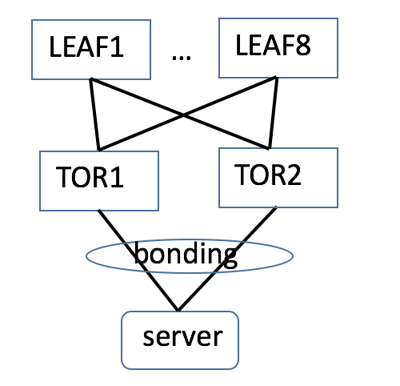
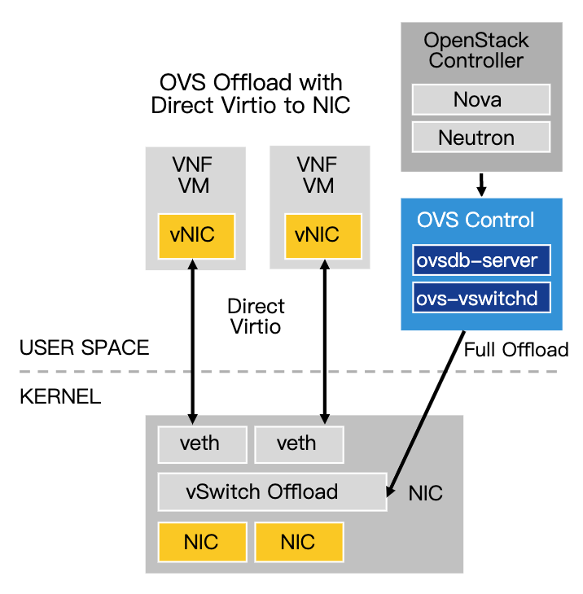
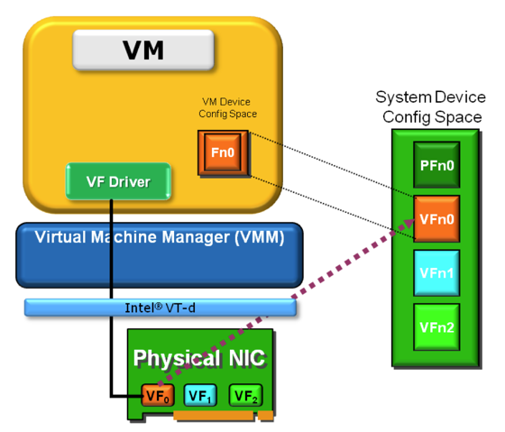

随着容器和云原生的发展，对网络提出了新的要求，无论是平台的分布化以及业务的微服务化，都需要一个强大的网络来支撑大规模虚拟节点以及微服务之间的通信。

具体到技术层面，云原生对于网络的要求，一是基础的二三层网络联通，二是4~7层的高级网络功能。

本文主要描述适用于容器的二三层网络，该网络需要满足如下的需求：

- 大规模，连接成千上万的容器
- 高性能（低延时、高带宽）
- 高可靠
- 高效的网络监控，及早发现故障，跟踪故障和故障自愈

# 拓扑

服务器的双网卡做 bond 绑定之后双归到两台的不同的 ToR 上，两台 ToR 组成去堆叠组网，这样的基础物理网络具有高可靠性、大带宽的优点。

# 虚拟网络

服务器内部连接容器的虚拟网络基于 OVS 和智能网卡的方案，兼顾了 OVS 的 SDN 转发灵活控制的特点，又可以将 Openflow 流表 offload 到智能网卡上，通过硬件转发来提高转发性能。

容器网络由 [CNI](/post/cloud/network/201907-cni) 创建和删除，在 Kubernetes 创建应用 Pod 之前配置网络时调用。

## OVS

OpenvSwitch 以其丰富的功能，作为多层虚拟交换机，已经广泛应用于云环境中。Open vSwitch的主要功能是为物理机上的VM提供二层网络接入，和云环境中的其它物理交换机 并行工作在Layer 2。

## SR-IOV

SR-IOV(PCI-SIG Single Root I/O Virtualization and Sharing)是PCI-SIG组织发布的规范。

SR-IOV 设计目标：通过为虚拟机提供独立的I/O地址空间、中断和DMA流而避免VMM的介入；允许设备支持多个虚拟功能，并且最小化每个附加功能的硬件成本。

SR-IOV引入了两个PCIe的function types

Physical Functions(PFs)：包括管理SR-IOV功能在内的所有PCIe function。

Virtual Functions(VFs)：一部分轻量级的PCIe function，只能进行必要的数据操作和配置。

SR-IOV机制提供独立多个可配置的VF，每一个VF具有独立的PCIe配置空间。VF是“轻量级”PCIe功能，包含数据传输所需的资源，提供了一种数据输入和输出的机制。

虚拟机中的VF驱动程序应该是半虚拟化驱动程序(知道它在虚拟化环境中)，并且只执行它可用的操作。

VF驱动程序是一个专门的驱动程序，它只有某些可用的功能，例如能够在VF中配置DMA描述符、配置MAC地址、VLAN标签等。

通常，VF提供发送和接收数据的能力, 以及执行复位的功能，复位仅影响VF本身，而不影响整个物理设备。对于超出VF复位或发送和接收数据的动作，VF驱动程序需要与主驱动程序通信。

## 容器

将 SR-IOV 的 VF 加入到容器的 namespace 中，将 VF 对应的 rep 口加入到 OVS 网桥上。这样就连接了宿主机与容器网络。

容器的 IP 由 IPAM 分配，一般一个 ToR 下有两个 24 位网段的地址来支持最多 506 个容器 IP。

容器的网关配置在 ToR 上，在容器中设置默认路由，下一跳为网关地址。

## 宿主机

通过 OVS 流表来转发内部的流量，通过将 OVS 流表 offload 到智能网卡来提高转发性能、降低时延、增大吞吐。

对每个容器都增加一条流表，当收到目的 IP 为容器 IP 的报文时，修改报文目的 MAC 为容器的 MAC 然后转发给容器的 VTEP 端口

宿主机路由表配置一条到宿主机网关的默认路由，宿主机与容器的网段一般是不同的，网关也是不同的，但都是落在 ToR 上。

从容器发出的流量首先发送到宿主机的 OVS bridge，bridge 查看是否有匹配的流表，如果是到本宿主机内部的流量则直接从对应的 VTEP 发送给容器。如果没有匹配则通过宿主机上的默认路由发送给网关，即 ToR 交换机。

# 物理网络

## ToR

ToR 使用 [去堆叠方案](/post/cloud/network/201906-stackless) 方案，具有很高的可靠性，在其上生成到服务器和容器的 32 位主机路由，所有到服务器和容器的流量都是经过三层路由转发。

交换机作为服务器和容器的网关，交换机上有：

- 到本机下联服务器、容器 IP 的 32 位主机路由
- 到其他服务器、容器的 24 位网段路由

推荐在 ToR 上运行 EBGP 协议来发布路由。

# 总结

该方案基于智能网卡构建的基础网络具有很高的性能和控制的灵活性，不需要做 Overlay，具有很高的稳定性，网络拓扑简单，物理网络无需改造。缺点是智能网卡成本高。
