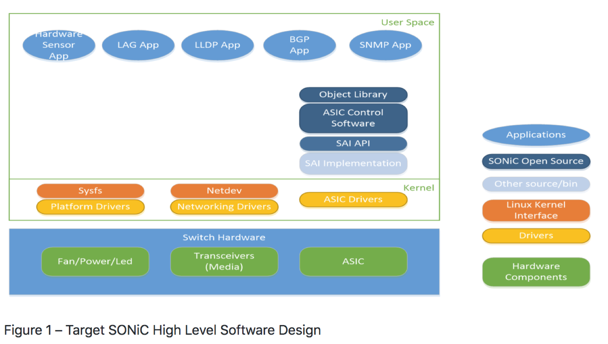
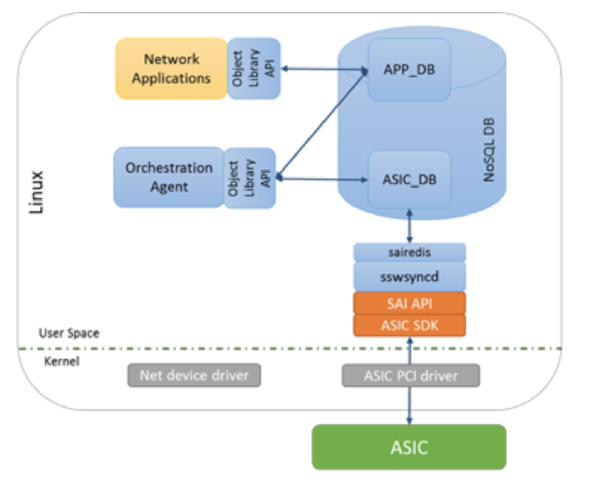

当前的数据中心基本都是采用 Clos 架构，可以更好的支持东西向流量无阻塞转发，适用于数据中心的分布式应用。Clos 架构可以只用盒式交换机堆出一个大规模的网络，这种组网具有以低成本而且方便水平扩展的优势。数据中心的网络需求单一，因此很多公司自研盒式交换机，白盒交换机生态系统也因此得到了很大的发展，随着标准的制定和越来越多的上下游厂商支持，自研白盒交换机的难度越来越低。

[SONiC （Software for Open Networking in the Cloud）](https://azure.github.io/SONiC/) 是有微软开源的适用于数据中心云网络的交换机系统，目前托管在 OCP，支持多种厂商的硬件和 ASIC 转发芯片，基于 Linux 系统。提供在数据中心广泛应用的 BGP 和 RDMA 等功能。并且有一个活跃的社区来共建丰富多样的功能，可以帮助用户根据自己的需求灵活定制实现自己的网络功能。

# 技术架构

SONiC是第一个将单一的交换机软件分解成多个组件的解决方案，方便开发和扩展新功能。基于现有的开源技术，如容器 Docker，key-value 数据库 Redis，Quagga BGP 和 LLDPD 等协议，以及配置化工具 Ansible。

交换机抽象接口 [SAI（Switch Abstraction Interface）](https://github.com/opencomputeproject/SAI) 为网络硬件供应商定义了标准化编程接口，通过 SAI 的接口可以对交换机硬件下发配置和获取状态，能够在无需任何修改的前提下，使得软件支持多个交换机芯片。

SONiC 系统框架如下图：

主要有以下几个核心部分组成：

- 最底层的是交换机硬件，包括电源、风扇、光模块等外设，核心是交换芯片 ASIC
- 在硬件之上的是操作系统 Linux 内核，运行着系统和外设的驱动，核心是 ASIC 驱动
- 在系统之上的用户空间，运行着 SONiC 核心程序，包括对接 SAI 接口和 ASIC 接口，维护交换机状态数据库
- 最上一层是各种网络应用程序，像 BGP、SNMP 等，从下层的数据库获取交换机状态信息，同时根据协议状态修改交换机的状态。这些应用程序广泛采用了开源的组件。

SONiC 关键的组件都以容器的方式运行，下面介绍 SONiC 核心的组件 SwSS

## SwSS

SwSS（Switch state Servic） 是 SONiC 最重要的组件提供了数据库通讯接口，和网络应用和交换机硬件的状态标识。

网络应用层（netwowrk applications）通过对象库接口可以从 `APP_DB` 读取和写入。例如：netlink route syncer, quagga FPM route syncer，ACL、QoS、load balancer等。

Orchestration agents 通过对象库接口可以在 APP 和 ASIC 数据库之间读取和写入数据。Orchestration agents 负责必要的逻辑整理，并将应用层数据传送到 SAI objects

The syncd process 在 ASIC_DB and the SAI SDK 之间进行读取和写入 SAI objects.

1. key-value 键值型数据库：Redis

	- 数据可全部放入内存，适用于频繁访问数据的场景
	- SONiC 在 Redis 中创建多个表分别用来记录配置、运行状态、数据统计等
	- Redis 支持对表项的订阅，可以由数据库的同步机制来驱动应用程序接受数据。

	用于提供一个独立于语言的接口，数据可持久化、复制和进行多进程通信的方法。Redis 作为底层数据库引擎。

2. netwowrk applications

	使用 SwSS API，SONiC 网络应用不需要知道底层通信细节，完全独立于硬件。网络应用之需要关注他们需要的数据，并不需要关心其他实现细节。

	比如需要 SwSS 实现功能有：3层2层桥接、路由、ACL，QOS，遥测流、隧道、链路聚合、负载均衡和基于策略的路由等等。

3. Orchestration Agent

	这个功能实现了 APP_DB 和 ASIC_DB 中表之间的逻辑转化和拷贝。

	每个 ASIC 表必须只有一个 producer ，这就是 orchestration agent 来实现。只能由 orchestration agent 来写入 ASIC_DB table.

4. syncd

	switch sync 是个守护进程，在 ASIC_DB 表 和一个 SAI 兼容的 ASIC SDK 之间进行数据拷贝。 每个 SAI SDK 实例只有一 syncd 过程。

5. Database 的实现

	SwSS 在 redis 中实现表概念是通过关键字做前缀命名的。

	app_table 设计成：route_table 和 neigh_table。

	ASIC_ tables 是从 SAI 头文件中创建出来. 如： asic_sai_unicast_route_entry_t 和 asic_sai_neighbor_entry_t。

	SwSS 提供了数据库通讯接口，和网络应用和交换机硬件的状态标识。包含以下功能模块：fpmsyncd neighsyncd intfsyncd portsyncd orchagent swssconfig cfgmgr

	各个模块管理以下功能：

	- teamsyncd/teamsyncd
	- fpmsyncd/fpmsyncd
	- intfsyncd/intfsyncd
	- cfgmgr/intfmgrd
	- cfgmgr/vlanmgrd
	- neighsyncd/neighsyncd
	- portsyncd/portsyncd
	- orchagent/orchagent
	- orchagent/routeresync
	- swssconfig/swssconfig
	- swssconfig/swssplayer

**总结**

Sonic-swss 为各个模快加载配置，执行用户操操作，写入到APPL_DB数据，并通过NETLINK与内核进行通讯。

# 白盒交换机落地

白盒交换机的落地一般有如下几个阶段：

- 需求分析
- 软硬件选型
- ODM 定制和生产
- 软件开发
- 整机测试
- 上线部署

## 需求分析

自研可以先从 ToR 开始，然后才是 Leaf、Spine，因为 ToR 相对来讲功能单一一些，出故障后影响面最小，部署量也是最大的，方便后面上线灰度测试。

首先对 ToR 功能需求梳理，主要是二三层交换路由功能，主要的路由协议是 BGP，有一些功能不一定非要在 ToR 上实现，可以在网络的其他环节配置，如 ACL 可以在 Spine 上配置。然后对需求进行重要性和优先级排序，需求是分批实现的。

## 软硬件选型

根据前面的需求可以指导软硬件的选型，软件选型的逻辑：

- 功能要满足大部分需求，最好不需要很大的开发量就可以满足需求；另外软件框架的性能要好，这样很多性能问题才能有优化的空间。
- 硬件支持和适配，软件要能做到与硬件解耦，方便切换硬件芯片，不至于被硬件厂家绑定。
- 系统扩展性，方便根据自己的应用场景和需求灵活定制开发功能，比如在交换机上做网络监控。
- 开源社区，一个氛围活跃的社区可以帮助自研交换机的小团队解决很多问题，共建社区良性发展。

硬件选型的逻辑：

- 功能，主要是转发芯片的功能要满足当前和以后潜在的需求，还有一些网络监控的需求，比如 INT（Inband Network Telemetry）、芯片丢包的抓取能力等。还要关注芯片厂商后续升级换代芯片的 Roadmap。
- 性能，转发芯片的吞吐，buffer 大小，64 字节小包线速转发，CPU 和内存是否足够强，以支持后续的开发和扩展。
- 稳定性，交换机作为网络最重要的节点，硬件的稳定性比软件的稳定性更加重要，这个一般要采用有经验的厂商来避免出问题。
- 服务，互联网自研交换机的团队一般不会很大，需要芯片和硬件厂商提供很多底层的支持，包括硬件和驱动的测试和故障定位。选取一个可靠的队友相当重要。

软硬件选型要结合自己的应用场景综合考虑，比如通用的 ToR 场景下使用常见的转发芯片就可以满足需求，而一些网络节点，比如网关可以采用可编程芯片灵活控制，这样以硬件的高性能和软件的灵活性可以创造出创新的解决方案。

## ODM 定制和生产

根据硬件选型就可以选择 ODM 厂商了，最好让硬件设计成模块化的，CPU 和 内存方便移植和扩展的，这样无论是定位问题、维修还是后期的提升性能都很方便。另外就是选取靠谱的 ODM 厂商很重要。

## 软件开发

软件开发应该聚焦在特别重要和紧急的需求上，多关注社区的 Roadmap，如果是标注的功能，以后社区可能也做这个功能，最好采用社区的版本，方便与社区同步。

可以聚焦在网络监控功能的开发上，因为这种功能需求大家都不太一样，社区可能不会去做。网络监控一直是最大的痛点，这个做好了也是自研交换机价值的最大体现。

## 整机测试

测试工作将是自研交换机所有工作的重点，因为不像商用交换机有很大的测试团队和经过市场验证的环节，即使是开源系统 SONiC 也存在很多 bug，因为各家的应用场景不一样，各个用户和厂商只会测试自己关注的功能和模块。就需要用户自己充分测试来保证系统的稳定性。

测试是一种重复耗时、枯燥且容易出错但是又极其重要的工作，互联网公司的自研交换机团队一般没有多少人，需要搭建一套自动化测试环境，通过编写测试脚本来提高测试效率。也要积极争取厂商的测试资源，他们有成熟的测试团队，可以帮助发现和解决问题。

## 上线部署

在前面的这么多工作做完之后，终于可以落地部署了，在部署之前要做好部署规划，除了功能验证之外还要与公司现有的网络监控平台对接。提前设想一些问题发生后，如何发现、处理和恢复网络故障。甚至要比商用交换机有更强的监控机制，充分了解设备的运行状态，给用户以足够的部署信心。还要注意在开始灰度阶段选择上线的业务最好是离线业务场景，对网络的质量不是特别敏感，这样出问题也能将损失降低。最好是按照一定的节奏灰度部署，开始量太大了容易出现大问题，量太少了又不容易发现问题。
